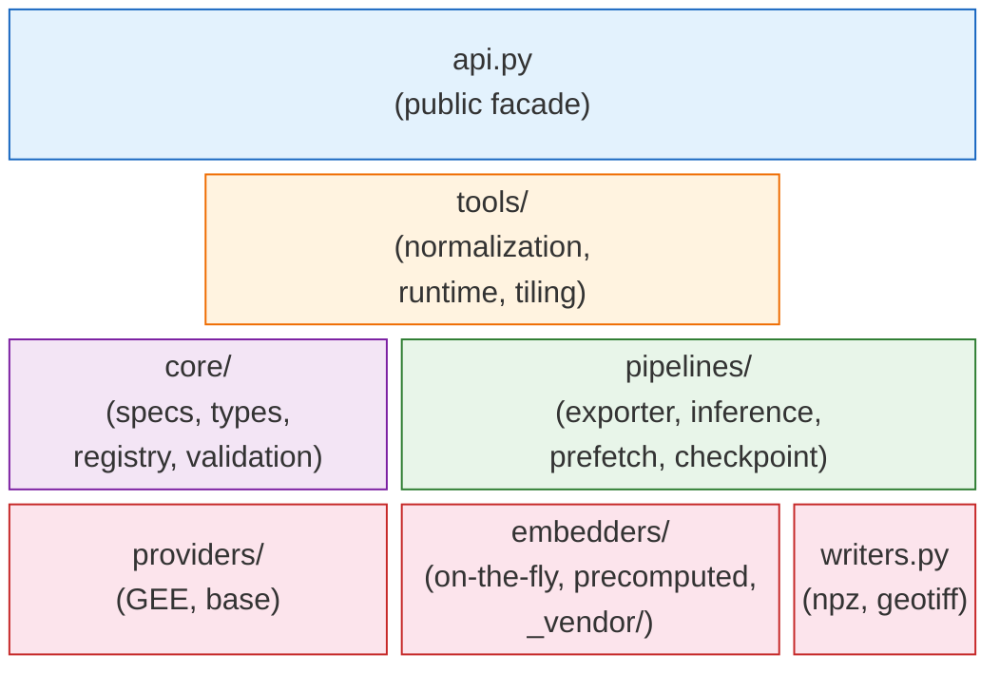
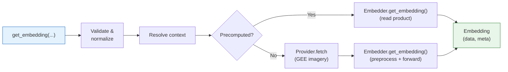
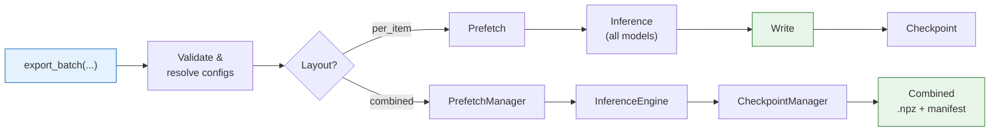
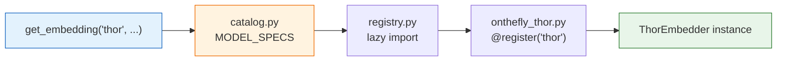
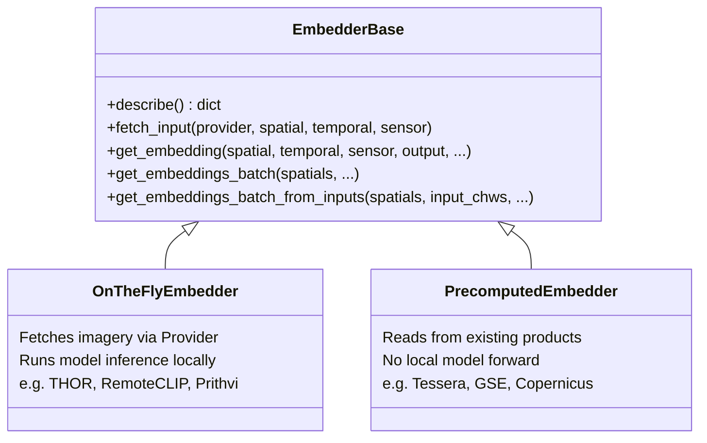
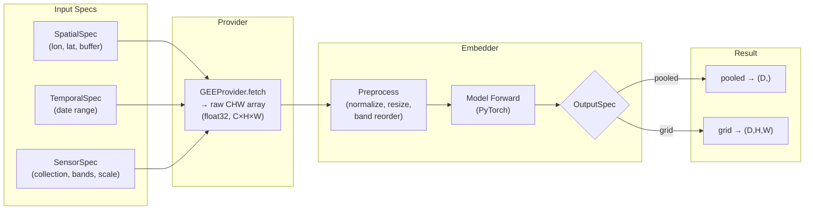

# Architecture

This page explains how rs-embed is organized internally.
It is aimed at contributors, integrators, and users who want to understand what happens between an API call and the returned `Embedding` object.

For the public API surface, see [API](api.md).
For adding a new model, see [Extending](extending.md).

---

## Module Map

rs-embed is split into five packages plus a thin public facade.

| Package | Responsibility |
| --- | --- |
| **`api.py`** | Public facade. Validates inputs, resolves defaults, delegates to pipelines. Contains no heavy execution logic. |
| **`core/`** | Spec dataclasses (`SpatialSpec`, `TemporalSpec`, `OutputSpec`, ...), the model registry, validation rules, and shared error types. |
| **`embedders/`** | One module per model family. Each implements `EmbedderBase` and owns preprocessing, checkpoint loading, and forward inference. Vendored upstream code lives in `_vendor/`. |
| **`providers/`** | Data access backends. `GEEProvider` fetches imagery from Google Earth Engine; `ProviderBase` defines the interface for future backends. `resolution.py` handles backend selection and provider lifecycle (auto-detection, caching, init kwargs). `fetch.py` provides satellite-specific fetch helpers (`fetch_s2_rgb_chw`, `fetch_s1_vvvh_raw_chw`, `fetch_s2_multiframe_raw_tchw`, etc.) and normalization used by embedders. |
| **`pipelines/`** | Orchestration: `BatchExporter` (export lifecycle), `InferenceEngine` (single/batch dispatch), `PrefetchManager` (IO), `CheckpointManager` (resume). |
| **`tools/`** | Stateless helpers: name normalization, sensor/model defaults, tiling, serialization, progress bars. Shared by both `api.py` and `pipelines/`. |
| **`writers.py`** | Serializes results to disk (`.npz`, GeoTIFF, etc.). |

---

## Call Flow: `get_embedding()`

A single `get_embedding(...)` call follows this path:

Key observations:

- **`api.py` does no heavy work** — it validates, resolves context, then delegates.
- **Precomputed models** skip the provider entirely. They read from pre-built embedding products (e.g. Earth Engine assets).
- **On-the-fly models** go through a provider fetch step first. The provider returns a CHW numpy array, which the embedder preprocesses and passes through the model.
- **`input_prep`** (resize / tile) is applied at the API level *before* the embedder sees the data. For tiling, the API calls the embedder multiple times and stitches results.

---

## Call Flow: `export_batch()`

`export_batch(...)` is the dataset-generation path. It adds prefetching, checkpointing, and multi-model orchestration on top of the single-embedding flow.

Key observations:

- **Input reuse** — when `save_inputs=True` and `save_embeddings=True`, the provider patch is fetched once and shared. Models with the same sensor config reuse the same cached input.
- **Checkpointing** — after each model or spatial completes, progress is saved. A crashed run can be resumed from the last checkpoint.
- **Inference strategy** — `InferenceEngine` picks single-point or batch dispatch based on whether the embedder supports `get_embeddings_batch_from_inputs()`.

---

## Model Registration & Lazy Loading

Models are discovered through a two-level lookup:

1. **`MODEL_SPECS`** in `catalog.py` maps model names to `(module_name, class_name)` pairs. This is the stable catalog — it never imports anything.
2. **`registry.py`** lazily imports the module only when the model is first requested, then caches the class.
3. **`@register("name")`** on the embedder class stores it in the runtime registry.

This means unused models cost nothing at import time — only the models you actually call get loaded.

---

## Embedder Class Hierarchy

All embedders inherit from `EmbedderBase`. The two main families differ in how they obtain data:

On-the-fly embedders typically:

- Define `input_spec = ModelInputSpec(...)` or override `fetch_input()` for data retrieval
- Load a checkpoint (PyTorch weights) on first use
- Implement preprocessing (band selection, normalization, resizing) in `get_embedding()`

Precomputed embedders typically:

- Use a provider to read a pre-built product (e.g. an Earth Engine ImageCollection of embeddings)
- Skip model forward entirely — `get_embedding()` reads and returns the stored embedding

---

## Data Flow: From Specs to Embedding

This diagram traces the data transformation at each stage for an on-the-fly model:

---

## Where to Go Next

- [Extending](extending.md) — add a new embedder using this architecture
- [API](api.md) — public function signatures
- [Concepts](concepts.md) — semantic meaning of specs and backends
- [Contributing](contributing.md) — repository workflow and PR requirements
