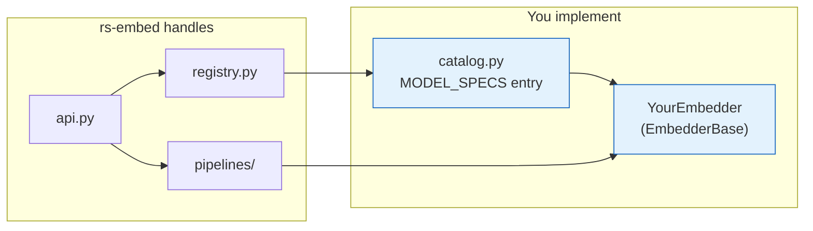

# Extending rs-embed

This page documents the extension contract for adding a new embedder.

!!! tip "Read the architecture first"
    If you have not already, read [Architecture](architecture.md) for a visual overview of how modules, registries, and pipelines fit together. This page focuses on the *contract* you need to implement; the architecture page explains *where your code sits* in the larger system.

For repository workflow and pull request requirements, see [Contributing Guide](contributing.md).

---

## Overview

Adding a model means:

1. Create an embedder class in `src/rs_embed/embedders/`.
2. Register it with `@register("your_model_name")`.
3. Add it to `MODEL_SPECS` in `src/rs_embed/embedders/catalog.py`.
4. Implement `describe()` and `get_embedding(...)`.



---

## Registration

Models are discovered through `catalog.py` → `registry.py` via lazy import:

```python
# catalog.py
MODEL_SPECS["your_model"] = ("your_module", "YourEmbedder")

# your_module.py
@register("your_model")
class YourEmbedder(EmbedderBase): ...
```

The module is only imported when `get_embedding("your_model", ...)` is first called. If it's not in `MODEL_SPECS`, string-based lookup will not find it.

---

## Embedder Interface

All models implement `EmbedderBase`:

```python
class EmbedderBase:
    def describe(self) -> dict: ...
    def fetch_input(self, provider, *, spatial, temporal, sensor): ...
    def get_embedding(self, *, spatial, temporal, sensor, output,
                      backend, device, input_chw, model_config): ...
    def get_embeddings_batch(...): ...
    def get_embeddings_batch_from_inputs(...): ...
```

### `describe()`

Returns a JSON-serializable capability dictionary. Must be fast — no checkpoint downloads or model loading.

```python
{
  "type": "on_the_fly",
  "backend": ["provider"],
  "output": ["pooled", "grid"],
  "defaults": {"scale_m": 10, "image_size": 224},
  "model_config": {
    "variant": {"type": "string", "default": "base", "choices": ["base", "large"]}
  }
}
```

### `get_embedding(...)`

The main inference entry point. If `input_chw` is provided, **do not fetch again** — use it directly. This is how `export_batch` avoids redundant downloads when `save_inputs=True`.

```python
if input_chw is None:
    input_chw = provider.fetch_array_chw(...)
# preprocess + infer using input_chw
```

### Output modes

`OutputSpec.pooled()` expects `(D,)`, `OutputSpec.grid(...)` expects `(D, H, W)`. If your model does not support a mode, raise `ModelError`.

---

## Minimal Skeleton

Create `src/rs_embed/embedders/toy_model.py`:

```python
from __future__ import annotations

import hashlib
from dataclasses import asdict
from typing import Any, Dict, Optional
import numpy as np

from rs_embed.core.registry import register
from rs_embed.core.embedding import Embedding
from rs_embed.core.errors import ModelError
from rs_embed.core.specs import SpatialSpec, TemporalSpec, SensorSpec, OutputSpec
from rs_embed.embedders.base import EmbedderBase


@register("toy_model_v1")
class ToyModelV1(EmbedderBase):
    def describe(self) -> Dict[str, Any]:
        return {
            "type": "precomputed",
            "backend": ["auto"],
            "output": ["pooled"],
        }

    def get_embedding(
        self,
        *,
        spatial: SpatialSpec,
        temporal: Optional[TemporalSpec],
        sensor: Optional[SensorSpec],
        output: OutputSpec,
        backend: str = "auto",
        device: str = "auto",
        input_chw: Optional[np.ndarray] = None,
        model_config: Optional[Dict[str, Any]] = None,
    ) -> Embedding:
        if output.mode != "pooled":
            raise ModelError("toy_model_v1 only supports pooled output")

        seed_bytes = hashlib.blake2s(
            f"{spatial!r}|{temporal!r}|{self.model_name}".encode(),
            digest_size=4,
        ).digest()
        rng = np.random.default_rng(int.from_bytes(seed_bytes, "little"))

        return Embedding(
            data=rng.standard_normal(512).astype("float32"),
            meta={
                "model": self.model_name,
                "backend": backend,
                "spatial": asdict(spatial),
                "temporal": asdict(temporal) if temporal else None,
            },
        )
```

Then register in `src/rs_embed/embedders/catalog.py`:

```python
MODEL_SPECS["toy_model_v1"] = ("toy_model", "ToyModelV1")
```

---

## On-the-fly Models


Two fetch patterns:

- **Declarative**: set `input_spec = ModelInputSpec(...)` on the embedder — the base `fetch_input()` handles provider fetch.
- **Custom**: override `fetch_input(...)` when you need fallback chains, multi-sensor routing, or fetch-time metadata.

!!! tip
    Keep provider IO separate from model inference. That makes batching, caching, and export reuse simpler.

---

## Vendored Runtime Code

If the model depends on upstream code that is easier to vendor than install, place it under `src/rs_embed/embedders/_vendor/`. Keep the adapter in `onthefly_<model>.py`; keep vendored code minimally patched.

Include the upstream license as `_vendor/LICENSE.<model>`. If the vendored code requires third-party packages, surface a helpful `ModelError` when they are missing.

---

## Batch Methods

The base class loops over `get_embedding()` by default. Override when the model supports true vectorized inference:

```python
def get_embeddings_batch_from_inputs(
    self, *, spatials, input_chws, temporal, sensor,
    model_config, output, backend, device,
):
    # 1) preprocess + stack prefetched CHW inputs
    # 2) single batched forward pass
    # 3) split outputs back into Embedding objects
```

`export_batch` prefers `get_embeddings_batch_from_inputs` when prefetched inputs are available, so overriding this method usually gives the biggest speedup.

---

## Optional Dependencies

Import heavy dependencies inside methods or with a `try/except` at module level. Raise a helpful error if missing:

```python
try:
    import torch
except Exception as e:
    torch = None
    _torch_err = e

def _require_torch():
    if torch is None:
        raise ModelError("Torch is required. Install with: pip install rs-embed")
```

---

## Testing

### Registry

```python
from rs_embed.core.registry import get_embedder_cls

def test_toy_model_registered():
    cls = get_embedder_cls("toy_model_v1")
    assert cls is not None
```

### API-level

```python
from rs_embed import PointBuffer, TemporalSpec, OutputSpec, get_embedding

def test_toy_model_get_embedding():
    emb = get_embedding(
        "toy_model_v1",
        spatial=PointBuffer(0, 0, 1000),
        temporal=TemporalSpec.year(2022),
        output=OutputSpec.pooled(),
    )
    assert emb.data.shape == (512,)
```

### Export integration

If your model supports batch export, add a small `export_batch` test with `monkeypatch` to avoid network calls. See `tests/test_export_batch.py` for patterns.

---

## Documentation

Update these as needed:

- `docs/models.md` — overview table
- `docs/models/<model>.md` — model detail page (use [Model Detail Template](model_detail_template.md))
- `docs/models_reference.md` — if the model adds cross-model comparison caveats

---

## Checklist

| Item | What to check |
|------|---------------|
| Registration | `@register("...")` + `MODEL_SPECS` entry in `catalog.py` |
| `describe()` | Fast, accurate, no heavy loading |
| Fetch path | `input_spec` or custom `fetch_input(...)` defined |
| Input reuse | `get_embedding()` respects `input_chw` when provided |
| Error handling | Clear `ModelError` for missing optional dependencies |
| Tests | `pytest -q` passes with registry + API-level tests |
| Docs | Model detail page + overview table updated |
