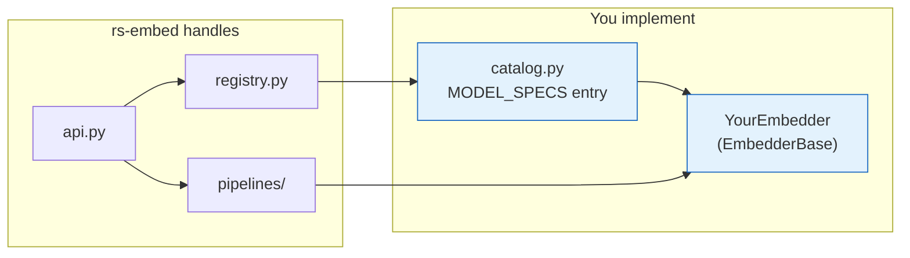
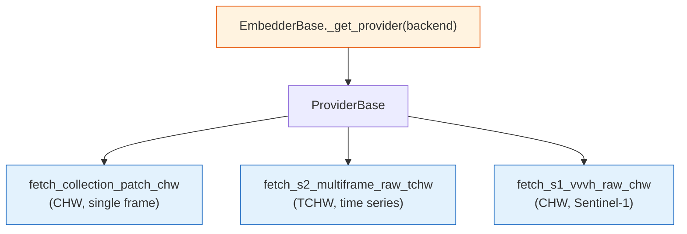

# Extending rs-embed

This page documents the extension contract for adding a new embedder.

!!! tip "Read the architecture first"
    If you have not already, read [Architecture](architecture.md) for a visual overview of how modules, registries, and pipelines fit together. This page focuses on the *contract* you need to implement; the architecture page explains *where your code sits* in the larger system.

For repository workflow and pull request requirements, see [Contributing Guide](contributing.md).

---

## Overview

Adding a model means:

1. Create an embedder class in `src/rs_embed/embedders/`.
2. Register it with `@register("your_model_name")`.
3. Add it to `MODEL_SPECS` in `src/rs_embed/embedders/catalog.py`.
4. Implement `describe()` and `get_embedding(...)`.



---

## Registration

Models are discovered through `catalog.py` → `registry.py` via lazy import:

```python
# catalog.py
MODEL_SPECS["your_model"] = ("your_module", "YourEmbedder")

# your_module.py
@register("your_model")
class YourEmbedder(EmbedderBase): ...
```

The module is only imported when `get_embedding("your_model", ...)` is first called. If it's not in `MODEL_SPECS`, string-based lookup will not find it.

---

## Embedder Interface

All models implement `EmbedderBase`:

```python
class EmbedderBase:
    def describe(self) -> dict: ...
    def fetch_input(self, provider, *, spatial, temporal, sensor): ...
    def get_embedding(self, *, spatial, temporal, sensor, output,
                      backend, device, input_chw, model_config): ...
    def get_embeddings_batch(...): ...
    def get_embeddings_batch_from_inputs(...): ...
```

### `describe()`

Returns a JSON-serializable capability dictionary. Must be fast — no checkpoint downloads or model loading.

```python
{
  "type": "on_the_fly",
  "backend": ["provider"],
  "output": ["pooled", "grid"],
  "defaults": {"scale_m": 10, "image_size": 224},
  "model_config": {
    "variant": {"type": "string", "default": "base", "choices": ["base", "large"]}
  }
}
```

### `get_embedding(...)`

The main inference entry point. If `input_chw` is provided, **do not fetch again** — use it directly. This is how `export_batch` avoids redundant downloads when `save_inputs=True`.

```python
if input_chw is None:
    input_chw = provider.fetch_array_chw(...)
# preprocess + infer using input_chw
```

!!! note "How `model_config` flows from the public API"
    The public-facing functions (`get_embedding`, `get_embeddings_batch`) accept model settings as **direct keyword arguments**, not as a `model_config` dict:

    ```python
    # Correct — pass model settings directly as kwargs
    get_embedding("dofa", spatial=..., variant="large")

    # Wrong — model_config is not a public parameter
    get_embedding("dofa", spatial=..., model_config={"variant": "large"})
    ```

    Internally the API collects `**model_kwargs` into a dict and passes it to the embedder as `model_config`.  Your embedder receives it the standard way (`model_config: dict | None`), so the internal interface is unchanged.  The `describe()` key `"model_config"` documents the accepted keys — users pass those keys directly as kwargs.

### Output modes

`OutputSpec.pooled()` expects `(D,)`, `OutputSpec.grid(...)` expects `(D, H, W)`. If your model does not support a mode, raise `ModelError`.

---

## Minimal Skeleton

Create `src/rs_embed/embedders/toy_model.py`:

```python
from __future__ import annotations

import hashlib
from dataclasses import asdict
from typing import Any, Dict, Optional
import numpy as np

from rs_embed.core.registry import register
from rs_embed.core.embedding import Embedding
from rs_embed.core.errors import ModelError
from rs_embed.core.specs import SpatialSpec, TemporalSpec, SensorSpec, OutputSpec
from rs_embed.embedders.base import EmbedderBase


@register("toy_model_v1")
class ToyModelV1(EmbedderBase):
    def describe(self) -> Dict[str, Any]:
        return {
            "type": "precomputed",
            "backend": ["auto"],
            "output": ["pooled"],
        }

    def get_embedding(
        self,
        *,
        spatial: SpatialSpec,
        temporal: Optional[TemporalSpec],
        sensor: Optional[SensorSpec],
        output: OutputSpec,
        backend: str = "auto",
        device: str = "auto",
        input_chw: Optional[np.ndarray] = None,
        model_config: Optional[Dict[str, Any]] = None,
    ) -> Embedding:
        if output.mode != "pooled":
            raise ModelError("toy_model_v1 only supports pooled output")

        seed_bytes = hashlib.blake2s(
            f"{spatial!r}|{temporal!r}|{self.model_name}".encode(),
            digest_size=4,
        ).digest()
        rng = np.random.default_rng(int.from_bytes(seed_bytes, "little"))

        return Embedding(
            data=rng.standard_normal(512).astype("float32"),
            meta={
                "model": self.model_name,
                "backend": backend,
                "spatial": asdict(spatial),
                "temporal": asdict(temporal) if temporal else None,
            },
        )
```

Then register in `src/rs_embed/embedders/catalog.py`:

```python
MODEL_SPECS["toy_model_v1"] = ("toy_model", "ToyModelV1")
```

---

## On-the-fly Models


Two fetch patterns:

- **Declarative**: set `input_spec = ModelInputSpec(...)` on the embedder — the base `fetch_input()` handles provider fetch.
- **Custom**: override `fetch_input(...)` when you need fallback chains, multi-sensor routing, or fetch-time metadata.

!!! tip
    Keep provider IO separate from model inference. That makes batching, caching, and export reuse simpler.

---

## Using a Provider to Fetch Satellite Data

A **provider** is the system's interface to a remote data service (currently GEE). When writing an
on-the-fly embedder you never instantiate a provider directly — call `self._get_provider(backend)`
and the base class returns a ready, authenticated, cached instance.



All fetch helpers live in `rs_embed.providers.fetch`.  They wrap the low-level provider call,
validate the returned array shape, and re-raise `ProviderError` as `ModelError` so the
embedder never leaks provider internals.

---

### Path 1 — Declarative fetch via `input_spec`

If your model uses a fixed collection and band set, declare `input_spec` as a class attribute.
The base `fetch_input()` does the provider call for you — no code to write.

```python
from rs_embed.core.specs import ModelInputSpec

@register("my_model_v1")
class MyModelV1(EmbedderBase):
    input_spec = ModelInputSpec(
        collection="COPERNICUS/S2_SR_HARMONIZED",
        bands=("B2", "B3", "B4", "B8"),   # BGRNIR
        scale_m=10,
        cloudy_pct=30,
        image_size=224,
    )
    # fetch_input() is inherited — nothing else needed
    # fetch_input() returns raw DN [0, 10000]; normalize in get_embedding()
```

`ModelInputSpec.temporal_mode` controls single vs. multi-frame:

| `temporal_mode` | `n_frames` | Array shape returned |
|---|---|---|
| `"single"` (default) | — | `(C, H, W)` |
| `"multi"` | e.g. `8` | `(T, C, H, W)` |

---

### Path 2 — Custom fetch via `fetch_input()` override

Override `fetch_input()` when the declarative path is not flexible enough:
multi-sensor routing, Sentinel-1, fetch-time metadata, or any non-standard collection.

The override must return a `FetchResult(data=array, meta=dict)` or `None` (falls back to
generic provider fetch).  The `data` field is what the pipeline passes as `input_chw` to
`get_embedding()`.

#### Example A — Single S2 frame (CHW)

```python
from rs_embed.core.types import FetchResult
from rs_embed.providers.fetch import fetch_collection_patch_chw

def fetch_input(self, provider, *, spatial, temporal, sensor):
    raw = fetch_collection_patch_chw(
        provider,
        spatial=spatial,
        temporal=temporal,
        collection="COPERNICUS/S2_SR_HARMONIZED",
        bands=("B2", "B3", "B4", "B8"),
        scale_m=int(sensor.scale_m),
        cloudy_pct=int(sensor.cloudy_pct),
        composite=str(sensor.composite),
        fill_value=float(sensor.fill_value),
    )
    # raw: float32 CHW in raw DN [0, 10000]
    return FetchResult(data=raw, meta={})
```

#### Example B — S2 time series (TCHW)

Use this when the model expects multiple cloud-filtered frames over a date range.
Pass `TemporalSpec.range(start, end)` from the caller; the provider selects the
`n_frames` least-cloudy images within the window.

```python
from rs_embed.providers.fetch import fetch_s2_multiframe_raw_tchw

def fetch_input(self, provider, *, spatial, temporal, sensor):
    raw_tchw = fetch_s2_multiframe_raw_tchw(
        provider,
        spatial=spatial,
        temporal=temporal,          # must be TemporalSpec.range(...)
        bands=("B2", "B3", "B4", "B8A", "B11", "B12"),
        n_frames=8,                 # how many frames to sample
        collection="COPERNICUS/S2_SR_HARMONIZED",
        scale_m=int(sensor.scale_m),
        cloudy_pct=int(sensor.cloudy_pct),
        composite="median",
        fill_value=0.0,
    )
    # raw_tchw: float32 [T, C, H, W] in raw DN [0, 10000]
    return FetchResult(data=raw_tchw, meta={"n_frames": raw_tchw.shape[0]})
```

#### Example C — Sentinel-1 VV/VH (CHW)

S1 fetch returns raw float32 VV/VH in linear or dB scale.  Use
`fetch_s1_vvvh_raw_chw_with_meta` to capture IW-mode decisions and orbit metadata.

```python
from rs_embed.providers.fetch import (
    fetch_s1_vvvh_raw_chw_with_meta,
    normalize_s1_vvvh_chw,       # log1p + 99th-pct scale -> [0, 1]
)

def fetch_input(self, provider, *, spatial, temporal, sensor):
    raw, meta = fetch_s1_vvvh_raw_chw_with_meta(
        provider,
        spatial=spatial,
        temporal=temporal,
        scale_m=int(getattr(sensor, "scale_m", 10)),
        orbit=getattr(sensor, "orbit", None),        # "ASCENDING" / "DESCENDING" / None
        use_float_linear=True,                        # linear scale (not dB)
        composite="median",
        require_iw=True,           # prefer IW acquisition mode
        relax_iw_on_empty=True,    # fall back if no IW images found
    )
    # raw: float32 [2, H, W] — channel 0 = VV, channel 1 = VH
    # meta: {"iw_used": bool, "orbit": str | None, ...}
    return FetchResult(data=raw, meta=meta)
```

#### Example D — Multi-sensor routing (S2 or S1)

When a single model supports multiple input modalities, read `sensor.modality` to
branch the fetch logic.  This is the pattern used by TerraFM and THOR.

```python
def fetch_input(self, provider, *, spatial, temporal, sensor):
    modality = str(getattr(sensor, "modality", "s2") or "s2").lower()

    if modality == "s2":
        raw = fetch_collection_patch_chw(
            provider, spatial=spatial, temporal=temporal,
            collection="COPERNICUS/S2_SR_HARMONIZED",
            bands=("B2", "B3", "B4", "B8"),
            scale_m=int(sensor.scale_m), cloudy_pct=int(sensor.cloudy_pct),
            composite=str(sensor.composite), fill_value=float(sensor.fill_value),
        )
        return FetchResult(data=raw, meta={})

    if modality == "s1":
        raw, meta = fetch_s1_vvvh_raw_chw_with_meta(
            provider, spatial=spatial, temporal=temporal,
            scale_m=int(sensor.scale_m),
            use_float_linear=bool(getattr(sensor, "use_float_linear", True)),
            require_iw=bool(getattr(sensor, "s1_require_iw", True)),
            relax_iw_on_empty=bool(getattr(sensor, "s1_relax_iw_on_empty", True)),
        )
        return FetchResult(data=raw, meta=meta)

    raise ModelError(f"Unsupported modality: {modality!r}. Expected 's2' or 's1'.")
```

---

### Using the fetched array inside `get_embedding()`

Always guard against a pre-fetched `input_chw` before calling the provider.
`export_batch` sets `input_chw` when it has already downloaded the patch, so
calling `fetch_input()` again would waste a network round-trip.

```python
def get_embedding(self, *, spatial, temporal, sensor, output, backend,
                  device="auto", input_chw=None, model_config=None):
    if input_chw is None:
        result = self.fetch_input(
            self._get_provider(backend),
            spatial=spatial,
            temporal=temporal,
            sensor=sensor or self._default_sensor(),
        )
        input_chw = result.data  # np.ndarray

    # normalize then run model forward on input_chw
    ...
```

---

### Normalization helpers

`fetch_input()` and all fetch helpers return **raw provider values** (S2 DN in [0, 10000],
S1 linear float, etc.).  Normalization to model input range is done inside
`get_embedding()` — the embedder decides the exact transform.

Common patterns used across the codebase:

| Sensor / need | Transform |
|---|---|
| S2 SR → [0, 1] | `np.clip(raw / 10000.0, 0.0, 1.0)` |
| S2 SR → clipped DN (model normalizes) | `np.clip(raw, 0.0, 10000.0)` |
| S1 VV/VH → [0, 1] | `normalize_s1_vvvh_chw(raw)` from `rs_embed.providers.fetch` |
| passthrough (nan-safe) | `np.nan_to_num(raw, nan=0.0, posinf=0.0, neginf=0.0)` |

```python
from rs_embed.providers.fetch import normalize_s1_vvvh_chw

def get_embedding(self, *, ..., input_chw=None, ...):
    if input_chw is None:
        result = self.fetch_input(self._get_provider(backend), ...)
        raw = result.data   # raw DN [0, 10000]
    else:
        raw = np.asarray(input_chw, dtype=np.float32)

    # Normalization is this embedder's responsibility:
    x_chw = np.clip(raw / 10000.0, 0.0, 1.0)   # S2 SR example
    # ... run model forward on x_chw
```

---

## Vendored Runtime Code

If the model depends on upstream code that is easier to vendor than install, place it under `src/rs_embed/embedders/_vendor/`. Keep the adapter in `onthefly_<model>.py`; keep vendored code minimally patched.

Include the upstream license as `_vendor/LICENSE.<model>`. If the vendored code requires third-party packages, surface a helpful `ModelError` when they are missing.

---

## Batch Methods

The base class loops over `get_embedding()` by default. Override when the model supports true vectorized inference:

```python
def get_embeddings_batch_from_inputs(
    self, *, spatials, input_chws, temporal, sensor,
    model_config, output, backend, device,
):
    # 1) preprocess + stack prefetched CHW inputs
    # 2) single batched forward pass
    # 3) split outputs back into Embedding objects
```

`export_batch` prefers `get_embeddings_batch_from_inputs` when prefetched inputs are available, so overriding this method usually gives the biggest speedup.

---

## Optional Dependencies

Import heavy dependencies inside methods or with a `try/except` at module level. Raise a helpful error if missing:

```python
try:
    import torch
except Exception as e:
    torch = None
    _torch_err = e

def _require_torch():
    if torch is None:
        raise ModelError("Torch is required. Install with: pip install rs-embed")
```

---

## Testing

### Registry

```python
from rs_embed.core.registry import get_embedder_cls
from rs_embed.embedders.base import EmbedderBase

def test_toy_model_registered():
    cls = get_embedder_cls("toy_model_v1")  # raises ModelError if not found
    assert issubclass(cls, EmbedderBase)
```

### API-level

```python
from rs_embed import PointBuffer, TemporalSpec, OutputSpec, get_embedding

def test_toy_model_get_embedding():
    emb = get_embedding(
        "toy_model_v1",
        spatial=PointBuffer(0, 0, 1000),
        temporal=TemporalSpec.year(2022),
        output=OutputSpec.pooled(),
    )
    assert emb.data.shape == (512,)
```

### Export integration

If your model supports batch export, add a small `export_batch` test with `monkeypatch` to avoid network calls. See `tests/test_export_batch.py` for patterns.

---

## Documentation

Update these as needed:

- `docs/models.md` — overview table
- `docs/models/<model>.md` — model detail page (use [Model Detail Template](model_detail_template.md))
- `docs/models_reference.md` — if the model adds cross-model comparison caveats

---

## Checklist

| Item | What to check |
|------|---------------|
| Registration | `@register("...")` + `MODEL_SPECS` entry in `catalog.py` |
| `describe()` | Fast, accurate, no heavy loading |
| Fetch path | `input_spec` or custom `fetch_input(...)` defined (on-the-fly models only) |
| Input reuse | `get_embedding()` respects `input_chw` when provided |
| Error handling | Clear `ModelError` for missing optional dependencies |
| Tests | `pytest -q` passes with registry + API-level tests |
| Docs | Model detail page + overview table updated |
