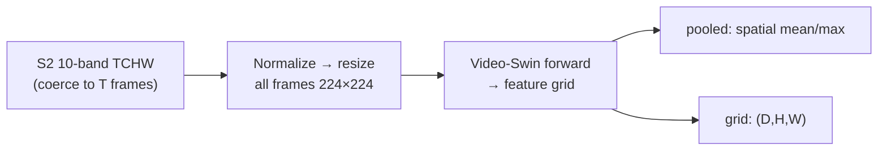
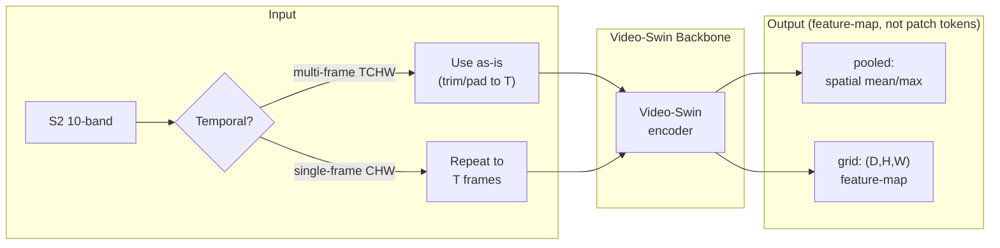

# AgriFM (`agrifm`)

## Quick Facts

| Field                | Value                                                                 |
| -------------------- | --------------------------------------------------------------------- |
| Model ID             | `agrifm`                                                              |
| Family / Backbone    | AgriFM (vendored Video Swin runtime + checkpoint loader)              |
| Adapter type         | `on-the-fly`                                                          |
| Training alignment   | High when `n_frames`, normalization, and checkpoint version are fixed |

!!! success "AgriFM In 30 Seconds"
    AgriFM is a Video-Swin-style temporal backbone trained on Sentinel-2 time series for agricultural/crop targets, and in `rs-embed` it fits best when you want a fixed-length multi-frame S2 stack turned into a pooled vector or a model feature-map grid.

    In `rs-embed`, its most important characteristics are:

    - fixed-`T`-frame stack with silent `CHW -> T` repeat behavior for single-frame inputs: see [Input Contract](#input-contract)
    - crop-oriented AgriFM S2 normalization statistics (`agrifm_stats`) as the default path: see [Environment Variables / Tuning Knobs](#environment-variables-tuning-knobs)
    - model feature-grid output `(D,H,W)` rather than a ViT patch-token reshape: see [Output Semantics](#output-semantics)

---

## Input Contract

| Field                 | Value                                                                              |
| --------------------- | ---------------------------------------------------------------------------------- |
| Backend               | provider only (`gee` / `auto`)                                                     |
| `TemporalSpec`        | `range` recommended — window split into `T` frames by the shared helper            |
| Default collection    | `COPERNICUS/S2_SR_HARMONIZED`                                                      |
| Default bands (order) | `B2, B3, B4, B5, B6, B7, B8, B8A, B11, B12` (10-band)                              |
| Default fetch         | `scale_m=10`, `cloudy_pct=30`, `composite="median"`, `fill_value=0.0`              |
| `input_chw`           | `CHW` (`C=10`, repeated to `T`) **or** `TCHW` (`C=10`, padded/truncated to exact `T`); raw SR `0..10000` |
| Side inputs           | none (adapter builds the `T`-frame stack from provider fetch)                      |

`T` is controlled by `RS_EMBED_AGRIFM_FRAMES` (default `8`). Values are clipped to raw S2 SR range `0..10000` before normalization.

---

## Preprocessing Pipeline

!!! tip "Resize is the default — tiling is also available"
    The pipeline below shows the default `input_prep="resize"` path. For large ROIs, use `input_prep="tile"` to split the input into tiles and preserve spatial detail. See [Choosing Settings](../choosing_settings.md#input-preparation-resize-vs-tile).



---

## Architecture Concept



---

## Environment Variables / Tuning Knobs

### Temporal / preprocessing

| Env var                         | Default        | Effect                                   |
| ------------------------------- | -------------- | ---------------------------------------- |
| `RS_EMBED_AGRIFM_FRAMES`        | `8`            | Fixed frame count `T`                    |
| `RS_EMBED_AGRIFM_IMG`           | `224`          | Resize target image size                 |
| `RS_EMBED_AGRIFM_NORM`          | `agrifm_stats` | `agrifm_stats`, `unit_scale`, or `none`  |
| `RS_EMBED_AGRIFM_FETCH_WORKERS` | `8`            | Provider prefetch workers for batch APIs |

### Checkpoint loading

| Env var                          | Default                    | Effect                         |
| -------------------------------- | -------------------------- | ------------------------------ |
| `RS_EMBED_AGRIFM_CKPT`           | unset                      | Local checkpoint path          |
| `RS_EMBED_AGRIFM_AUTO_DOWNLOAD`  | `1`                        | Allow checkpoint auto-download |
| `RS_EMBED_AGRIFM_CACHE_DIR`      | `~/.cache/rs_embed/agrifm` | Checkpoint cache dir           |
| `RS_EMBED_AGRIFM_CKPT_FILE`      | `AgriFM.pth`               | Cached checkpoint filename     |
| `RS_EMBED_AGRIFM_CKPT_URL`       | project default URL        | Checkpoint download URL        |
| `RS_EMBED_AGRIFM_CKPT_MIN_BYTES` | large-size threshold       | Download validation threshold  |

## Output Semantics

**`pooled`**: spatial mean/max pooling over the AgriFM feature grid; metadata records frame count and normalization settings.

**`grid`**: `(D,H,W)` feature-map output from the Video-Swin encoder, not a ViT patch-token reshape.

---

## Examples

### Minimal provider-backed example

```python
from rs_embed import get_embedding, PointBuffer, TemporalSpec, OutputSpec

emb = get_embedding(
    "agrifm",
    spatial=PointBuffer(lon=121.5, lat=31.2, buffer_m=2048),
    temporal=TemporalSpec.range("2022-01-01", "2022-12-31"),
    output=OutputSpec.pooled(),
    backend="gee",
)
```

### Example temporal packaging and normalization tuning

```python
# Example (shell):
export RS_EMBED_AGRIFM_FRAMES=8
export RS_EMBED_AGRIFM_IMG=224
export RS_EMBED_AGRIFM_NORM=agrifm_stats
```

---

## Paper & Links

- **Publication**: [RSE 2026](https://www.sciencedirect.com/science/article/pii/S0034425726000040)
- **Code**: [flyakon/AgriFM](https://github.com/flyakon/AgriFM)

---

## Reference

- Single-frame `CHW` input is silently repeated to `T` identical frames — this runs but does not represent real temporal variation.
- Output is a Video-Swin feature-map grid, not ViT patch tokens — the spatial dimensions are backbone-dependent, not `image_size / patch_size`.
- The default normalization (`agrifm_stats`) uses crop-oriented statistics; `unit_scale` may be more appropriate for non-agricultural scenes.
