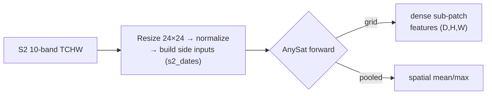
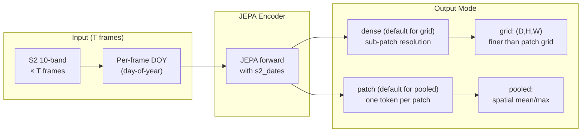

# AnySat (`anysat`)


## Quick Facts

| Field                | Value                                                               |
| -------------------- | ------------------------------------------------------------------- |
| Model ID             | `anysat`                                                            |
| Family / Backbone    | AnySat (vendored local runtime)                                     |
| Adapter type         | `on-the-fly`                                                        |
| Model config keys    | `variant` (default: `base`; choices: `base`)                        |
| Training alignment   | Medium (depends on frame count, normalization mode, and image size) |

!!! success "AnySat In 30 Seconds"
    AnySat is a JEPA-style foundation model designed to absorb *any* spatial resolution and *any* sensor modality, and in `rs-embed` it runs as a Sentinel-2 multi-frame path that builds its own `s2_dates` day-of-year side input from per-frame midpoints — so you are running real temporal sequence modeling, not a single composite.

    In `rs-embed`, its most important characteristics are:

    - **required** `s2_dates` (per-frame DOY) derived from frame-bin midpoints: see [Input Contract](#input-contract)
    - dense sub-patch grid as the default `grid` path, denser than the usual ViT patch grid: see [Output Semantics](#output-semantics)
    - `sensor.scale_m` / `fetch.scale_m` must be a positive multiple of 10 m: see [Preprocessing Pipeline](#preprocessing-pipeline)

---

## Input Contract

| Field                 | Value                                                                              |
| --------------------- | ---------------------------------------------------------------------------------- |
| Backend               | provider (`auto` recommended in public API)                                        |
| `TemporalSpec`        | `range` recommended — window split into `T` sub-windows for temporal modeling      |
| Default collection    | `COPERNICUS/S2_SR_HARMONIZED`                                                      |
| Default bands (order) | `B2, B3, B4, B5, B6, B7, B8, B8A, B11, B12` (10-band)                              |
| Default fetch         | `scale_m=10` (must be a positive multiple of 10), `cloudy_pct=30`, `composite="median"`, `fill_value=0.0` |
| `input_chw`           | `CHW` (`C=10`, repeated to `T`) **or** `TCHW` (`C=10`, padded/truncated to exact `T`); raw SR `0..10000` |
| Side inputs           | **required** `s2_dates` `[1,T]` — auto-derived from per-frame midpoint DOY         |

`T` is controlled by `RS_EMBED_ANYSAT_FRAMES` (default `8`). `sensor.scale_m` / `fetch.scale_m` must be a positive multiple of 10 m.

---

## Preprocessing Pipeline

!!! tip "Resize is the default — tiling is also available"
    The pipeline below shows the default `input_prep="resize"` path. For large ROIs, use `input_prep="tile"` to split the input into tiles and preserve spatial detail. See [Choosing Settings](../choosing_settings.md#input-preparation-resize-vs-tile).



!!! warning "Important constraint"
    `sensor.scale_m` or `fetch.scale_m` must be a positive multiple of 10 meters.

---

## Architecture Concept



---

## Environment Variables / Tuning Knobs

| Env var                          | Default                    | Effect                                                              |
| -------------------------------- | -------------------------- | ------------------------------------------------------------------- |
| `RS_EMBED_ANYSAT_FRAMES`         | `8`                        | Number of temporal frames `T`                                       |
| `RS_EMBED_ANYSAT_IMG`            | `24`                       | Per-frame resize target (square)                                    |
| `RS_EMBED_ANYSAT_NORM`           | `per_tile_zscore`          | Series normalization mode                                           |
| `RS_EMBED_ANYSAT_MODEL_SIZE`     | `base`                     | AnySat model size                                                   |
| `RS_EMBED_ANYSAT_GRID_MODE`      | `dense`                    | Grid path native AnySat spatial output (`dense` or `patch`)         |
| `RS_EMBED_ANYSAT_POOLED_SOURCE`  | `patch`                    | Pooled path source (`patch` compatibility pooling or native `tile`) |
| `RS_EMBED_ANYSAT_FLASH_ATTN`     | `0`                        | Enable flash attention path if supported                            |
| `RS_EMBED_ANYSAT_PRETRAINED`     | `1`                        | Load pretrained checkpoint weights                                  |
| `RS_EMBED_ANYSAT_CKPT`           | unset                      | Local checkpoint override                                           |
| `RS_EMBED_ANYSAT_HF_REPO`        | `g-astruc/AnySat`          | Hugging Face repo used for checkpoint download                      |
| `RS_EMBED_ANYSAT_HF_FILE`        | `models/AnySat.pth`        | Checkpoint file inside the Hugging Face repo                        |
| `RS_EMBED_ANYSAT_CACHE_DIR`      | `~/.cache/rs_embed/anysat` | Checkpoint cache dir                                                |
| `RS_EMBED_ANYSAT_CKPT_MIN_BYTES` | adapter threshold          | Download size sanity check                                          |
| `RS_EMBED_ANYSAT_FETCH_WORKERS`  | `8`                        | Provider prefetch workers for batch APIs                            |

## Output Semantics

**`pooled`**: defaults to spatial pooling over AnySat's `patch` grid; pass `pooled_source="tile"` (or `RS_EMBED_ANYSAT_POOLED_SOURCE=tile`) to use the native AnySat tile embedding instead.

**`grid`**: defaults to AnySat `dense` sub-patch features `(D,H,W)`; pass `grid_feature_mode="patch"` (or `RS_EMBED_ANYSAT_GRID_MODE=patch`) to recover the older patch-grid behavior.

---

## Examples

### Minimal example

```python
from rs_embed import get_embedding, PointBuffer, TemporalSpec, OutputSpec

emb = get_embedding(
    "anysat",
    spatial=PointBuffer(lon=121.5, lat=31.2, buffer_m=2048),
    temporal=TemporalSpec.range("2022-01-01", "2023-01-01"),
    output=OutputSpec.pooled(),
    backend="auto",
)
```

### Example with temporal/frame tuning (env-controlled)

```python
# Example (shell):
export RS_EMBED_ANYSAT_FRAMES=8
export RS_EMBED_ANYSAT_NORM=per_tile_zscore
export RS_EMBED_ANYSAT_IMG=24
```

---

## Paper & Links

- **Publication**: [CVPR 2025](https://arxiv.org/abs/2412.14123)
- **Code**: [gastruc/AnySat](https://github.com/gastruc/AnySat)

---

## Reference

- `sensor.scale_m` / `fetch.scale_m` must be a positive multiple of 10 m — non-multiples raise immediately.
- The default grid output uses `dense` (sub-patch resolution), which differs from most other models' patch-level grids.
- Single-frame `CHW` input is silently repeated to `T` frames — this is valid but produces a different temporal signal than actual multi-frame data.
