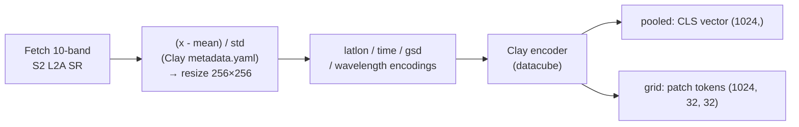
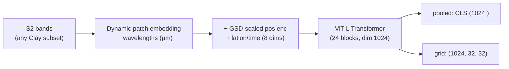

# Clay (`clay`)

## Quick Facts

| Field                | Value                                                              |
| -------------------- | ------------------------------------------------------------------ |
| Model ID             | `clay`                                                             |
| Family / Backbone    | Clay v1.5 MAE encoder (ViT-L-class, patch 8, dynamic patch embed)  |
| Adapter type         | `on-the-fly`                                                       |
| Model config keys    | `model_size` (default: `large`; must match the checkpoint)         |
| Training alignment   | High (official metadata.yaml stats + official metadata encodings)  |

!!! success "Clay In 30 Seconds"
    Clay is an open-source Earth foundation model trained as a masked autoencoder across many sensors. Its encoder is conditioned on *metadata, not just pixels*: per-channel wavelengths generate the patch embedding (DOFA-style dynamic embedding), the position encoding is scaled by ground sample distance (GSD), and normalized lat/lon + acquisition-time vectors are added to every patch token.

    In `rs-embed`, its most important characteristics are:

    - Sentinel-2 L2A 10-band input, normalized with the official Clay `metadata.yaml` per-band mean/std (raw SR DN, no rescale): see [Preprocessing Pipeline](#preprocessing-pipeline)
    - lat/lon + temporal-midpoint + gsd + wavelength conditioning built automatically from `spatial` / `temporal` / `sensor`: see [Metadata Conditioning](#metadata-conditioning)
    - pooled output is the encoder **CLS token** (the official "embedding" of the Clay tutorials); rectangular ROIs are fetch-square enlarged and pooled from the ROI's tokens (`roi_grid_mean`)

---

## Input Contract

=== "Provider backend (`gee` / `auto`)"

    | Field                 | Value                                                                          |
    | --------------------- | ------------------------------------------------------------------------------ |
    | `TemporalSpec`        | `range` or `year` (normalized to range; midpoint drives the time encoding)     |
    | Default collection    | `COPERNICUS/S2_SR_HARMONIZED`                                                  |
    | Default bands (order) | `B2, B3, B4, B5, B6, B7, B8, B8A, B11, B12` (Clay `sentinel-2-l2a` band order) |
    | Default fetch         | `scale_m=10`, `cloudy_pct=30`, `composite="median"`, `fill_value=0.0`          |
    | `input_chw` override  | `CHW`, `C == len(bands)`, raw SR DN values                                     |
    | Side inputs           | wavelengths (µm) resolved from Clay's metadata for the requested S2 bands      |

=== "Tensor backend (`tensor`)"

    | Field          | Value                                                                          |
    | -------------- | ------------------------------------------------------------------------------ |
    | `TemporalSpec` | used for the time encoding (defaults to the standard range when `None`)        |
    | `input_chw`    | **required**, `CHW`, raw SR DN — **not** pre-normalized `[0,1]`                |
    | `sensor.bands` | required unless `C == 10` (then the default 10-band order is assumed)          |
    | Batch API      | use `get_embeddings_batch_from_inputs(...)` for batched tensor inputs          |

!!! note "Band subsets"
    Clay's dynamic patch embedding is band-flexible by design: any subset of the 10 supported S2 bands works, and the adapter resolves the matching mean/std/wavelength triplets per band. Bands outside Clay's `sentinel-2-l2a` metadata (e.g. `B1`, `B9`) raise immediately.

---

## Preprocessing Pipeline

### Provider path



Normalization follows the official Clay embedding tutorials exactly: raw surface-reflectance DN values are standardized per band with the `sentinel-2-l2a` statistics from Clay's `metadata.yaml` (`v2.Normalize(mean, std)` equivalent — no `[0,1]` rescale, no clipping).

!!! note "Fixed adapter behavior"
    Image size is fixed at `256` (Clay's chip size; `256 / patch 8 → 32×32` token grid). A rectangular ROI is fetch-square enlarged (real imagery, not stretched) and the token grid is cropped back to the ROI after encoding.

---

## Metadata Conditioning

Clay's encoder input is a *datacube*, not a bare image. The adapter assembles it per the official recipe:

| Datacube key | Built from                | Encoding                                                        |
| ------------ | ------------------------- | --------------------------------------------------------------- |
| `pixels`     | provider fetch / tensor   | per-band standardized, 256×256                                  |
| `latlon`     | `spatial` center          | `[sin lat, cos lat, sin lon, cos lon]` (radians)                |
| `time`       | `temporal` midpoint       | `[sin week, cos week, sin hour, cos hour]` (ISO week / hour)    |
| `gsd`        | `sensor.scale_m`          | scalar; scales the 2-D sin/cos position encoding                |
| `waves`      | Clay metadata per band    | central wavelengths (µm) → dynamic patch-embedding weights      |

A median composite has no acquisition hour, so the hour term is encoded at `0` (midnight), matching date-only usage in the official tutorials.

---

## Architecture Concept



---

## Environment Variables / Tuning Knobs

| Env var                       | Default               | Effect                                             |
| ----------------------------- | --------------------- | -------------------------------------------------- |
| `RS_EMBED_CLAY_FETCH_WORKERS` | `8`                   | Provider prefetch workers for batch APIs           |
| `RS_EMBED_CLAY_BATCH_SIZE`    | CPU:`4`, CUDA:`32`    | Inference batch size for batch APIs                |
| `RS_EMBED_CLAY_WEIGHTS`       | unset                 | Local override for the checkpoint file             |
| `RS_EMBED_CLAY_WEIGHTS_DIR`   | unset                 | Directory override containing the checkpoint       |
| `RS_EMBED_CLAY_HF_REPO_ID`    | `made-with-clay/Clay` | Hugging Face repo used for checkpoint download     |
| `RS_EMBED_CLAY_HF_FILENAME`   | `v1.5/clay-v1.5.ckpt` | Checkpoint file inside the repo                    |
| `RS_EMBED_CLAY_HF_REVISION`   | `main`                | Hugging Face revision used for checkpoint download |
| `RS_EMBED_CLAY_MODEL_SIZE`    | `large`               | Encoder size (must match the checkpoint)           |

---

## Model-specific Settings

The published v1.5 checkpoint is the `large` encoder; `model_size` exists for custom/self-trained checkpoints only.

| model_size | Patch size | Embed dim | Blocks | Heads | Notes                                        |
| ---------- | ---------- | --------- | ------ | ----- | -------------------------------------------- |
| `large`    | 8          | 1024      | 24     | 16    | Default; matches `v1.5/clay-v1.5.ckpt` (~311M encoder params) |
| `base`     | 8          | 768       | 12     | 12    | For custom checkpoints                       |
| `small`    | 8          | 384       | 6      | 6     | For custom checkpoints                       |
| `tiny`     | 8          | 192       | 6      | 4     | For custom checkpoints                       |

The checkpoint is the full Lightning MAE checkpoint (~4.8 GB, includes decoder + frozen teacher); only the `model.encoder.*` weights are loaded.

---

## Examples

### Minimal provider-backed example

```python
from rs_embed import get_embedding, PointBuffer, TemporalSpec, OutputSpec

emb = get_embedding(
    "clay",
    spatial=PointBuffer(lon=121.5, lat=31.2, buffer_m=1280),
    temporal=TemporalSpec.range("2023-06-01", "2023-09-01"),
    output=OutputSpec.pooled(),   # (1024,) CLS embedding
    backend="gee",
)
```

### Patch-token grid

```python
emb = get_embedding(
    "clay",
    spatial=PointBuffer(lon=121.5, lat=31.2, buffer_m=1280),
    temporal=TemporalSpec.year(2023),
    output=OutputSpec.grid(),     # (1024, 32, 32)
    backend="gee",
)
```

---

## Paper & Links

- **Project**: [madewithclay.org](https://madewithclay.org)
- **Code**: [Clay-foundation/model](https://github.com/Clay-foundation/model) (Apache-2.0)
- **Weights**: [made-with-clay/Clay](https://huggingface.co/made-with-clay/Clay) (v1.5)
- **Docs**: [Clay documentation](https://clay-foundation.github.io/model/)

---

## Reference

- The tensor backend rejects inputs already in `[0,1]` — pass raw SR DN values.
- Pooled output is the CLS token (`model_cls`); a rectangular ROI switches pooled output to the ROI token mean (`roi_grid_mean`).
- The lat/lon and time encodings come from `spatial`/`temporal`, so identical pixels at different locations/dates produce (slightly) different embeddings — this is Clay's designed behavior.
