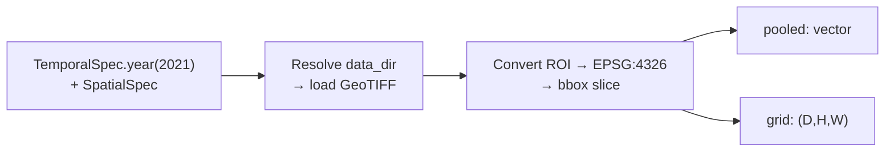
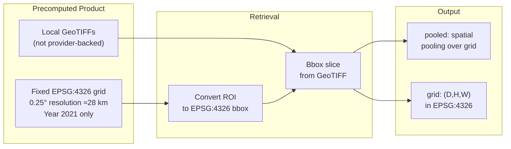

# Copernicus Embed (`copernicus`)


## Quick Facts

| Field             | Value                                                              |
| ----------------- | ------------------------------------------------------------------ |
| Model ID          | `copernicus`                                                       |
| Aliases           | `copernicus_embed`                                                 |
| Family / Source   | `torchgeo/copernicus_embed` GeoTIFF redistribution on Hugging Face |
| Adapter type      | `precomputed`                                                      |
| Training alignment | N/A (precomputed product)                                         |

!!! success "Copernicus Embed In 30 Seconds"
    Copernicus Embed is a precomputed global embedding product redistributed as local GeoTIFFs via the `torchgeo/copernicus_embed` Hugging Face dataset. `rs-embed` does no model inference here, it just slices the requested bbox out of a local GeoTIFF on a fixed `EPSG:4326` 0.25° grid.

    In `rs-embed`, its most important characteristics are:

    - **strict** `TemporalSpec.year(2021)`; no other years are currently supported: see [Retrieval Contract](#retrieval-contract)
    - product CRS is a fixed `EPSG:4326` 0.25° grid, differing from the EPSG:3857 default used by provider-backed paths elsewhere: see [Retrieval Contract](#retrieval-contract)
    - ROIs smaller than one full 0.25° pixel raise immediately instead of silently returning an empty grid: see [Retrieval Pipeline](#retrieval-pipeline)

---

## Retrieval Contract

| Field              | Value                                                                              |
| ------------------ | ---------------------------------------------------------------------------------- |
| Backend            | `auto` (legacy `local` still accepted)                                             |
| `SpatialSpec`      | `BBox` direct, or `PointBuffer` converted to EPSG:4326 bbox                        |
| `TemporalSpec`     | `TemporalSpec.year(2021)`; `range(...)` accepted → uses start year (+`UserWarning`), which must be `2021` else raises |
| Source             | `torchgeo/copernicus_embed` local GeoTIFF                                          |
| Product CRS        | fixed `EPSG:4326` 0.25° grid                                                       |
| Product resolution | 0.25° (~28 km at equator)                                                          |
| Data directory     | `RS_EMBED_COP_DIR` (default `data/copernicus_embed`), or per-call `sensor.collection="dir:/path/to/copernicus_embed"` |
| Side inputs        | none                                                                               |

!!! warning "CRS differs from provider-backed models"
    Copernicus Embed keeps its product-native `EPSG:4326` 0.25° grid even though the public spatial input is still `EPSG:4326`. Other provider-backed models sample on EPSG:3857 by default — do not compare grids across these two paths without reprojecting.

---

## Retrieval Pipeline



!!! note "Temporal metadata"
    `temporal` is validated, but metadata in the current adapter is built with `temporal=None`, so record the requested year externally if strict provenance matters.

---

## Architecture Concept



---

## Environment Variables / Tuning Knobs

| Env var                             | Default                 | Effect                                             |
| ----------------------------------- | ----------------------- | -------------------------------------------------- |
| `RS_EMBED_COP_DIR`                  | `data/copernicus_embed` | Local Copernicus embed GeoTIFF directory           |
| `RS_EMBED_COPERNICUS_BATCH_WORKERS` | `4`                     | Batch worker count for `get_embeddings_batch(...)` |

!!! info "Non-env override"
    `sensor.collection="dir:/path/to/copernicus_embed"` overrides the data directory per call.

Current fixed adapter behavior (not env-configurable in v0.1):

The current adapter keeps `download=True`, and that is not env-configurable in v0.1.

---

## Output Semantics

**`pooled`**: spatial pooling over the sampled `CHW` embedding grid.

**`grid`**: `(D,H,W)` slice of the product grid; metadata records `input_crs=EPSG:4326`, `output_crs=EPSG:4326`, and `product_resolution_deg=0.25`.

---

## Examples

### Minimal example

```python
from rs_embed import get_embedding, PointBuffer, TemporalSpec, OutputSpec

emb = get_embedding(
    "copernicus",
    spatial=PointBuffer(lon=121.5, lat=31.2, buffer_m=5000),
    temporal=TemporalSpec.year(2021),
    output=OutputSpec.pooled(),
    backend="auto",
)
```

### Local dataset directory override

```python
# Example (shell):
export RS_EMBED_COP_DIR=/data/copernicus_embed
```

---

## Paper & Links

- **Publication**: [ICCV 2025](https://arxiv.org/abs/2503.11849)

---

## Reference

- Only year `2021` is supported in the current adapter — other years raise immediately.
- The grid is EPSG:4326 at 0.25° resolution (≈28 km) — ROIs smaller than one pixel raise an error.
- This is a local GeoTIFF product, not provider-backed — `tifffile` / `imagecodecs` must be installed.
