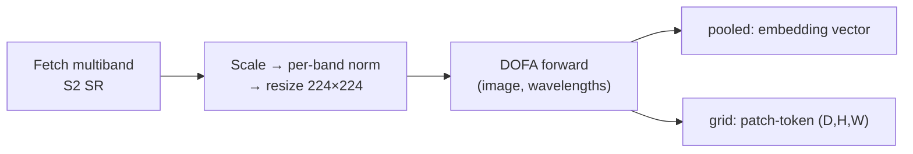
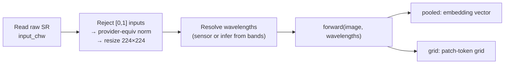
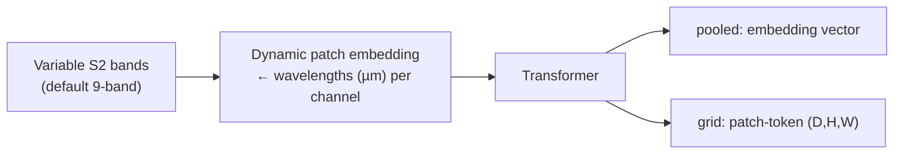

# DOFA (`dofa`)

## Quick Facts

| Field                | Value                                                         |
| -------------------- | ------------------------------------------------------------- |
| Model ID             | `dofa`                                                        |
| Family / Backbone    | DOFA ViT (`base` / `large`, official checkpoints)             |
| Adapter type         | `on-the-fly`                                                  |
| Model config keys    | `variant` (default: `base`; choices: `base`, `large`)         |
| Training alignment   | Medium-High (when wavelengths and band semantics are correct) |

!!! success "DOFA In 30 Seconds"
    DOFA ("Dynamic One-For-All") is a wavelength-conditioned ViT: it takes a per-channel wavelength vector (µm) as an *explicit* side input and uses it to generate its patch embeddings, so arbitrary multispectral band combinations work as long as you provide matching wavelengths — the wavelengths are part of the model input, not metadata.

    In `rs-embed`, its most important characteristics are:

    - **required** per-channel `wavelengths_um` side input; inference from `sensor.bands` only works for known S2 subsets: see [Input Contract](#input-contract)
    - official DOFA S2 per-band mean/std preprocessing locked to fixed `224×224`: see [Preprocessing Pipeline](#preprocessing-pipeline)
    - supports both provider backend *and* `backend="tensor"`, with the tensor path rejecting already-normalized `[0,1]` inputs: see [Input Contract](#input-contract)

---

## Input Contract

=== "Provider backend (`gee` / `auto`)"

    | Field                 | Value                                                                      |
    | --------------------- | -------------------------------------------------------------------------- |
    | `TemporalSpec`        | **required** `TemporalSpec.range(start, end)`                              |
    | Default collection    | `COPERNICUS/S2_SR_HARMONIZED`                                              |
    | Default bands (order) | `B4, B3, B2, B5, B6, B7, B8, B11, B12` (official DOFA S2 9-band order)     |
    | Default fetch         | `scale_m=10`, `cloudy_pct=30`, `composite="median"`, `fill_value=0.0`      |
    | `input_chw` override  | `CHW`, `C == len(bands)`, raw SR `0..10000`                                |
    | Side inputs           | **required** `wavelengths_um` (µm, one per channel)                        |

=== "Tensor backend (`tensor`)"

    | Field          | Value                                                                                 |
    | -------------- | ------------------------------------------------------------------------------------- |
    | `TemporalSpec` | ignored (no provider fetch)                                                           |
    | `input_chw`    | **required**, `CHW`, raw SR `0..10000` — **not** pre-normalized `[0,1]`               |
    | `sensor.bands` | **required** — gates the official per-band preprocessing path                         |
    | Side inputs    | **required** `wavelengths_um`, or inferable from `sensor.bands` for known S2 subsets  |
    | Batch API      | use `get_embeddings_batch_from_inputs(...)` for batched tensor inputs                 |

!!! note "Wavelength inference"
    If `sensor.wavelengths` is not provided, the adapter tries to infer from `sensor.bands`, but this only works for the known Sentinel-2 subsets. Whatever the source, `len(wavelengths_um)` must always match `C`. For custom band combinations, pass `sensor.wavelengths` explicitly.

---

## Preprocessing Pipeline

!!! tip "Tiling is the default — resize is also available"
    `input_prep=None`/`"auto"` tiles large ROIs by default to preserve spatial detail; pass `input_prep="resize"` to downsample the whole ROI to the model's input size in a single forward pass instead. See [Choosing Settings](../choosing_settings.md#input-preparation-resize-vs-tile).

### Provider path



### Tensor path



!!! note "Fixed adapter behavior"
    The current implementation fixes image size at `224`, and the official preprocessing path is defined for Sentinel-2 subsets of `B4,B3,B2,B5,B6,B7,B8,B11,B12`.

---

## Architecture Concept



---

## Environment Variables / Tuning Knobs

| Env var                       | Default            | Effect                                              |
| ----------------------------- | ------------------ | --------------------------------------------------- |
| `RS_EMBED_DOFA_FETCH_WORKERS` | `8`                | Provider prefetch workers for batch APIs            |
| `RS_EMBED_DOFA_BATCH_SIZE`    | CPU:`8`, CUDA:`64` | Inference batch size for batch APIs                 |
| `RS_EMBED_DOFA_BASE_WEIGHTS`  | unset              | Local override for the base checkpoint file         |
| `RS_EMBED_DOFA_LARGE_WEIGHTS` | unset              | Local override for the large checkpoint file        |
| `RS_EMBED_DOFA_WEIGHTS_DIR`   | unset              | Directory override containing DOFA checkpoint files |
| `RS_EMBED_DOFA_HF_REPO_ID`    | `earthflow/DOFA`   | Hugging Face repo used for checkpoint download      |
| `RS_EMBED_DOFA_HF_REVISION`   | `main`             | Hugging Face revision used for checkpoint download  |

Non-env model selection knobs:

The main non-env knobs are `variant` (`base` or `large`), `sensor.bands` for channel semantics and wavelength inference, and `sensor.wavelengths` for an explicit wavelength vector in micrometers.

---

## Model-specific Settings

`variant` selects the DOFA backbone size. In `rs-embed`, pass it as `variant="base" | "large"` (or their one-letter aliases `"b"`/`"l"`).

| Variant | Vendored builder    | HF checkpoint file       | Patch size | Embed dim | Transformer blocks | Attention heads | Notes                                                                              |
| ------- | ------------------- | ------------------------ | ---------- | --------- | ------------------ | --------------- | ---------------------------------------------------------------------------------- |
| `base`  | `vit_base_patch16`  | `DOFA_ViT_base_e100.pth` | 16         | 768       | 12                 | 12              | Current default. ViT-B/16-class backbone with the DOFA wavelength-dynamic patch embed (~113M params total). |
| `large` | `vit_large_patch16` | `DOFA_ViT_large_e100.pth`| 16         | 1024      | 24                 | 16              | Highest capacity. ViT-L/16-class backbone (~329M params total).                    |

!!! info "How To Read Embed Dim"
    `Embed dim` is DOFA's `embed_dim` and becomes the pooled embedding width `(D,)` and the channel dimension of a `grid` output `(D,H,W)`.

Checkpoints are downloaded from `RS_EMBED_DOFA_HF_REPO_ID` (default `earthflow/DOFA`) at `RS_EMBED_DOFA_HF_REVISION`. You can fully override them with `RS_EMBED_DOFA_BASE_WEIGHTS` / `RS_EMBED_DOFA_LARGE_WEIGHTS`, or point `RS_EMBED_DOFA_WEIGHTS_DIR` at a directory that contains both files.

!!! tip "Quick reminder"
    Pass `variant` directly to `get_embedding("dofa", ..., variant="base")`. For export jobs, use `ExportModelRequest.configure("dofa", variant="large")`.

Example:

```python
from rs_embed import PointBuffer, TemporalSpec, OutputSpec, get_embedding

emb = get_embedding(
    "dofa",
    spatial=PointBuffer(lon=121.5, lat=31.2, buffer_m=2048),
    temporal=TemporalSpec.range("2022-06-01", "2022-09-01"),
    output=OutputSpec.pooled(),
    backend="gee",
    variant="large",
)
```

---

## Examples

### Minimal provider-backed example (S2 wavelengths inferred automatically)

```python
from rs_embed import get_embedding, PointBuffer, TemporalSpec, OutputSpec

emb = get_embedding(
    "dofa",
    spatial=PointBuffer(lon=121.5, lat=31.2, buffer_m=2048),
    temporal=TemporalSpec.range("2022-06-01", "2022-09-01"),
    output=OutputSpec.pooled(),
    backend="gee",
)
```

### Switch to the large checkpoint

```python
from rs_embed import get_embedding, PointBuffer, TemporalSpec, OutputSpec

emb = get_embedding(
    "dofa",
    spatial=PointBuffer(lon=121.5, lat=31.2, buffer_m=2048),
    temporal=TemporalSpec.range("2022-06-01", "2022-09-01"),
    output=OutputSpec.pooled(),
    backend="gee",
    variant="large",
)
```

### Custom bands / wavelengths example (conceptual)

```python
from rs_embed import SensorSpec

sensor = SensorSpec(
    collection="COPERNICUS/S2_SR_HARMONIZED",
    bands=("B2", "B3", "B4", "B8"),
    scale_m=10,
)
# If bands are non-standard, provide wavelengths explicitly via an extended sensor object/field used by your code path.
```

---

## Paper & Links

- **Publication**: [arXiv 2024](https://arxiv.org/abs/2403.15356)
- **Code**: [zhu-xlab/DOFA](https://github.com/zhu-xlab/DOFA)

---

## Reference

- The tensor backend rejects inputs already in `[0,1]` — pass raw SR values (`0..10000`).
- `wavelengths_um` must have exactly as many entries as input channels. If using non-standard bands, pass `sensor.wavelengths` explicitly.
- Only `base` and `large` variants exist; other values raise immediately.
