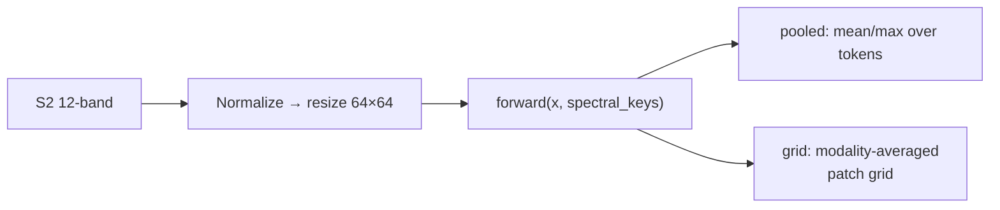
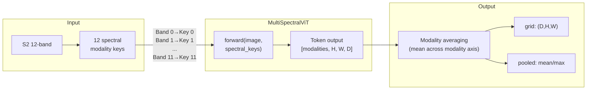

# FoMo (`fomo`)


## Quick Facts

| Field                | Value                                                                                    |
| -------------------- | ---------------------------------------------------------------------------------------- |
| Model ID             | `fomo`                                                                                   |
| Family / Backbone    | FoMo-Bench `MultiSpectralViT` (vendored local code + checkpoint loader)                  |
| Adapter type         | `on-the-fly`                                                                             |
| Training alignment   | Medium-High when `S2_KEYS`, normalization, and model config match checkpoint assumptions |

!!! success "FoMo In 30 Seconds"
    FoMo (FoMo-Bench `MultiSpectralViT`) treats each Sentinel-2 band as its own spectral *modality*: alongside the 12-band image the adapter passes 12 modality keys, and the model emits a token sequence whose layout is `[modalities, H, W, D]`, which `rs-embed` then averages over the modality dimension to produce a single spatial grid.

    In `rs-embed`, its most important characteristics are:

    - **required** 12-value spectral modality key mapping (one integer per S2 channel), overridable via `RS_EMBED_FOMO_S2_KEYS`: see [Input Contract](#input-contract)
    - `grid` output is a modality-averaged patch grid, with a `1×1` vector grid fallback when token layout is incompatible: see [Output Semantics](#output-semantics)
    - small default input size (`64`) and patch size (`16`) that must stay aligned with the checkpoint — changing model-config envs silently breaks loading: see [Environment Variables / Tuning Knobs](#environment-variables-tuning-knobs)

---

## Input Contract

| Field                 | Value                                                                              |
| --------------------- | ---------------------------------------------------------------------------------- |
| Backend               | provider only (`gee` / `auto`)                                                     |
| `TemporalSpec`        | `range` recommended (normalized via shared helper)                                 |
| Default collection    | `COPERNICUS/S2_SR_HARMONIZED`                                                      |
| Default bands (order) | `B1, B2, B3, B4, B5, B6, B7, B8, B8A, B9, B11, B12` (12-band)                      |
| Default fetch         | `scale_m=10`, `cloudy_pct=30`, `composite="median"`, `fill_value=0.0`              |
| `input_chw`           | `CHW`, `C=12` in adapter band order, raw SR `0..10000`                             |
| Side inputs           | **required** 12 spectral modality keys — adapter provides S2 defaults              |

!!! note "Spectral modality keys"
    The FoMo forward path requires one modality key per channel. The default S2 mapping is encoded in `_DEFAULT_S2_MODALITY_KEYS`, and can be overridden via `RS_EMBED_FOMO_S2_KEYS` (exactly 12 comma-separated integers).

---

## Preprocessing Pipeline

!!! tip "Tiling is the default — resize is also available"
    `input_prep=None`/`"auto"` tiles large ROIs by default to preserve spatial detail; pass `input_prep="resize"` to downsample the whole ROI to the model's input size in a single forward pass instead. See [Choosing Settings](../choosing_settings.md#input-preparation-resize-vs-tile).



---

## Architecture Concept



---

## Environment Variables / Tuning Knobs

### Core model / preprocessing

| Env var                       | Default                    | Effect                                                 |
| ----------------------------- | -------------------------- | ------------------------------------------------------ |
| `RS_EMBED_FOMO_IMG`           | `64`                       | Resize target image size                               |
| `RS_EMBED_FOMO_PATCH`         | `16`                       | Patch size (used for model config + grid expectations) |
| `RS_EMBED_FOMO_NORM`          | `unit_scale`               | `unit_scale`, `per_tile_minmax`, or `none`             |
| `RS_EMBED_FOMO_S2_KEYS`       | adapter S2 default mapping | 12 comma-separated modality keys                       |
| `RS_EMBED_FOMO_FETCH_WORKERS` | `8`                        | Provider prefetch workers for batch APIs               |

### FoMo model config (advanced; keep aligned with checkpoint)

| Env var                     | Default | Effect                                 |
| --------------------------- | ------- | -------------------------------------- |
| `RS_EMBED_FOMO_DIM`         | `768`   | Model dim                              |
| `RS_EMBED_FOMO_DEPTH`       | `12`    | Transformer depth                      |
| `RS_EMBED_FOMO_HEADS`       | `12`    | Attention heads                        |
| `RS_EMBED_FOMO_MLP_DIM`     | `2048`  | MLP dim                                |
| `RS_EMBED_FOMO_NUM_CLASSES` | `1000`  | Class head size (config compatibility) |

### Checkpoint loading

| Env var                        | Default                          | Effect                         |
| ------------------------------ | -------------------------------- | ------------------------------ |
| `RS_EMBED_FOMO_CKPT`           | unset                            | Local checkpoint path          |
| `RS_EMBED_FOMO_AUTO_DOWNLOAD`  | `1`                              | Allow checkpoint auto-download |
| `RS_EMBED_FOMO_CACHE_DIR`      | `~/.cache/rs_embed/fomo`         | Checkpoint cache dir           |
| `RS_EMBED_FOMO_CKPT_FILE`      | default FoMo checkpoint filename | Cached ckpt filename           |
| `RS_EMBED_FOMO_CKPT_URL`       | default Dropbox URL              | Checkpoint download URL        |
| `RS_EMBED_FOMO_CKPT_MIN_BYTES` | adapter threshold                | Download size sanity check     |

---

## Output Semantics

**`pooled`**: token mean/max over the full sequence; metadata records `token_count`, `token_dim`, and pooling mode.

**`grid`**: tokens are interpreted as `[modalities, H, W, D]`, averaged over modalities → `(D,H,W)` with `grid_kind="spectral_mean_patch_tokens"`; falls back to a `1x1` vector grid with `grid_kind="vector_as_1x1"` when token layout is incompatible.

---

## Examples

### Minimal provider-backed example

```python
from rs_embed import get_embedding, PointBuffer, TemporalSpec, OutputSpec

emb = get_embedding(
    "fomo",
    spatial=PointBuffer(lon=121.5, lat=31.2, buffer_m=2048),
    temporal=TemporalSpec.range("2022-06-01", "2022-09-01"),
    output=OutputSpec.pooled(),
    backend="gee",
)
```

### Example FoMo tuning (env-controlled)

```python
# Example (shell):
export RS_EMBED_FOMO_IMG=64
export RS_EMBED_FOMO_PATCH=16
export RS_EMBED_FOMO_NORM=unit_scale
export RS_EMBED_FOMO_S2_KEYS=6,7,8,9,10,11,12,13,14,15,17,18
```

---

## Paper & Links

- **Publication**: [AAAI 2025](https://arxiv.org/abs/2312.10114)
- **Code**: [RolnickLab/FoMo-Bench](https://github.com/RolnickLab/FoMo-Bench)

---

## Reference

- `RS_EMBED_FOMO_S2_KEYS` must have exactly 12 values — length mismatches raise immediately.
- Grid output uses modality-averaging over spectral keys; if the token layout is incompatible, the adapter falls back to a `1×1` grid.
- The default image size is `64` (not 224) — this is intentional and matches FoMo's architecture.
