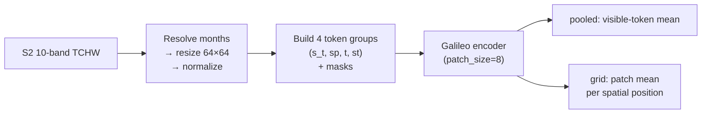
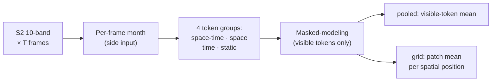

# Galileo (`galileo`)

## Quick Facts

| Field                | Value                                                               |
| -------------------- | ------------------------------------------------------------------- |
| Model ID             | `galileo`                                                           |
| Family / Backbone    | Galileo `Encoder` from vendored local runtime                       |
| Adapter type         | `on-the-fly`                                                        |
| Training alignment   | Medium (depends on `temporal_mode`, `IMG`, `PATCH`, normalization)  |

!!! success "Galileo In 30 Seconds"
    Galileo is NASA Harvest's masked-modeling multi-modal encoder with structured token groups (space-time / space / time / static), and in `rs-embed` it runs as a Sentinel-2 multi-frame path that derives per-frame `months` tokens from frame-bin midpoints and does both pooled and grid output from visible (unmasked) tokens at Galileo's own patch level.

    In `rs-embed`, its most important characteristics are:

    - **window-adaptive** temporal sampling (`temporal_mode="auto"`): ~30-day frames, ≤12, matching Galileo's monthly pretraining cadence — see [Temporal Sampling](#temporal-sampling)
    - **required** per-frame `months` side input, optionally forced to a constant via `RS_EMBED_GALILEO_MONTH`: see [Input Contract](#input-contract)
    - hard constraint: `image_size % patch_size == 0`: see [Preprocessing Pipeline](#preprocessing-pipeline)
    - pooled/grid use Galileo's own visible-token averaging at the patch level rather than a generic token reshape: see [Output Semantics](#output-semantics)

---

## Input Contract

| Field                 | Value                                                                                              |
| --------------------- | -------------------------------------------------------------------------------------------------- |
| Backend               | provider (`auto` recommended in public API)                                                        |
| `TemporalSpec`        | `range` recommended — `T` is derived from the window (see [Temporal Sampling](#temporal-sampling)) |
| Default collection    | `COPERNICUS/S2_SR_HARMONIZED`                                                                      |
| Default bands (order) | `B2, B3, B4, B5, B6, B7, B8, B8A, B11, B12` (10-band)                                              |
| Default fetch         | `scale_m=10`, `cloudy_pct=30`, `composite="median"`, `fill_value=0.0`                              |
| `input_chw`           | `CHW` (`C=10`, repeated to `T`) **or** `TCHW` (`C=10`, padded/truncated to exact `T`); raw SR `0..10000` |
| Side inputs           | **required** `months` `[1,T]` — derived from frame-bin midpoints, or forced via `RS_EMBED_GALILEO_MONTH` |

`T` is window-adaptive by default (see [Temporal Sampling](#temporal-sampling)); pin it manually with `RS_EMBED_GALILEO_FRAMES` or `n_frames=`. `image_size % patch_size == 0` is a hard constraint — see [Preprocessing Pipeline](#preprocessing-pipeline).

---

## Temporal Sampling

Galileo encodes **month-of-year** (0–11) per frame and pretrains on ~monthly composites capped at 12 frames. `rs-embed` matches that cadence by deriving the frame count from the requested window instead of using a fixed number — the same `fixed_or_equal_bins` policy used by [`olmoearth`](olmoearth.md#temporal_mode) (see the cross-model [Temporal Sampling](../temporal_sampling.md) overview):

| `temporal_mode` | Behavior |
| --------------- | -------- |
| `auto` (default) | `single` (T=1) when the window spans one monthly frame (≤ ~1 month); `multi` otherwise. |
| `single` | One composite over the whole range (T=1). |
| `multi` | `~30-day` frames anchored at the range start, at most **12**. |

For windows longer than the 12-month capacity (beyond ~390 days), the range is **equal-divided into 12 frames** so the whole period is covered (instead of dropping the trailing time). Because those frames are then spaced wider than the monthly training cadence, the case is surfaced: `meta["temporal_sampling"]="equal_divided"`, `meta["temporal_spacing_stretched"]=True`, `meta["effective_stride_days"]`, and a `UserWarning`. Embeddings from such windows are extrapolated — narrow the window to stay in-distribution.

!!! warning "Cost"
    Any range longer than ~1 month resolves to `multi`, fetching **one composite per frame** (up to 12) — up to ~12× the GEE fetches of a single composite. Sub-month windows are *cheaper* than before (1 frame instead of a fixed 8). Pass `temporal_mode="single"` (or `RS_EMBED_GALILEO_TEMPORAL_MODE=single`) to force the cheap path, or `n_frames=`/`RS_EMBED_GALILEO_FRAMES` to pin a manual count.

```python
from rs_embed import get_embedding, PointBuffer, TemporalSpec, OutputSpec

# Force a single composite (cheapest) regardless of window length:
emb = get_embedding(
    "galileo",
    spatial=PointBuffer(lon=121.5, lat=31.2, buffer_m=2048),
    temporal=TemporalSpec.range("2022-01-01", "2025-01-01"),
    output=OutputSpec.pooled(),
    backend="auto",
    temporal_mode="single",
)
```

---

## Preprocessing Pipeline

!!! tip "Resize is the default — tiling is also available"
    The pipeline below shows the default `input_prep="resize"` path. For large ROIs, use `input_prep="tile"` to split the input into tiles and preserve spatial detail. See [Choosing Settings](../choosing_settings.md#input-preparation-resize-vs-tile).



!!! warning "Constraint"
    `image_size % patch_size == 0` is required.

---

## Architecture Concept



---

## Environment Variables / Tuning Knobs

| Env var                          | Default                     | Effect                                                                            |
| -------------------------------- | --------------------------- | --------------------------------------------------------------------------------- |
| `RS_EMBED_GALILEO_MODEL_SIZE`    | `nano`                      | Galileo model size selector (`models/<size>/`)                                    |
| `RS_EMBED_GALILEO_MODEL_PATH`    | unset                       | Local model folder override containing `config.json` + `encoder.pt`               |
| `RS_EMBED_GALILEO_HF_REPO`       | `nasaharvest/galileo`       | Hugging Face repo used for snapshot download                                      |
| `RS_EMBED_GALILEO_CACHE_DIR`     | `~/.cache/rs_embed/galileo` | Download cache dir for model snapshots                                            |
| `RS_EMBED_GALILEO_AUTO_DOWNLOAD` | `1`                         | Auto-download model folder from Hugging Face when `MODEL_PATH` is unset           |
| `RS_EMBED_GALILEO_IMG`           | `64`                        | Frame resize target                                                               |
| `RS_EMBED_GALILEO_PATCH`         | `8`                         | Encoder patch size                                                                |
| `RS_EMBED_GALILEO_TEMPORAL_MODE` | `auto`                      | `auto` / `single` / `multi` (see [Temporal Sampling](#temporal-sampling))         |
| `RS_EMBED_GALILEO_FRAMES`        | unset                       | Manual frame-count override `T` (bypasses the adaptive monthly policy)            |
| `RS_EMBED_GALILEO_NORM`          | `none`                      | S2 normalization mode (`none`, `unit_scale`, `per_tile_minmax`, `official_stats`) |
| `RS_EMBED_GALILEO_ADD_LN`        | `1`                         | Add layer norm on encoder exit                                                    |
| `RS_EMBED_GALILEO_MONTH`         | unset                       | Force a constant month (1..12) for all frames                                     |
| `RS_EMBED_GALILEO_FETCH_WORKERS` | `8`                         | Prefetch workers for batch APIs                                                   |

---

## Output Semantics

**`pooled`**: uses Galileo's pooled token output (`token_mean`); `pooling="max"` max-pools the grid instead (`grid_max`).

**`grid`**: Galileo's own patch-level visible-token averaging — each spatial position is the mean of visible tokens assigned to that patch.

---

## Examples

### Minimal example

```python
from rs_embed import get_embedding, PointBuffer, TemporalSpec, OutputSpec

emb = get_embedding(
    "galileo",
    spatial=PointBuffer(lon=121.5, lat=31.2, buffer_m=2048),
    temporal=TemporalSpec.range("2022-01-01", "2023-01-01"),
    output=OutputSpec.pooled(),
    backend="auto",
)
```

### Example tuning temporal packaging (env-controlled)

```python
# Example (shell):
export RS_EMBED_GALILEO_TEMPORAL_MODE=multi   # auto (default) | single | multi
export RS_EMBED_GALILEO_FRAMES=8              # optional: pin a manual frame count
export RS_EMBED_GALILEO_IMG=64
export RS_EMBED_GALILEO_PATCH=8
export RS_EMBED_GALILEO_NORM=official_stats
```

---

## Paper & Links

- **Publication**: [ICML 2025](https://arxiv.org/abs/2502.09356)
- **Code**: [nasaharvest/galileo](https://github.com/nasaharvest/galileo)

---

## Reference

- `image_size % patch_size == 0` is a hard constraint — violations raise immediately.
- Frame count is window-adaptive (`temporal_mode="auto"`): ~30-day frames, ≤12, matching Galileo's monthly cadence. Windows beyond ~390 days are equal-divided into 12 frames with an out-of-distribution `UserWarning`. See [Temporal Sampling](#temporal-sampling).
- `RS_EMBED_GALILEO_FRAMES` / `n_frames=` pins a manual frame count and bypasses the adaptive policy (the caller owns the spacing).
- Forcing a constant month via `RS_EMBED_GALILEO_MONTH` overrides the auto-derived temporal signal and changes embedding semantics.
- The `months` side input is derived from frame-bin midpoints; an unusual temporal window may produce unexpected month values.
