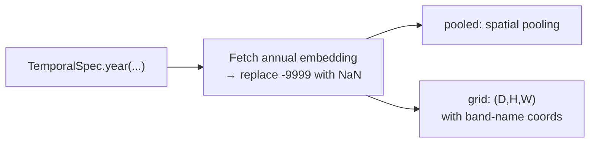
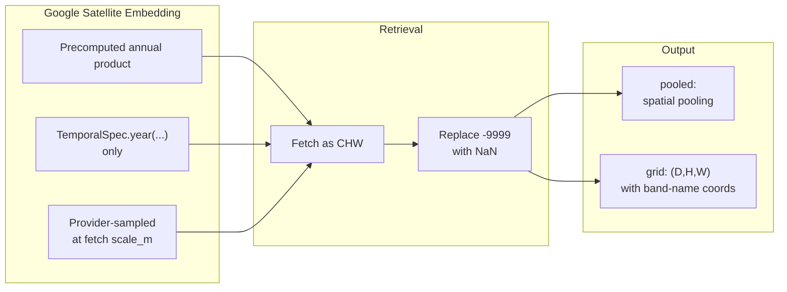

# Google Satellite Embedding Annual (`gse`)


## Quick Facts

| Field              | Value                                                                              |
| ------------------ | ---------------------------------------------------------------------------------- |
| Model ID           | `gse`                                                                              |
| Aliases            | `gse_annual`                                                                       |
| Family / Source    | Google Satellite Embedding annual product (`GOOGLE/SATELLITE_EMBEDDING/V1/ANNUAL`) |
| Adapter type       | `precomputed`                                                                      |
| Training alignment | N/A (precomputed product)                                                          |

!!! success "Google Satellite Embedding In 30 Seconds"
    GSE is Google's precomputed annual Satellite Embedding product (`GOOGLE/SATELLITE_EMBEDDING/V1/ANNUAL`) — no model inference happens locally; the adapter just provider-samples the already-computed embedding image at your ROI, so the "embedding" is a Google-produced global annual feature map rather than anything `rs-embed` runs a forward pass for.

    In `rs-embed`, its most important characteristics are:

    - `TemporalSpec.year(...)` is the intended temporal mode; `range(...)` is also accepted and resolves to its **start year** (with a `UserWarning`): see [Retrieval Contract](#retrieval-contract)
    - `fetch.scale_m` / `sensor.scale_m` still controls provider *sampling* resolution even though the underlying product is precomputed: see [Environment Variables / Tuning Knobs](#environment-variables-tuning-knobs)
    - product fill value `-9999` is automatically converted to `NaN` in the returned grid: see [Retrieval Pipeline](#retrieval-pipeline)

---

## Retrieval Contract

| Field               | Value                                                                    |
| ------------------- | ------------------------------------------------------------------------ |
| Backend             | provider (`auto` recommended) — provider-sampled, not local              |
| `SpatialSpec`       | `BBox` or `PointBuffer` via standard provider sampling                   |
| `TemporalSpec`      | `TemporalSpec.year(...)` (preferred); `range(...)` accepted → uses start year + `UserWarning` |
| Collection          | `GOOGLE/SATELLITE_EMBEDDING/V1/ANNUAL` (fixed)                           |
| Sampling resolution | `fetch.scale_m` or `sensor.scale_m` (default `10 m`)                     |
| Composite           | `mosaic` (fixed)                                                         |
| Fill value          | `-9999` (converted to `NaN` in returned grid)                            |
| Side inputs         | none                                                                     |

---

## Retrieval Pipeline



!!! note "Large requests tile automatically"
    When a `BBox`'s estimated pixel footprint exceeds the GEE `sampleRectangle` limit, the region is split into a sub-`BBox` grid, fetched tile-by-tile, and concatenated — so there is no hard cap on request size, and the result matches a single large fetch. `gse` manages this tiling itself; passing `input_prep="tile"` only emits a `UserWarning` clarifying that.

---

## Architecture Concept



---

## Environment Variables / Tuning Knobs

| Env var                      | Default | Effect                                             |
| ---------------------------- | ------- | -------------------------------------------------- |
| `RS_EMBED_GSE_BATCH_WORKERS` | `4`     | Batch worker count for `get_embeddings_batch(...)` |

!!! info "Primary non-env sampling knob"
    The main non-env sampling knob is `fetch.scale_m`, or the more explicit `sensor.scale_m`.

---

## Output Semantics

**`pooled`**: spatial pooling over the sampled embedding grid.

**`grid`**: `(D,H,W)` in product space; the `d` coordinate uses product band names, and fill value `-9999` is converted to `NaN`.

---

## Examples

### Minimal annual example

```python
from rs_embed import get_embedding, PointBuffer, TemporalSpec, OutputSpec

emb = get_embedding(
    "gse",
    spatial=PointBuffer(lon=121.5, lat=31.2, buffer_m=2048),
    temporal=TemporalSpec.year(2021),
    output=OutputSpec.pooled(),
    backend="auto",
)
```

### Sampling resolution example

```python
from rs_embed import FetchSpec

fetch = FetchSpec(scale_m=30)
```

---

## Paper & Links

- **Publication**: [arXiv 2025](https://arxiv.org/abs/2507.22291)

---

## Reference

- `TemporalSpec.year(...)` is the intended input; `range(...)` is accepted and resolves to its start year (emitting a `UserWarning`).
- Fill regions in the source product use `-9999`, which the adapter converts to `NaN` — downstream code must handle NaN values.
- Resolution is controlled by `fetch.scale_m` (or `sensor.scale_m`) at the provider level, not by the adapter.
