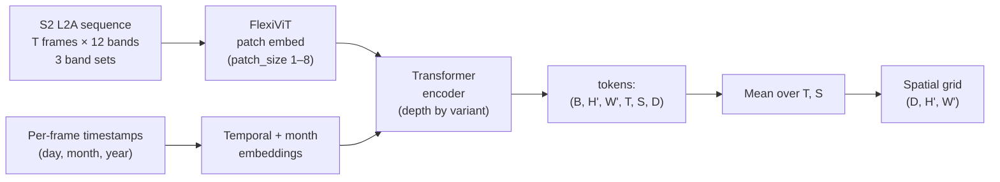

# OlmoEarth (`olmoearth`)

## Quick Facts

| Field                | Value                                                                                                     |
| -------------------- | --------------------------------------------------------------------------------------------------------- |
| Model ID             | `olmoearth`                                                                                               |
| Family / Backbone    | OlmoEarth v1/v1.1 — FlexiViT encoder (ViT-style) trained on the Major TOM dataset                       |
| Adapter type         | `on-the-fly`                                                                                              |
| Model config keys    | `variant` (default: `tiny_v1_1`), `patch_size` (default: `4`), `image_size` (default: `256`)                  |
| Training alignment   | High (S2 L2A 12-band; native 10 m resolution; per-band mean±2σ normalization matches training pipeline)   |

!!! success "OlmoEarth In 30 Seconds"
    OlmoEarth is a **multi-modal geospatial foundation model** from Allen AI, trained on the Major TOM dataset with Sentinel-2 L2A as the primary modality. It uses a FlexiViT encoder that accepts variable patch sizes, enabling flexible spatial resolution trade-offs. In `rs-embed`, the adapter fetches all **12 S2 L2A bands** and encodes them in a single forward pass.

    Key characteristics:
    - All 12 S2 L2A bands in the OlmoEarth band-set order (10 m → 20 m → 60 m groups)
    - **S1 modality** via `modality="s1"`: Sentinel-1 GRD `VV/VH` in dB, like TerraFM
    - Per-band normalization using OlmoEarth's COMPUTED strategy (mean ± 2σ)
    - 4 size variants in v1 (`nano`/`tiny`/`base`/`large`) and 3 in v1.1 (`nano_v1_1`/`tiny_v1_1`/`base_v1_1`)
    - `patch_size` controls the spatial token density (1–8); default `4` matches the official inference example
    - Input image resized to `image_size` (default 256) before encoding
    - Requires `olmoearth-pretrain-minimal` (`pip install rs-embed[olmoearth]`)

---

## Input Contract

| Field                 | Value                                                                              |
| --------------------- | ---------------------------------------------------------------------------------- |
| Backend               | provider only (`gee` / `auto`)                                                     |
| `TemporalSpec`        | `range` or `year` (normalized via shared helper; year → full year composite)       |
| Modalities            | `s2` (default) or `s1` via `modality="s1"`                                         |
| Side inputs           | timestamps (derived from temporal midpoint), none required from user                |

| Modality       | Collection                    | Bands (order)                                        | `input_chw` (override)              | Extra sensor fields                          |
| -------------- | ----------------------------- | ---------------------------------------------------- | ----------------------------------- | --------------------------------------------- |
| `s2` (default) | `COPERNICUS/S2_SR_HARMONIZED` | `B2,B3,B4,B8,B5,B6,B7,B8A,B11,B12,B1,B9` (12-band)   | `CHW`, `C=12`, raw SR DN `0..10000` | `scale_m=10`, `cloudy_pct=30`, `composite`    |
| `s1`           | `COPERNICUS/S1_GRD`           | `VV, VH` (2-band, **dB**)                            | `CHW`, `C=2`, backscatter in dB     | `scale_m=10`, `s1_require_iw`, `composite`    |

The S2 band order matches OlmoEarth's internal `Modality.SENTINEL2_L2A` definition:
three band sets (10 m, 20 m, 60 m) totaling 12 channels. The S1 order matches
`Modality.SENTINEL1` (`vv`, `vh`; single band set).

!!! note "S1 values are dB"
    OlmoEarth's S1 normalization statistics are computed in **dB** (VV mean ≈ −11.6,
    VH mean ≈ −17.7), so the adapter fetches the dB collection `COPERNICUS/S1_GRD` by
    default (`use_float_linear=False`). If you switch the sensor to the linear-power
    collection (`use_float_linear=True` → `COPERNICUS/S1_GRD_FLOAT`), the adapter
    converts to dB via `10·log10` before normalization. `input_chw` overrides for
    `s1` must already be in dB.

---

## Preprocessing Pipeline

```mermaid
flowchart LR
    TEMP["Temporal range"] --> BINS["Build 30-day bins\nanchored at range start\n(max 12)"]
    BINS --> FETCH["Fetch one S2 composite\nper 30-day bin\nraw DN, C=12"]
    FETCH --> DROP["Drop empty-bin frames\nkeep aligned timestamps"]
    DROP --> NORM["Per-frame per-band mean±2σ\nnormalization"]
    NORM --> RESIZE["Resize each frame to image_size\n(default 256×256)"]
    RESIZE --> STACK["Stack frames\n(T, C, H, W)"]
    STACK --> TS["Frame timestamps\n(day, month, year)"]
    STACK --> SAMPLE["Build MaskedOlmoEarthSample\n(B=1, H, W, T, C=12)"]
    TS --> SAMPLE
    SAMPLE --> ENC["FlexiViT encoder\npatch_size=4 (default)"]
    ENC --> POOL["Pool over T×BandSets\n→ (B, H', W', D)"]
    POOL --> OUTPUT{Output mode}
    OUTPUT -- pooled --> VEC["Global mean/max\n→ (D,) vector"]
    OUTPUT -- grid --> GRID["Spatial token map\n(D, H', W')"]
```



---

## Architecture Concept



The encoder output is a 6-D tensor `(B, H', W', T, S, D)` where `T` is the number of retained temporal frames and `S` is the number of band sets (3 for v1, 1 for v1.1 due to the linear patch embedding change). All pooling is applied after the encoder.

---

## Model-specific Settings

### `variant`

Selects the model size and version. Weights are automatically downloaded from Hugging Face on first use.

| Variant      | Version | Encoder Dim | Depth | HuggingFace Repo                   |
| ------------ | ------- | ----------- | ----- | ---------------------------------- |
| `nano`       | v1      | 128         | 4     | `allenai/OlmoEarth-v1-Nano`        |
| `tiny`       | v1      | 192         | 12    | `allenai/OlmoEarth-v1-Tiny`        |
| `base`       | v1      | 768         | 12    | `allenai/OlmoEarth-v1-Base`        |
| `large`      | v1      | 1024        | 24    | `allenai/OlmoEarth-v1-Large`       |
| `nano_v1_1`  | v1.1    | 128         | 4     | `allenai/OlmoEarth-v1_1-Nano`      |
| `tiny_v1_1`  | v1.1    | 192         | 12    | `allenai/OlmoEarth-v1_1-Tiny`      |
| `base_v1_1`  | v1.1    | 768         | 12    | `allenai/OlmoEarth-v1_1-Base`      |

!!! note "v1 vs v1.1 architecture difference"
    v1 uses a Conv2D-based patch embedding, producing 3 separate band-set token groups per spatial location.
    v1.1 uses a linear patch embedding (`use_linear_patch_embed=True`) that merges band sets into a single token stream. Both versions produce the same output dimensionality after pooling.

Short aliases are accepted: `nano_11`, `tiny_11`, `base_11` for v1.1 variants; `nano_v1`, `tiny_v1`, `base_v1`, `large_v1` for v1 variants.

### `patch_size`

Controls the spatial patch size for the FlexiViT encoder. Smaller values produce more spatial tokens (higher resolution) at the cost of longer inference time.

| `patch_size` | Tokens (256×256 image) | Note                              |
| ------------ | ---------------------- | --------------------------------- |
| `4`          | 64 × 64 = 4096         | Default; more spatially detailed  |
| `8`          | 32 × 32 = 1024         | Faster; coarser spatial grid      |
| `2`          | 128 × 128 = 16384      | Very detailed; significantly slower |

### `image_size`

Target pixel size for the resize step. The fetched patch is always resized to `(image_size, image_size)` before encoding. Must be divisible by `patch_size`.

Default: `256` (matching the OlmoEarth training tile size).

### `temporal_mode`

| Value             | Behavior                                                                                       |
| ----------------- | ---------------------------------------------------------------------------------------------- |
| `single` (default) | One composite over the whole temporal range (`T=1`), timestamp = range midpoint               |
| `multi`           | One composite per **30-day bin** anchored at the range start, up to **12 frames**             |

`multi` mirrors how OlmoEarth was pretrained: the official pipeline slices each
sample's year window into fixed 30-day bins (`duration=30d` strides in the
rslearn config — *not* calendar months), and feeds each frame's start date as
its `(day, month, year)` timestamp. The adapter reproduces exactly that:

- Bins: `[start, start+30d), [start+30d, start+60d), …`, last bin truncated at
  the range end, capped at 12 frames (ranges longer than ~360 days are truncated).
- Per-frame timestamp = bin start date (matching the official pipeline).
- Bins with no imagery are **dropped from the sequence** (the encoder runs with
  `fast_pass=True`, which ignores attention masks, so empty frames cannot be
  masked out — they are excluded instead). At least one bin must have data.
- Works for both `s2` and `s1`. S1 reuses the single-frame S1 fetch per bin, so
  IW filtering and dB handling apply within each bin.

```python
emb = rs.get_embedding(
    "olmoearth",
    spatial=BBox(minlon=-2.0, minlat=6.0, maxlon=-1.9, maxlat=6.1),
    temporal=TemporalSpec.year(2022),       # → 12 monthly-cadence frames
    temporal_mode="multi",
    output=OutputSpec.pooled(),
)
print(emb.meta["n_frames"])   # ≤ 12, depending on data availability
```

!!! note "Multi-frame `input_chw` contract"
    When overriding inputs in `multi` mode, pass `[T, C, H, W]` where `T` equals
    the number of 30-day bins of the temporal range; represent empty bins as
    all-NaN frames. Plain `[C, H, W]` inputs are always treated as single-frame.

---

## Output Semantics

### Pooled (`OutputSpec.pooled()`)

The encoder output `(B, H', W', T, S, D)` is pooled over all spatial, temporal, and band-set dimensions via the OlmoEarth built-in `pool_unmasked_tokens()`. This produces a `(D,)` vector.

`pooling="mean"` (default) computes mean; `pooling="max"` computes max over token positions.

### Grid (`OutputSpec.grid()`)

Returns a `(D, H', W')` spatial token map as an `xarray.DataArray` with dimensions `(d, y, x)`. The temporal (`T`) and band-set (`S`) dimensions are averaged out; only the spatial token grid is retained.

Grid size depends on `image_size` and `patch_size`:
```
H' = W' = image_size // patch_size
```
For defaults (256, patch_size=4): `64 × 64` grid.

---

## Environment Variables

| Variable                         | Default  | Effect                                              |
| -------------------------------- | -------- | --------------------------------------------------- |
| `RS_EMBED_OLMOEARTH_VARIANT`     | `tiny_v1_1`   | Default model variant when `model_config` not given |
| `RS_EMBED_OLMOEARTH_PATCH_SIZE`  | `4`      | Default patch size when `model_config` not given    |
| `RS_EMBED_OLMOEARTH_IMAGE_SIZE`  | `256`    | Default image resize target                         |
| `RS_EMBED_OLMOEARTH_TEMPORAL_MODE` | `single` | Default temporal mode (`single` / `multi`)        |
| `RS_EMBED_OLMOEARTH_FETCH_WORKERS` | `8`    | Parallel GEE fetch workers for batch calls          |
| `RS_EMBED_OLMOEARTH_BATCH_SIZE`  | `4` (CPU) / `16` (CUDA) | Inference batch size for `get_embeddings_batch_from_inputs` |

---

## Installation

OlmoEarth requires an additional package not included in the base `rs-embed` install:

```bash
pip install rs-embed[olmoearth]
# or
uv pip install olmoearth-pretrain-minimal
```

---

## Usage Examples

### Minimal example

```python
from rs_embed import BBox, OutputSpec, TemporalSpec, get_embedding

emb = get_embedding(
    "olmoearth",
    spatial=BBox(minlon=-2.0, minlat=6.0, maxlon=-1.9, maxlat=6.1),
    temporal=TemporalSpec.range("2022-06-01", "2022-09-01"),
    output=OutputSpec.pooled(),
    backend="gee",
)
```

### Choose variant and modality

```python
from rs_embed import BBox, OutputSpec, TemporalSpec, get_embedding

emb = get_embedding(
    "olmoearth",
    spatial=BBox(minlon=-2.0, minlat=6.0, maxlon=-1.9, maxlat=6.1),
    temporal=TemporalSpec.range("2022-06-01", "2022-09-01"),
    output=OutputSpec.grid(),
    backend="gee",
    variant="tiny_v1_1",
    modality="s1",
)
```

---

## Notes and Caveats

- The OlmoEarth normalizer linearly maps `mean ± 2σ` to `[0, 1]` (`(x − min) / (max − min)`); values outside that range fall outside `[0, 1]` rather than being clipped — matching the official `Normalizer` implementation.
- `patch_size` is a **model input** (FlexiViT accepts variable patch sizes), not a preprocessing hyperparameter. Different `patch_size` values may produce embeddings with different spatial characteristics.
- The `large` variant is only available in v1 (no v1.1 large release at time of writing).
- Weights are cached by `huggingface_hub` in the default HF cache directory.

---

## License

OlmoEarth — the weights, the training/inference datasets, and the `olmoearth-pretrain-minimal`
code — is released by Allen AI (Ai2) under the **OlmoEarth Artifact License**. This is a
*responsible-use* / source-available license, **not** an OSI open-source license like MIT or
Apache 2.0 (which `rs-embed` itself uses). Anything covered by the license — the model, the
dataset, the code, or any derivative of them — is collectively called the **"Artifacts."**

- 📄 Full license text: [allenai/olmoearth_pretrain — LICENSE](https://github.com/allenai/olmoearth_pretrain/blob/main/LICENSE)
- 📦 Source / model code: [github.com/allenai/olmoearth_pretrain](https://github.com/allenai/olmoearth_pretrain)

### What it lets you do

You may, free of charge, **use, reproduce, modify, display, and distribute** the Artifacts, and
**create and share derivatives** — including transfer-learning/fine-tuning from the weights, using
the model's outputs to generate synthetic data, and building new models or datasets on top of it.

### What it forbids (Section 2 — use restrictions)

You may **not** use OlmoEarth or any derivative for:

- **Military & defense** — weapons development, military operations, intelligence gathering, or
  human surveillance / policing.
- **Extractive activities** — planning or facilitating the extraction of raw materials from the
  earth: oil, natural gas, and minerals (drilling, mining), as well as **deforestation**.

!!! note "Monitoring ≠ facilitating extraction"
    The restriction targets *planning or facilitating* extraction/deforestation. Passive
    **monitoring** use cases — e.g. tracking deforestation, land cover, or land-use change — are
    generally distinct from facilitating the extraction itself. When in doubt, read the license.

### If you redistribute the Artifacts (Section 3)

- **Cite Ai2** as the source.
- **Include or link to the license** for everyone you pass the Artifacts to.
- **Propagate the Section 2 use restrictions** to all downstream recipients (unless Ai2 grants
  written approval otherwise).

Breaching the use restrictions **automatically terminates** your license (Section 4). The Artifacts
are provided "as is" with no warranty (Section 6).

!!! info "How this affects `rs-embed`"
    `rs-embed` does **not** bundle or redistribute the OlmoEarth weights or code — it declares
    `olmoearth-pretrain-minimal` as an *optional* dependency and downloads the weights from
    Hugging Face at runtime. The license therefore binds **you, the end user**, directly; the
    `rs-embed` package stays Apache 2.0. Just make sure your own use complies with Section 2 above.
