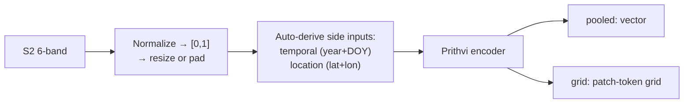
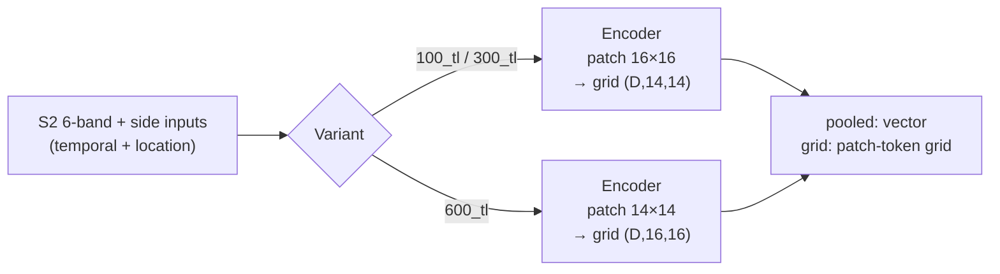

# Prithvi-EO v2 (`prithvi`)


## Quick Facts

| Field                | Value                                                         |
| -------------------- | ------------------------------------------------------------- |
| Model ID             | `prithvi`                                                     |
| Aliases              | `prithvi_eo_v2_s2_6b`                                         |
| Family / Backbone    | Prithvi-EO v2 via vendored `PrithviMAE` runtime               |
| Adapter type         | `on-the-fly`                                                  |
| Model config keys    | `variant` (default: `prithvi_eo_v2_100_tl`)                   |
| Training alignment   | Medium (depends on preprocessing mode and resize/pad choices) |

!!! success "Prithvi In 30 Seconds"
    Prithvi-EO v2 is the IBM/NASA geospatial foundation model for a fixed Sentinel-2 6-band subset (`BLUE,GREEN,RED,NIR_NARROW,SWIR_1,SWIR_2`), and its defining feature in `rs-embed` is that the vendored runtime requires *both* temporal coordinates and *location* coordinates as explicit model side inputs — the adapter derives them from the window midpoint and ROI center so you don't have to, but they are still a real part of the forward pass.

    In `rs-embed`, its most important characteristics are:

    - **required** temporal (`year, day_of_year`) and location (`lat, lon`) side inputs auto-derived by the adapter: see [Input Contract](#input-contract)
    - 30 m default `sensor.scale_m`, not the more common S2 10 m default — a frequent source of silent drift: see [Environment Variables / Tuning Knobs](#environment-variables-tuning-knobs)
    - `resize` vs `pad` preprocessing changes token geometry and should be treated as part of the experiment, not as a cosmetic knob: see [Environment Variables / Tuning Knobs](#environment-variables-tuning-knobs)

---

## Input Contract

| Field                 | Value                                                                                         |
| --------------------- | --------------------------------------------------------------------------------------------- |
| Backend               | provider only (`gee` / `auto`)                                                                |
| `TemporalSpec`        | `range` preferred; `year(YYYY)` is normalized to `[YYYY-01-01, (YYYY+1)-01-01)`               |
| Default collection    | `COPERNICUS/S2_SR_HARMONIZED`                                                                 |
| Default bands (order) | `BLUE, GREEN, RED, NIR_NARROW, SWIR_1, SWIR_2` (6-band, S2 semantic names)                    |
| Default fetch         | `scale_m=30` (note: **not** 10 m), `cloudy_pct=30`, `composite="median"`, `fill_value=0.0`    |
| `input_chw`           | `CHW`, `C=6`, raw SR `0..10000` — adapter clips and replaces non-finite values                |
| Side inputs           | **required** temporal coords `(year, day_of_year)` and location coords `(lat, lon)` — **auto-derived** by adapter from window midpoint and ROI center |

---

## Preprocessing Pipeline

!!! tip "Resize is the default — tiling is also available"
    The pipeline below shows the default `input_prep="resize"` path. For large ROIs, use `input_prep="tile"` to split the input into tiles and preserve spatial detail. See [Choosing Settings](../choosing_settings.md#input-preparation-resize-vs-tile).



---

## Architecture Concept



---

## Environment Variables / Tuning Knobs

| Env var                          | Default                | Effect                                                          |
| -------------------------------- | ---------------------- | --------------------------------------------------------------- |
| `RS_EMBED_PRITHVI_KEY`           | `prithvi_eo_v2_100_tl` | Prithvi variant selector                                        |
| `RS_EMBED_PRITHVI_PRETRAINED`    | `1`                    | Use pretrained weights vs random init                           |
| `RS_EMBED_PRITHVI_CACHE_DIR`     | unset                  | Optional Hugging Face cache dir for config/checkpoint downloads |
| `RS_EMBED_PRITHVI_WEIGHTS_ONLY`  | `1`                    | `torch.load(..., weights_only=...)` compatibility toggle        |
| `RS_EMBED_PRITHVI_PREP`          | `resize`               | Input prep mode: `resize` or `pad`                              |
| `RS_EMBED_PRITHVI_IMG`           | `224`                  | Target square size for `resize` mode                            |
| `RS_EMBED_PRITHVI_PATCH_MULT`    | `16`                   | Pad multiple for `pad` mode                                     |
| `RS_EMBED_PRITHVI_FETCH_WORKERS` | `8`                    | Provider prefetch workers for batch APIs                        |
| `RS_EMBED_PRITHVI_BATCH_SIZE`    | CPU:`4`, CUDA:`16`     | Inference batch size for batch APIs                             |

---

## Model-specific Settings

`variant` selects the Prithvi-EO v2 backbone size. In `rs-embed`, pass it as `variant="prithvi_eo_v2_100_tl" | "prithvi_eo_v2_300_tl" | "prithvi_eo_v2_600_tl"`, or use the short aliases `"100_tl"` / `"300_tl"` / `"600_tl"` (the `100m_tl` / `300m_tl` / `600m_tl` spellings are also accepted).

| Variant   | Model key (runtime)    | HF repo                                      | Checkpoint file             | Patch size `(T,H,W)` | Embed dim | Transformer blocks | Attention heads | Notes                                                                                                        |
| --------- | ---------------------- | -------------------------------------------- | --------------------------- | -------------------- | --------- | ------------------ | --------------- | ------------------------------------------------------------------------------------------------------------ |
| `100_tl`  | `prithvi_eo_v2_100_tl` | `ibm-nasa-geospatial/Prithvi-EO-2.0-100M-TL` | `Prithvi_EO_V2_100M_TL.pt`  | `(1, 16, 16)`        | 768       | 12                 | 12              | Current default. ~100M params; ViT-B-class encoder with temporal+location side inputs.                      |
| `300_tl`  | `prithvi_eo_v2_300_tl` | `ibm-nasa-geospatial/Prithvi-EO-2.0-300M-TL` | `Prithvi_EO_V2_300M_TL.pt`  | `(1, 16, 16)`        | 1024      | 24                 | 16              | ~300M params; ViT-L-class encoder. Same patch geometry as `100_tl`, so token grid counts match.             |
| `600_tl`  | `prithvi_eo_v2_600_tl` | `ibm-nasa-geospatial/Prithvi-EO-2.0-600M-TL` | `Prithvi_EO_V2_600M_TL.pt`  | `(1, 14, 14)`        | 1280      | 32                 | 16              | Highest capacity. ~600M params; uses a **different** spatial patch size (14, not 16), so token grid geometry differs from the smaller two variants at the same `RS_EMBED_PRITHVI_IMG`. |

!!! info "How To Read Embed Dim"
    `Embed dim` is Prithvi's encoder `embed_dim`. It becomes the pooled embedding width `(D,)` and the channel dimension of a `grid` output `(D,H,W)`.

!!! warning "Patch Size Differs For `600_tl`"
    `100_tl` and `300_tl` use a `(1,16,16)` patch, while `600_tl` uses `(1,14,14)`. At the default `RS_EMBED_PRITHVI_IMG=224`, that means `14×14` patch tokens for the smaller variants but `16×16` patch tokens for `600_tl`. If you compare grids across variants, either keep variant fixed or use `RS_EMBED_PRITHVI_PREP=pad` with an `IMG` that divides cleanly by both `14` and `16` (for example `224`, which does).

All three variants share the same fixed Sentinel-2 6-band input (`BLUE,GREEN,RED,NIR_NARROW,SWIR_1,SWIR_2`), the same `num_frames=4` runtime default, and the same required temporal+location side inputs derived by the adapter.

`variant` overrides `RS_EMBED_PRITHVI_KEY`. For export jobs, use `ExportModelRequest.configure("prithvi", variant="prithvi_eo_v2_300_tl")`.

Example:

```python
from rs_embed import PointBuffer, TemporalSpec, OutputSpec, get_embedding

emb = get_embedding(
    "prithvi",
    spatial=PointBuffer(lon=121.5, lat=31.2, buffer_m=2048),
    temporal=TemporalSpec.range("2022-06-01", "2022-09-01"),
    output=OutputSpec.pooled(),
    backend="gee",
    variant="300_tl",
)
```

---

## Examples

### Minimal example (explicit temporal window)

```python
from rs_embed import get_embedding, PointBuffer, TemporalSpec, OutputSpec

emb = get_embedding(
    "prithvi",
    spatial=PointBuffer(lon=121.5, lat=31.2, buffer_m=2048),
    temporal=TemporalSpec.range("2022-06-01", "2022-09-01"),
    output=OutputSpec.pooled(),
    backend="gee",
)
```

### With custom preprocessing mode (env-controlled)

```python
# Example (shell):
export RS_EMBED_PRITHVI_PREP=pad
export RS_EMBED_PRITHVI_PATCH_MULT=16
export RS_EMBED_PRITHVI_PRETRAINED=1
```

### With variant selection

```python
from rs_embed import get_embedding, PointBuffer, TemporalSpec, OutputSpec

emb = get_embedding(
    "prithvi",
    spatial=PointBuffer(lon=121.5, lat=31.2, buffer_m=2048),
    temporal=TemporalSpec.range("2022-06-01", "2022-09-01"),
    output=OutputSpec.pooled(),
    backend="gee",
    variant="prithvi_eo_v2_300_tl",
)
```

---

## Paper & Links

- **Publication**: [arXiv 2023](https://arxiv.org/abs/2310.18660)
- **Model**: [ibm-nasa-geospatial](https://huggingface.co/ibm-nasa-geospatial)

---

## Reference

- Default `scale_m` is `30`, not `10` — this is intentional and differs from most other S2 models.
- `resize` vs `pad` preprocessing changes token geometry; treat it as part of experiment design.
- Variant `600_tl` uses patch size 14 (not 16), producing a different grid shape than `100_tl`/`300_tl`.
