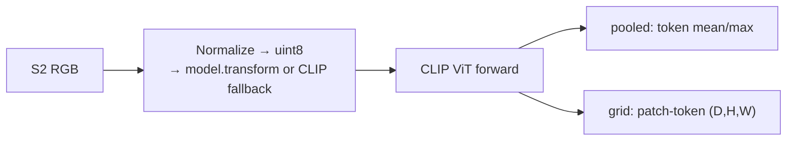
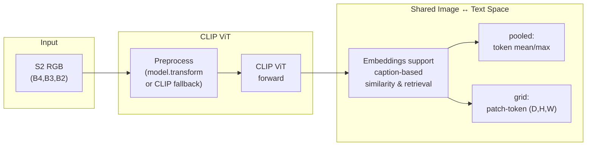

# RemoteCLIP (`remoteclip`)

## Quick Facts

| Field                | Value                                                                                                            |
| -------------------- | ---------------------------------------------------------------------------------------------------------------- |
| Model ID             | `remoteclip`                                                                                                     |
| Aliases              | `remoteclip_s2rgb`                                                                                               |
| Family / Backbone    | RemoteCLIP (CLIP-style ViT via `rshf.remoteclip.RemoteCLIP`)                                                     |
| Adapter type         | `on-the-fly`                                                                                                     |
| Training alignment   | Medium (higher if wrapper `model.transform(...)` matches training pipeline; fallback is generic CLIP preprocess) |

!!! success "RemoteCLIP In 30 Seconds"
    RemoteCLIP is a CLIP-style vision-language ViT continually fine-tuned on remote-sensing image-text pairs, so its embeddings live in a *shared* image/text space that supports caption-based retrieval — in `rs-embed` you are getting the visual side of that shared space from a 3-band RGB Sentinel-2 input.

    In `rs-embed`, its most important characteristics are:

    - RGB-only (`B4,B3,B2`) with a fixed `224×224` preprocessing path: see [Input Contract](#input-contract)
    - checkpoint override goes through `sensor.collection="hf:<repo>"` rather than an environment variable: see [Environment Variables / Tuning Knobs](#environment-variables-tuning-knobs)
    - preprocessing prefers the wrapper `model.transform(...)` but falls back to a generic CLIP pipeline — these paths are **not** identical and should be logged: see [Preprocessing Pipeline](#preprocessing-pipeline)

---

## Input Contract

| Field                 | Value                                                                                  |
| --------------------- | -------------------------------------------------------------------------------------- |
| Backend               | provider (`auto` recommended)                                                          |
| `TemporalSpec`        | **required** `TemporalSpec.range(start, end)` — treated as filter-and-composite window |
| Default collection    | `COPERNICUS/S2_SR_HARMONIZED`                                                          |
| Default bands (order) | `B4, B3, B2`                                                                           |
| Default fetch         | `scale_m=10`, `cloudy_pct=30`, `composite="median"`                                    |
| `input_chw`           | `CHW`, `C=3` in `(B4,B3,B2)` order                                                     |
| Side inputs           | none                                                                                   |

!!! note "Checkpoint override via `sensor.collection`"
    Use `sensor.collection="hf:<repo_or_path>"` (e.g. `hf:MVRL/remote-clip-vit-base-patch32`) to swap in a different RemoteCLIP checkpoint — the `hf:` prefix is how this adapter distinguishes checkpoint overrides from regular provider collections.

---

## Preprocessing Pipeline

!!! warning "Resize is the default for `grid`"
    RemoteCLIP `grid` output is an image-level CLIP ViT patch-token grid, not a seamless dense geospatial field. For `input_prep=None` or `input_prep="auto"`, `rs-embed` resolves to `input_prep="resize"` by default and emits a warning. Explicit `input_prep="tile"` is still allowed for experimental visualization, but metadata marks it as seam-prone and not recommended for grid mosaics.



!!! note "Current adapter image size"
    The image size is fixed at `224` in this adapter path.

---

## Architecture Concept



---

## Environment Variables / Tuning Knobs

| Env var                                                  | Default            | Effect                                                   |
| -------------------------------------------------------- | ------------------ | -------------------------------------------------------- |
| `RS_EMBED_REMOTECLIP_FETCH_WORKERS`                      | `8`                | Provider prefetch worker count for batch APIs            |
| `RS_EMBED_REMOTECLIP_BATCH_SIZE`                         | CPU:`8`, CUDA:`64` | Inference batch size for batch APIs                      |
| `HUGGINGFACE_HUB_CACHE` / `HF_HOME` / `HUGGINGFACE_HOME` | unset              | Controls HF cache path used for model snapshot downloads |

!!! info "Checkpoint override"
    Set `sensor.collection="hf:<repo_or_local_path>"` (not env-based in this adapter).

---

## Output Semantics

**`pooled`**: returns the image-level RemoteCLIP visual embedding, suitable for similarity search and retrieval.

**`grid`**: exposes ViT patch-token layout when the wrapper provides tokens. Default/auto input preparation resolves to resize, and metadata records `input_prep.model_policy="resize_default_for_image_level_vit_patch_grid"`, `grid_semantics="vit_patch_tokens"`, and `grid_tile_recommended=false`.

---

## Examples

### Minimal example

```python
from rs_embed import get_embedding, PointBuffer, TemporalSpec, OutputSpec

emb = get_embedding(
    "remoteclip",
    spatial=PointBuffer(lon=121.5, lat=31.2, buffer_m=2048),
    temporal=TemporalSpec.range("2022-06-01", "2022-09-01"),
    output=OutputSpec.pooled(),
    backend="auto",
)
```

### Custom checkpoint via `sensor.collection="hf:..."`

```python
from rs_embed import get_embedding, PointBuffer, TemporalSpec, OutputSpec, SensorSpec

emb = get_embedding(
    "remoteclip",
    spatial=PointBuffer(lon=121.5, lat=31.2, buffer_m=2048),
    temporal=TemporalSpec.range("2022-06-01", "2022-09-01"),
    sensor=SensorSpec(
        collection="hf:MVRL/remote-clip-vit-base-patch32",
        bands=("B4", "B3", "B2"),
        scale_m=10,
        cloudy_pct=30,
        composite="median",
    ),
    output=OutputSpec.grid(),
    backend="auto",
)
```

---

## Paper & Links

- **Publication**: [TGRS 2024](https://arxiv.org/abs/2306.11029)
- **Code**: [ChenDelong1999/RemoteCLIP](https://github.com/ChenDelong1999/RemoteCLIP)

---

## Reference

- Provider-only — `backend="tensor"` is not supported.
- The adapter prefers `model.transform` when available; otherwise falls back to CLIP-style preprocessing — the two paths may produce slightly different embeddings.
- Default/auto `grid` requests resolve to resize because tiled RemoteCLIP patch-token grids can show stitching seams.
- Grid output depends on the wrapper exposing a token sequence; some RemoteCLIP wrappers only return pooled vectors.
