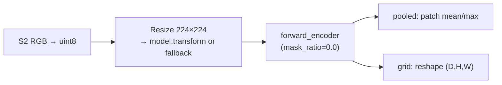
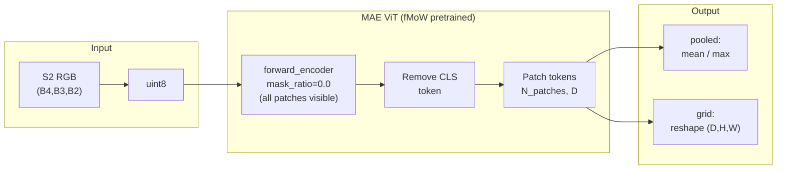

# SatMAE RGB (`satmae`)


## Quick Facts

| Field                | Value                                                                          |
| -------------------- | ------------------------------------------------------------------------------ |
| Model ID             | `satmae`                                                                       |
| Aliases              | `satmae_rgb`                                                                   |
| Family / Backbone    | SatMAE via `rshf.satmae.SatMAE`                                                |
| Adapter type         | `on-the-fly`                                                                   |
| Training alignment   | Medium-High (higher when wrapper `model.transform(...)` is available and used) |

!!! success "SatMAE In 30 Seconds"
    SatMAE is an MAE-pretrained ViT on fMoW imagery exposed via `rshf.satmae.SatMAE`, and in `rs-embed` it is the simplest RGB-only token extractor: `forward_encoder(mask_ratio=0.0)` is called every time to get patch tokens, which are then either pooled to a vector or reshaped into a ViT patch-token grid.

    In `rs-embed`, its most important characteristics are:

    - RGB-only (`B4,B3,B2`); raw SR is converted to `uint8` before model preprocessing: see [Preprocessing Pipeline](#preprocessing-pipeline)
    - token path is always used (`mask_ratio=0.0`), and any CLS token is auto-removed before pooling/grid: see [Reference](#reference)
    - checkpoint selection via `RS_EMBED_SATMAE_ID` (Hugging Face model ID) — default targets the fMoW large checkpoint: see [Environment Variables / Tuning Knobs](#environment-variables-tuning-knobs)

---

## Input Contract

| Field                 | Value                                                  |
| --------------------- | ------------------------------------------------------ |
| Backend               | provider only (`gee` / `auto`)                         |
| `TemporalSpec`        | `range` recommended (normalized via shared helper)     |
| Default collection    | `COPERNICUS/S2_SR_HARMONIZED`                          |
| Default bands (order) | `B4, B3, B2`                                           |
| Default fetch         | `scale_m=10`, `cloudy_pct=30`, `composite="median"`    |
| `input_chw`           | `CHW`, `C=3` in `(B4,B3,B2)` order, raw SR `0..10000`  |
| Side inputs           | none                                                   |

The adapter converts raw SR `0..10000` to `uint8` RGB before model preprocessing.

---

## Preprocessing Pipeline

!!! warning "`grid` tiles by default and can show seams"
    SatMAE `grid` output is an image-level ViT patch-token grid, not a seamless dense geospatial field. Like every other model, SatMAE tiles by default: `input_prep=None` or `input_prep="auto"` resolves to `input_prep="tile"`. Because tiled patch-token mosaics can show stitching seams at tile boundaries, the default/auto path and an explicit `input_prep="tile"` both emit a warning on `grid` output. Pass `input_prep="resize"` for a seamless (downsampled) grid — that is the recommended seamless opt-in and emits no warning.



!!! note "Token extraction"
    The current adapter path always targets token output rather than pre-pooled wrapper outputs. If a CLS token is present, the pooling and grid helpers remove it automatically.

---

## Output Semantics

**`pooled`**: pools SatMAE patch tokens with `mean` or `max`, after removing a CLS token when present.

**`grid`**: reshapes SatMAE patch tokens to `(D,H,W)`. Default/auto input preparation resolves to tile (and warns about seams on grid output), and metadata records `input_prep.model_policy="tile_default_for_image_level_vit_patch_grid"`, `grid_semantics="vit_patch_tokens"`, and `grid_tile_recommended=false`.

---

## Architecture Concept



---

## Environment Variables / Tuning Knobs

| Env var                         | Default                                  | Effect                                            |
| ------------------------------- | ---------------------------------------- | ------------------------------------------------- |
| `RS_EMBED_SATMAE_ID`            | `MVRL/satmae-vitlarge-fmow-pretrain-800` | HF model ID used by `SatMAE.from_pretrained(...)` |
| `RS_EMBED_SATMAE_IMG`           | `224`                                    | Resize / preprocess image size                    |
| `RS_EMBED_SATMAE_FETCH_WORKERS` | `8`                                      | Provider prefetch workers for batch APIs          |
| `RS_EMBED_SATMAE_BATCH_SIZE`    | CPU:`8`, CUDA:`32`                       | Inference batch size for batch APIs               |

---

## Examples

### Minimal provider-backed example

```python
from rs_embed import get_embedding, PointBuffer, TemporalSpec, OutputSpec

emb = get_embedding(
    "satmae",
    spatial=PointBuffer(lon=121.5, lat=31.2, buffer_m=2048),
    temporal=TemporalSpec.range("2022-06-01", "2022-09-01"),
    output=OutputSpec.pooled(),
    backend="gee",
)
```

### Example model/image-size tuning (env-controlled)

```python
# Example (shell):
export RS_EMBED_SATMAE_ID=MVRL/satmae-vitlarge-fmow-pretrain-800
export RS_EMBED_SATMAE_IMG=224
```

---

## Paper & Links

- **Publication**: [NeurIPS 2022](https://arxiv.org/abs/2207.08051)
- **Code**: [sustainlab-group/SatMAE](https://github.com/sustainlab-group/SatMAE)

---

## Reference

- Provider-only — `backend="tensor"` is not supported.
- Requires `rshf` with a compatible `SatMAE` wrapper exposing `forward_encoder`.
- Default/auto `grid` requests tile (like every model) and warn because tiled SatMAE patch-token grids can show stitching seams; pass `input_prep="resize"` for a seamless (downsampled) grid.
- The adapter auto-removes the CLS token; if `rshf` changes its output format, grid reshape may break.
