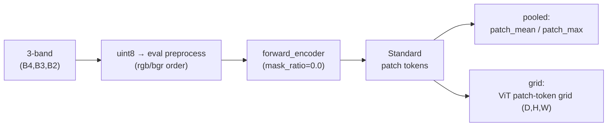
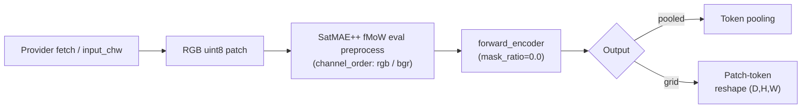
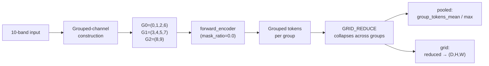
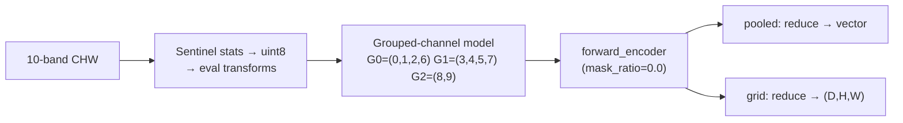

# SatMAE++ Family (`satmaepp`, `satmaepp_s2_10b`)

## Quick Facts

| Field             | `satmaepp` (RGB)                   | `satmaepp_s2_10b` (S2-10B)                     |
| ----------------- | ---------------------------------- | ---------------------------------------------- |
| Canonical ID      | `satmaepp`                         | `satmaepp_s2_10b`                              |
| Aliases           | `satmaepp_rgb`, `satmae++`         | `satmaepp_sentinel10`, `satmaepp_s2`           |
| Adapter type      | `on-the-fly`                       | `on-the-fly`                                   |
| Model config keys | none                               | `variant` (default: `large`; choices: `large`) |
| Core extraction   | `forward_encoder(mask_ratio=0.0)`  | `forward_encoder(mask_ratio=0.0)`              |

!!! success "SatMAE++ In 30 Seconds"
    SatMAE++ is a multi-scale improvement over SatMAE, and in `rs-embed` it ships as two **non-interchangeable** adapter paths: a plain RGB fMoW path (`satmaepp`) and a Sentinel-2 10-band grouped-channel path (`satmaepp_s2_10b`) that partitions channels into three fixed groups `((0,1,2,6),(3,4,5,7),(8,9))` and reduces grouped tokens at output time.

    In `rs-embed`, its most important characteristics are:

    - two separate adapter paths with different preprocessing, runtime loaders, and output semantics: see [Variant A: `satmaepp` (RGB)](#variant-a-satmaepp-rgb) and [Variant B: `satmaepp_s2_10b` (Sentinel-2 10-band)](#variant-b-satmaepp_s2_10b-sentinel-2-10-band)
    - 10-band path runs a **grouped-channel** runtime and needs `GRID_REDUCE` to control how grouped tokens collapse for the grid output: see [Variant B: `satmaepp_s2_10b` (Sentinel-2 10-band)](#variant-b-satmaepp_s2_10b-sentinel-2-10-band)
    - RGB path is sensitive to `CHANNEL_ORDER` (`rgb`/`bgr`) because the original SatMAE++ eval preprocessing was BGR-based: see [Variant A: `satmaepp` (RGB)](#variant-a-satmaepp-rgb)

---

## Shared Output Semantics

**`pooled`**: RGB path records `patch_mean`/`patch_max`; S2-10B path records `group_tokens_mean`/`group_tokens_max` reflecting its grouped-token runtime.

**`grid`**: `satmaepp` returns a standard ViT patch-token grid `(D,H,W)`; `satmaepp_s2_10b` reduces grouped tokens across channel groups then reshapes to `(D,H,W)`. Default/auto input preparation resolves to resize, and metadata records `input_prep.model_policy="resize_default_for_image_level_vit_patch_grid"`, `grid_semantics="vit_patch_tokens"`, and `grid_tile_recommended=false`.

!!! warning "Resize is the default for `grid`"
    SatMAE++ grid outputs are image-level ViT token grids, not seamless dense geospatial fields. For `input_prep=None` or `input_prep="auto"`, `rs-embed` resolves to `input_prep="resize"` by default and emits a warning. Explicit `input_prep="tile"` is still allowed for experimental visualization, but metadata marks it as seam-prone and not recommended for grid mosaics.

---

## Variant A: `satmaepp` (RGB)

### Input Contract

| Field                 | Value                                                  |
| --------------------- | ------------------------------------------------------ |
| Backend               | provider only (`gee`)                                  |
| `TemporalSpec`        | `range` (single-composite window)                      |
| Default collection    | `COPERNICUS/S2_SR_HARMONIZED`                          |
| Default bands (order) | `B4, B3, B2`                                           |
| Default fetch         | `scale_m=10`, `cloudy_pct=30`, `composite="median"`    |
| `input_chw`           | `CHW`, `C=3` in `(B4,B3,B2)` order, raw SR `0..10000`  |
| Side inputs           | none                                                   |

### Architecture Concept



### Preprocessing Pipeline

!!! warning "Resize is the default for `grid`"
    The pipeline below shows the default `input_prep="resize"` path. Explicit `input_prep="tile"` can split large ROIs into independent image-level token grids, but those grids can show stitching seams and are marked as experimental in metadata.



### Key Environment Variables

| Env var                           | Effect                                   |
| --------------------------------- | ---------------------------------------- |
| `RS_EMBED_SATMAEPP_ID`            | HF model ID / checkpoint selector        |
| `RS_EMBED_SATMAEPP_IMG`           | Eval image size                          |
| `RS_EMBED_SATMAEPP_CHANNEL_ORDER` | `rgb` or `bgr` preprocessing order       |
| `RS_EMBED_SATMAEPP_BGR`           | Legacy BGR toggle                        |
| `RS_EMBED_SATMAEPP_FETCH_WORKERS` | Provider prefetch workers for batch APIs |
| `RS_EMBED_SATMAEPP_BATCH_SIZE`    | Inference batch size for batch APIs      |

### Common Failure Modes

- wrong `input_chw` shape or band order
- checkpoint preprocessing mismatch because `CHANNEL_ORDER` changed
- missing `rshf` / SatMAE++ wrapper dependencies
- unexpected token shape causing grid reshape failures
- tiled `grid` output can show seams because each tile is an independent image-level token grid

---

## Variant B: `satmaepp_s2_10b` (Sentinel-2 10-band)

### Input Contract

| Field                 | Value                                                                               |
| --------------------- | ----------------------------------------------------------------------------------- |
| Backend               | provider only (`gee`)                                                               |
| `TemporalSpec`        | `range` (single-composite window)                                                   |
| Default collection    | `COPERNICUS/S2_SR_HARMONIZED`                                                       |
| Default bands (order) | `B2, B3, B4, B5, B6, B7, B8, B8A, B11, B12` — **strict** order, must match exactly  |
| Default fetch         | `scale_m=10`, `cloudy_pct=30`, `composite="median"`, `fill_value=0.0`               |
| `input_chw`           | `CHW`, `C=10` in the strict band order, raw SR `0..10000`                           |
| Side inputs           | none                                                                                |

### Architecture Concept



### Preprocessing + Runtime Loading

!!! warning "Resize is the default for `grid`"
    The 10-band grouped-channel path has the same grid caveat: grouped tokens are reduced and reshaped after an image-level forward pass. Explicit `input_prep="tile"` is allowed, but tiled grid mosaics are not recommended for seamless spatial outputs.



### Key Environment Variables

| Env var                              | Effect                                   |
| ------------------------------------ | ---------------------------------------- |
| `RS_EMBED_SATMAEPP_S2_CKPT_REPO`     | Checkpoint repo/source                   |
| `RS_EMBED_SATMAEPP_S2_CKPT_FILE`     | Checkpoint filename                      |
| `RS_EMBED_SATMAEPP_S2_MODEL_FN`      | Model constructor name                   |
| `RS_EMBED_SATMAEPP_S2_IMG`           | Eval image size                          |
| `RS_EMBED_SATMAEPP_S2_PATCH`         | Patch size                               |
| `RS_EMBED_SATMAEPP_S2_GRID_REDUCE`   | Group reduction mode for grid output     |
| `RS_EMBED_SATMAEPP_S2_WEIGHTS_ONLY`  | Weights-only checkpoint loading toggle   |
| `RS_EMBED_SATMAEPP_S2_FETCH_WORKERS` | Provider prefetch workers for batch APIs |
| `RS_EMBED_SATMAEPP_S2_BATCH_SIZE`    | Inference batch size for batch APIs      |

### Common Failure Modes

- `sensor.bands` order differs from the strict expected 10-band layout
- vendored runtime import fails or checkpoint download is unavailable
- grouped-token reshape assumptions do not match the loaded checkpoint/config
- `GRID_REDUCE` changes representation semantics across experiments
- tiled `grid` output can show seams because grouped tokens are reduced per independent tile

---

## Examples

### Minimal pooled examples

```python
from rs_embed import get_embedding, PointBuffer, TemporalSpec, OutputSpec

spatial = PointBuffer(lon=121.5, lat=31.2, buffer_m=2048)
temporal = TemporalSpec.range("2022-06-01", "2022-09-01")

emb_rgb = get_embedding(
    "satmaepp",
    spatial=spatial,
    temporal=temporal,
    output=OutputSpec.pooled(),
    backend="gee",
)

emb_s2 = get_embedding(
    "satmaepp_s2_10b",
    spatial=spatial,
    temporal=temporal,
    output=OutputSpec.pooled(),
    backend="gee",
)
```

### Example tuning knobs (env-controlled)

```python
# RGB variant:
export RS_EMBED_SATMAEPP_ID=...
export RS_EMBED_SATMAEPP_CHANNEL_ORDER=rgb
#
# S2-10B variant:
export RS_EMBED_SATMAEPP_S2_IMG=224
export RS_EMBED_SATMAEPP_S2_GRID_REDUCE=mean
```

### Example with variant selection

```python
from rs_embed import get_embedding, PointBuffer, TemporalSpec, OutputSpec

spatial = PointBuffer(lon=121.5, lat=31.2, buffer_m=2048)
temporal = TemporalSpec.range("2022-06-01", "2022-09-01")

emb_s2 = get_embedding(
    "satmaepp_s2_10b",
    spatial=spatial,
    temporal=temporal,
    output=OutputSpec.grid(),
    backend="gee",
    variant="large",
)
```

For export jobs, the same setting goes through
`ExportModelRequest.configure("satmaepp_s2_10b", variant="large")`.

---

## Paper & Links

- **Publication**: [CVPR 2024](https://arxiv.org/abs/2403.05419)
- **Code**: [techmn/satmae_pp](https://github.com/techmn/satmae_pp)

---

## Reference

- RGB variant is sensitive to `CHANNEL_ORDER` (`rgb`/`bgr`) — the original eval preprocessing was BGR-based.
- S2-10B variant's `GRID_REDUCE` changes the output semantics; `mean` and `max` are not interchangeable.
- Default/auto `grid` requests resolve to resize because tiled SatMAE++ patch-token grids can show stitching seams.
- The two variants (`satmaepp` and `satmaepp_s2_10b`) are separate model IDs with different preprocessing, not a config switch on the same model.
