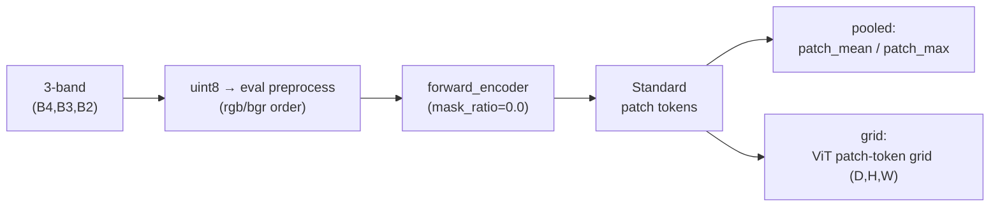
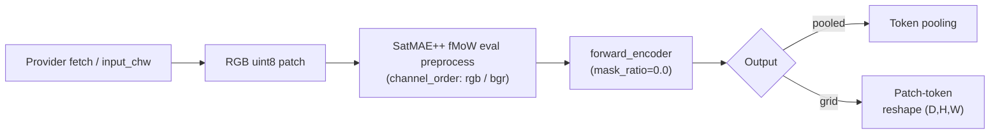
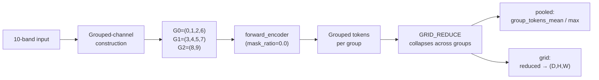
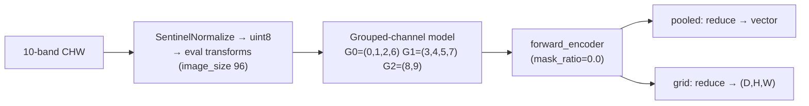

# SatMAE++ (`satmaepp`)

## Quick Facts

| Field             | `rgb` modality (default)           | `s2_10b` modality                              |
| ----------------- | ---------------------------------- | ---------------------------------------------- |
| Model ID          | `satmaepp`                         | `satmaepp`                                     |
| `modality`        | `rgb` (default)                    | `s2_10b`                                        |
| Aliases           | `satmaepp_rgb`, `satmae++`         | —                                              |
| Adapter type      | `on-the-fly`                       | `on-the-fly`                                   |
| Model config keys | none                               | `variant` (default: `large`; choices: `large`) |
| Core extraction   | `forward_encoder(mask_ratio=0.0)`  | `forward_encoder(mask_ratio=0.0)`              |

!!! success "SatMAE++ In 30 Seconds"
    SatMAE++ is a multi-scale improvement over SatMAE, and in `rs-embed` it ships as a single model `satmaepp` exposing two **non-interchangeable** modalities: a plain RGB fMoW path (`modality="rgb"`, the default) and a Sentinel-2 10-band grouped-channel path (`modality="s2_10b"`) that partitions channels into three fixed groups `((0,1,2,6),(3,4,5,7),(8,9))` and reduces grouped tokens at output time.

    In `rs-embed`, its most important characteristics are:

    - two modalities under one model name, with different preprocessing, runtime loaders, and output semantics — switch via `modality="s2_10b"`: see [`rgb` modality (default)](#rgb-modality-default) and [`s2_10b` modality (Sentinel-2 10-band)](#s2_10b-modality-sentinel-2-10-band)
    - the `s2_10b` modality runs a **grouped-channel** runtime and needs `GRID_REDUCE` to control how grouped tokens collapse for the grid output: see [`s2_10b` modality (Sentinel-2 10-band)](#s2_10b-modality-sentinel-2-10-band)
    - the `rgb` modality is sensitive to `CHANNEL_ORDER` (`rgb`/`bgr`) because the original SatMAE++ eval preprocessing was BGR-based: see [`rgb` modality (default)](#rgb-modality-default)

---

## Shared Output Semantics

**`pooled`**: the `rgb` modality records `patch_mean`/`patch_max`; the `s2_10b` modality records `group_tokens_mean`/`group_tokens_max` reflecting its grouped-token runtime.

**`grid`**: the `rgb` modality returns a standard ViT patch-token grid `(D,H,W)`; the `s2_10b` modality reduces grouped tokens across channel groups then reshapes to `(D,H,W)`. Default/auto input preparation resolves to tile (and warns about seams on grid output), and metadata records `input_prep.model_policy="tile_default_for_image_level_vit_patch_grid"`, `grid_semantics="vit_patch_tokens"`, and `grid_tile_recommended=false`.

!!! warning "`grid` tiles by default and can show seams"
    SatMAE++ grid outputs are image-level ViT token grids, not seamless dense geospatial fields. Like every other model, SatMAE++ tiles by default: `input_prep=None` or `input_prep="auto"` resolves to `input_prep="tile"`. Because tiled patch-token mosaics can show stitching seams at tile boundaries, the default/auto path and an explicit `input_prep="tile"` both emit a warning on `grid` output. Pass `input_prep="resize"` for a seamless (downsampled) grid — that is the recommended seamless opt-in and emits no warning. Both modalities of `satmaepp` inherit this policy.

---

## `rgb` modality (default)

### Input Contract

| Field                 | Value                                                  |
| --------------------- | ------------------------------------------------------ |
| Backend               | provider only (`gee`)                                  |
| `TemporalSpec`        | `range` (single-composite window)                      |
| Default collection    | `COPERNICUS/S2_SR_HARMONIZED`                          |
| Default bands (order) | `B4, B3, B2`                                           |
| Default fetch         | `scale_m=10`, `cloudy_pct=30`, `composite="median"`    |
| `input_chw`           | `CHW`, `C=3` in `(B4,B3,B2)` order, raw SR `0..10000`  |
| Side inputs           | none                                                   |

### Architecture Concept



### Preprocessing Pipeline

!!! warning "Tiling is the default for `grid`"
    SatMAE++ tiles by default like every other model, so the pipeline below shows the default `input_prep="tile"` path. Tiled image-level token grids can show stitching seams at tile boundaries, so the default/auto and explicit-tile paths warn on `grid` output. Pass `input_prep="resize"` for a seamless (downsampled) grid; that path emits no warning.



The `rgb` modality has no `variant` knob — it serves a single fMoW-RGB path.

### Key Environment Variables

| Env var                           | Effect                                   |
| --------------------------------- | ---------------------------------------- |
| `RS_EMBED_SATMAEPP_ID`            | HF model ID / checkpoint selector        |
| `RS_EMBED_SATMAEPP_IMG`           | Eval image size                          |
| `RS_EMBED_SATMAEPP_CHANNEL_ORDER` | `rgb` or `bgr` preprocessing order       |
| `RS_EMBED_SATMAEPP_BGR`           | Legacy BGR toggle                        |
| `RS_EMBED_SATMAEPP_FETCH_WORKERS` | Provider prefetch workers for batch APIs |
| `RS_EMBED_SATMAEPP_BATCH_SIZE`    | Inference batch size for batch APIs      |

### Common Failure Modes

- wrong `input_chw` shape or band order
- checkpoint preprocessing mismatch because `CHANNEL_ORDER` changed
- missing `rshf` / SatMAE++ wrapper dependencies
- unexpected token shape causing grid reshape failures
- tiled `grid` output can show seams because each tile is an independent image-level token grid

---

## `s2_10b` modality (Sentinel-2 10-band)

Select this path with `modality="s2_10b"`. It is the grouped-channel Sentinel-2 SR runtime with `image_size=96` and a single published checkpoint (`variant="large"`).

### Input Contract

| Field                 | Value                                                                               |
| --------------------- | ----------------------------------------------------------------------------------- |
| Backend               | provider only (`gee`)                                                               |
| `TemporalSpec`        | `range` (single-composite window)                                                   |
| Default collection    | `COPERNICUS/S2_SR_HARMONIZED`                                                       |
| Default bands (order) | `B2, B3, B4, B5, B6, B7, B8, B8A, B11, B12` — **strict** order, must match exactly  |
| Default fetch         | `scale_m=10`, `cloudy_pct=30`, `composite="median"`, `fill_value=0.0`               |
| `input_chw`           | `CHW`, `C=10` in the strict band order, raw SR `0..10000`                           |
| Side inputs           | none                                                                                |

### Architecture Concept



### Preprocessing + Runtime Loading

!!! warning "`grid` tiles by default and can show seams"
    The 10-band grouped-channel path has the same grid caveat: grouped tokens are reduced and reshaped after an image-level forward pass. It tiles by default like every other model, and tiled grid mosaics can show stitching seams, so the default/auto and explicit-tile paths warn on `grid` output. Pass `input_prep="resize"` for a seamless (downsampled) grid; that path emits no warning.



Metadata for the `s2_10b` grid records `grid_kind="spatial_tokens_aggregated_over_channel_groups"`, `channel_groups`, and `normalization="sentinel_normalize_source"`.

### Key Environment Variables

| Env var                              | Effect                                   |
| ------------------------------------ | ---------------------------------------- |
| `RS_EMBED_SATMAEPP_S2_CKPT_REPO`     | Checkpoint repo/source                   |
| `RS_EMBED_SATMAEPP_S2_CKPT_FILE`     | Checkpoint filename                      |
| `RS_EMBED_SATMAEPP_S2_MODEL_FN`      | Model constructor name                   |
| `RS_EMBED_SATMAEPP_S2_IMG`           | Eval image size (default `96`)           |
| `RS_EMBED_SATMAEPP_S2_PATCH`         | Patch size                               |
| `RS_EMBED_SATMAEPP_S2_GRID_REDUCE`   | Group reduction mode for grid output     |
| `RS_EMBED_SATMAEPP_S2_WEIGHTS_ONLY`  | Weights-only checkpoint loading toggle   |
| `RS_EMBED_SATMAEPP_S2_FETCH_WORKERS` | Provider prefetch workers for batch APIs |
| `RS_EMBED_SATMAEPP_S2_BATCH_SIZE`    | Inference batch size for batch APIs      |

### Common Failure Modes

- `sensor.bands` order differs from the strict expected 10-band layout
- vendored runtime import fails or checkpoint download is unavailable
- grouped-token reshape assumptions do not match the loaded checkpoint/config
- `GRID_REDUCE` changes representation semantics across experiments
- tiled `grid` output can show seams because grouped tokens are reduced per independent tile

---

## Examples

### Minimal pooled examples

```python
from rs_embed import get_embedding, PointBuffer, TemporalSpec, OutputSpec

spatial = PointBuffer(lon=121.5, lat=31.2, buffer_m=2048)
temporal = TemporalSpec.range("2022-06-01", "2022-09-01")

# Default RGB modality:
emb_rgb = get_embedding(
    "satmaepp",
    spatial=spatial,
    temporal=temporal,
    output=OutputSpec.pooled(),
    backend="gee",
)

# 10-band Sentinel-2 modality:
emb_s2 = get_embedding(
    "satmaepp",
    modality="s2_10b",
    spatial=spatial,
    temporal=temporal,
    output=OutputSpec.pooled(),
    backend="gee",
)
```

### Example tuning knobs (env-controlled)

```python
# RGB modality:
export RS_EMBED_SATMAEPP_ID=...
export RS_EMBED_SATMAEPP_CHANNEL_ORDER=rgb
#
# s2_10b modality:
export RS_EMBED_SATMAEPP_S2_IMG=96
export RS_EMBED_SATMAEPP_S2_GRID_REDUCE=mean
```

### Example with variant selection (`s2_10b` only)

```python
from rs_embed import get_embedding, PointBuffer, TemporalSpec, OutputSpec

spatial = PointBuffer(lon=121.5, lat=31.2, buffer_m=2048)
temporal = TemporalSpec.range("2022-06-01", "2022-09-01")

emb_s2 = get_embedding(
    "satmaepp",
    modality="s2_10b",
    spatial=spatial,
    temporal=temporal,
    output=OutputSpec.grid(),
    backend="gee",
    variant="large",
)
```

The `variant` knob only applies to the `s2_10b` modality (single published checkpoint); the `rgb` modality has no variant. For export jobs, the same setting goes through
`ExportModelRequest.configure("satmaepp", modality="s2_10b", variant="large")`.

---

## Paper & Links

- **Publication**: [CVPR 2024](https://arxiv.org/abs/2403.05419)
- **Code**: [techmn/satmae_pp](https://github.com/techmn/satmae_pp)

---

## Reference

- The `rgb` modality is sensitive to `CHANNEL_ORDER` (`rgb`/`bgr`) — the original eval preprocessing was BGR-based.
- The `s2_10b` modality's `GRID_REDUCE` changes the output semantics; `mean` and `max` are not interchangeable.
- Default/auto `grid` requests tile (like every model) and warn because tiled SatMAE++ patch-token grids can show stitching seams; pass `input_prep="resize"` for a seamless (downsampled) grid.
- The two modalities (`rgb` and `s2_10b`) are different preprocessing/runtime paths under the one `satmaepp` model name, selected with `modality=`. The `variant` knob applies only to `s2_10b`.
