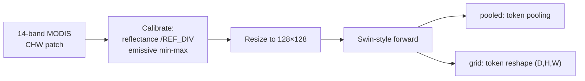
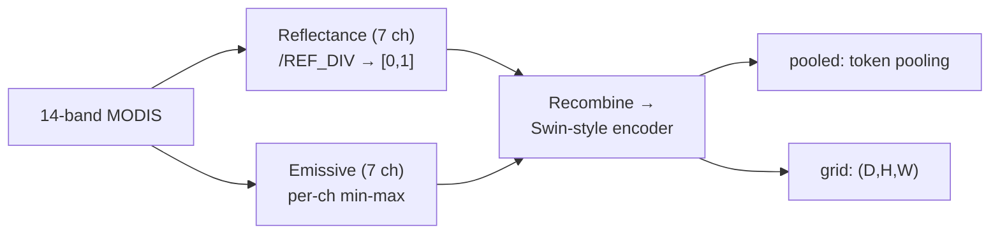

# SatVision-TOA (`satvision`)

## Quick Facts

| Field                | Value                                                                    |
| -------------------- | ------------------------------------------------------------------------ |
| Model ID             | `satvision`                                                              |
| Aliases              | `satvision_toa`                                                          |
| Family / Backbone    | SatVision-TOA checkpoint (HF/local checkpoint loader)                    |
| Adapter type         | `on-the-fly`                                                             |
| Training alignment   | High only when channel order + calibration match checkpoint expectations |

!!! success "SatVision-TOA In 30 Seconds"
    SatVision-TOA is a 14-channel MODIS top-of-atmosphere backbone, and its defining feature in `rs-embed` is **channel-type-aware calibration**: reflectance channels go through a divisor (`REF_DIV`) while emissive/thermal channels go through per-channel min-max calibration (`EMISSIVE_MINS/MAXS`), all driven by a strict MODIS band order the adapter does not try to guess.

    In `rs-embed`, its most important characteristics are:

    - strict 14-channel MODIS band order (`1,2,3,26,6,20,7,27,28,29,31,32,33,34`) — the adapter does **not** infer semantic channel order from values: see [Input Contract](#input-contract)
    - split reflectance/emissive normalization driven by `REF_DIV` plus `EMISSIVE_MINS`/`EMISSIVE_MAXS` calibration arrays: see [Environment Variables / Tuning Knobs](#environment-variables-tuning-knobs)
    - `1000 m` default `scale_m` matching MODIS native resolution rather than the usual Sentinel-2 10 m default: see [Input Contract](#input-contract)

---

## Input Contract

| Field                 | Value                                                                                                   |
| --------------------- | ------------------------------------------------------------------------------------------------------- |
| Backend               | provider only (`gee` / `auto`)                                                                          |
| `TemporalSpec`        | `range` recommended (normalized via shared helper)                                                      |
| Default collection    | `MODIS/061/MOD021KM`                                                                                    |
| Default bands (order) | **strict** `1, 2, 3, 26, 6, 20, 7, 27, 28, 29, 31, 32, 33, 34` (14-band MODIS order)                    |
| Default fetch         | `scale_m=1000`, `cloudy_pct=100`, `composite="mosaic"`, `fill_value=0.0`                                |
| `input_chw`           | `CHW`, `C == RS_EMBED_SATVISION_TOA_IN_CHANS` (default `14`); raw TOA or unit-scaled per norm mode      |
| Side inputs           | none (but channel calibration arrays `REFLECTANCE_IDXS` / `EMISSIVE_IDXS` / `REF_DIV` / `EMISSIVE_MINS/MAXS` matter) |

!!! warning "Strict band order"
    The adapter does **not** infer semantic channel order from values. `sensor.bands` must match the checkpoint's expected order exactly, and `len(sensor.bands) == in_chans` is checked.

---

## Preprocessing Pipeline

!!! tip "Tiling is the default — resize is also available"
    `input_prep=None`/`"auto"` tiles large ROIs by default to preserve spatial detail; pass `input_prep="resize"` to downsample the whole ROI to the model's input size in a single forward pass instead. See [Choosing Settings](../choosing_settings.md#input-preparation-resize-vs-tile).



---

## Architecture Concept



---

## Environment Variables / Tuning Knobs

### Model / weights

| Env var                                | Default                   | Effect                                          |
| -------------------------------------- | ------------------------- | ----------------------------------------------- |
| `RS_EMBED_SATVISION_TOA_ID`            | SatVision TOA HF model ID | HF model identifier                             |
| `RS_EMBED_SATVISION_TOA_CKPT`          | unset                     | Local checkpoint path override                  |
| `RS_EMBED_SATVISION_TOA_AUTO_DOWNLOAD` | `1`                       | Allow HF download when local checkpoint not set |
| `RS_EMBED_SATVISION_TOA_IMG`           | `128`                     | Resize target image size                        |
| `RS_EMBED_SATVISION_TOA_IN_CHANS`      | `14`                      | Expected channel count                          |
| `RS_EMBED_SATVISION_TOA_BATCH_SIZE`    | CPU:`2`, CUDA:`8`         | Inference batch size (batch APIs)               |
| `RS_EMBED_SATVISION_TOA_FETCH_WORKERS` | `8`                       | Provider prefetch workers (batch APIs)          |

### Normalization / calibration

| Env var                                   | Default          | Effect                          |
| ----------------------------------------- | ---------------- | ------------------------------- |
| `RS_EMBED_SATVISION_TOA_NORM`             | `auto`           | `auto`, `raw`, or `unit`        |
| `RS_EMBED_SATVISION_TOA_REFLECTANCE_IDXS` | adapter defaults | Reflectance channel indices     |
| `RS_EMBED_SATVISION_TOA_EMISSIVE_IDXS`    | adapter defaults | Emissive channel indices        |
| `RS_EMBED_SATVISION_TOA_REF_DIV`          | `100`            | Reflectance divisor             |
| `RS_EMBED_SATVISION_TOA_EMISSIVE_MINS`    | adapter defaults | Emissive min calibration values |
| `RS_EMBED_SATVISION_TOA_EMISSIVE_MAXS`    | adapter defaults | Emissive max calibration values |

### Default sensor overrides (if `sensor` omitted)

| Env var                             | Default                     | Effect                      |
| ----------------------------------- | --------------------------- | --------------------------- |
| `RS_EMBED_SATVISION_TOA_COLLECTION` | `MODIS/061/MOD021KM`        | Default provider collection |
| `RS_EMBED_SATVISION_TOA_BANDS`      | default 14-band MODIS order | Override default band list  |
| `RS_EMBED_SATVISION_TOA_SCALE_M`    | `1000`                      | Default fetch scale         |
| `RS_EMBED_SATVISION_TOA_CLOUDY_PCT` | `100`                       | Default cloud filter        |
| `RS_EMBED_SATVISION_TOA_FILL`       | `0`                         | Default fill value          |
| `RS_EMBED_SATVISION_TOA_COMPOSITE`  | `mosaic`                    | Default composite method    |

---

## Output Semantics

**`pooled`**: if model returns `[N,D]`, pools patch tokens with `mean`/`max`; if model already returns `(D,)`, returned directly as `model_pooled`.

**`grid`**: requires token-sequence output `[N,D]` and reshapes patch tokens to `(D,H,W)`.

---

## Examples

### Minimal provider-backed example

```python
from rs_embed import get_embedding, PointBuffer, TemporalSpec, OutputSpec

emb = get_embedding(
    "satvision",
    spatial=PointBuffer(lon=121.5, lat=31.2, buffer_m=5000),
    temporal=TemporalSpec.range("2022-07-01", "2022-07-31"),
    output=OutputSpec.pooled(),
    backend="gee",
)
```

### Example normalization tuning (env-controlled)

```python
# Example (shell):
export RS_EMBED_SATVISION_TOA_NORM=raw
export RS_EMBED_SATVISION_TOA_IMG=128
export RS_EMBED_SATVISION_TOA_REF_DIV=100
export RS_EMBED_SATVISION_TOA_IN_CHANS=14
```

---

## Paper & Links

- **Publication**: [arXiv 2024](https://arxiv.org/abs/2411.17000)
- **Code**: [nasa-nccs-hpda/pytorch-caney](https://github.com/nasa-nccs-hpda/pytorch-caney)

---

## Reference

- Provider-only — `backend="tensor"` is not supported.
- The 14-band MODIS channel order is strict and checkpoint-specific — wrong order produces silently bad embeddings even if shapes pass.
- Reflectance and emissive bands use different calibration (divisor vs min-max); mixing up `EMISSIVE_IDXS` or calibration arrays breaks normalization.
