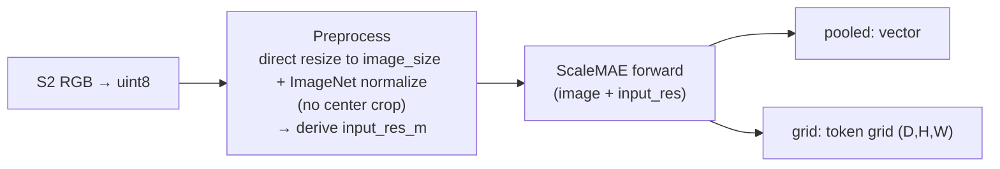
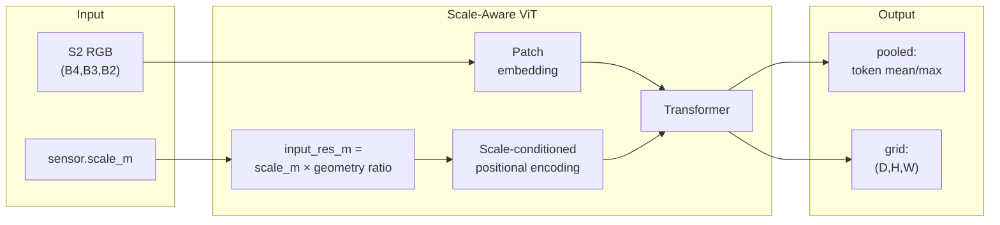

# ScaleMAE RGB (`scalemae`)

## Quick Facts

| Field                | Value                                                                     |
| -------------------- | ------------------------------------------------------------------------- |
| Model ID             | `scalemae`                                                                |
| Aliases              | `scalemae_rgb`                                                            |
| Family / Backbone    | ScaleMAE via `rshf.scalemae.ScaleMAE`                                     |
| Adapter type         | `on-the-fly`                                                              |
| Training alignment   | High when `sensor.scale_m` matches the source patch resolution semantics  |

!!! success "ScaleMAE In 30 Seconds"
    ScaleMAE is an MAE ViT that takes the effective ground-sample distance (`input_res_m`) as an **explicit scale-conditioning signal** baked into its positional encoding, so the same image seen at different resolutions produces different embeddings — and in `rs-embed` the adapter *derives* `input_res_m` from `sensor.scale_m` plus the post-preprocess geometry, which makes `sensor.scale_m` a first-class model parameter even though it looks like a fetch knob.

    In `rs-embed`, its most important characteristics are:

    - `sensor.scale_m` is a **model input**, not just a fetch resolution — a wrong value silently drifts embeddings across runs: see [Input Contract](#input-contract)
    - `grid` requires a token sequence and raises a clear error when the wrapper only exposes pooled output: see [Output Semantics](#output-semantics)
    - All inputs use a single direct-resize preprocessing (`Resize(image_size) -> Normalize`, no center crop) so the patch-token grid covers the full image and the square-fetch ROI crop stays aligned; ImageNet normalization is kept because it matches pretraining: see [Preprocessing Pipeline](#preprocessing-pipeline)

---

## Input Contract

| Field                 | Value                                                                                  |
| --------------------- | -------------------------------------------------------------------------------------- |
| Backend               | provider only (`gee` / `auto`)                                                         |
| `TemporalSpec`        | `range` recommended (normalized via shared helper)                                     |
| Default collection    | `COPERNICUS/S2_SR_HARMONIZED`                                                          |
| Default bands (order) | `B4, B3, B2`                                                                           |
| Default fetch         | `scale_m=10`, `cloudy_pct=30`, `composite="median"`                                    |
| `input_chw`           | `CHW`, `C=3` in `(B4,B3,B2)` order, raw SR `0..10000`                                  |
| Side inputs           | **required** effective scale `input_res_m` — **auto-derived** from `sensor.scale_m`    |

!!! warning "`sensor.scale_m` is a model input"
    ScaleMAE uses `sensor.scale_m` combined with the active preprocessing geometry to derive the effective `input_res_m` passed into the model's scale-aware positional encoding. A wrong `sensor.scale_m` silently drifts embeddings across runs — see [Preprocessing Pipeline](#preprocessing-pipeline).

---

## Preprocessing Pipeline

!!! warning "Resize is the default for `grid`"
    ScaleMAE `grid` output is an image-level ViT patch-token grid, not a seamless dense geospatial field. Like every other model, ScaleMAE tiles by default: `input_prep=None` or `input_prep="auto"` resolves to `input_prep="tile"`. Because tiled patch-token mosaics can show stitching seams at tile boundaries, the default/auto path and an explicit `input_prep="tile"` both emit a warning on `grid` output. Pass `input_prep="resize"` for a seamless (downsampled) grid — that is the recommended seamless opt-in and emits no warning.



!!! warning "Grid output requirement"
    `grid` output requires a token sequence after adapter normalization. If the model or wrapper returns pooled vectors only, `OutputSpec.grid()` raises a clear error instead of silently fabricating a grid.

---

## Architecture Concept



---

## Environment Variables / Tuning Knobs

| Env var                           | Default                      | Effect                                          |
| --------------------------------- | ---------------------------- | ----------------------------------------------- |
| `RS_EMBED_SCALEMAE_ID`            | `MVRL/scalemae-vitlarge-800` | HF model ID for `ScaleMAE.from_pretrained(...)` |
| `RS_EMBED_SCALEMAE_IMG`           | `224`                        | Resize / preprocess image size                  |
| `RS_EMBED_SCALEMAE_FETCH_WORKERS` | `8`                          | Provider prefetch workers for batch APIs        |
| `RS_EMBED_SCALEMAE_BATCH_SIZE`    | CPU:`8`, CUDA:`32`           | Inference batch size for batch APIs             |

Non-env but critical:

Even though it is not an environment variable, `sensor.scale_m` is a critical runtime setting because the adapter uses it to derive the effective `input_res_m` passed to ScaleMAE.

---

## Output Semantics

**`pooled`**: if `[N,D]` token sequence → pools with `mean`/`max`; if already `[D]` → returned as `model_pooled`; metadata records `tokens_kind`, `used_patch_size`, and `used_scale_m`.

**`grid`**: requires a token sequence; raises a clear error when the wrapper only exposes pooled output. Default/auto input preparation resolves to tile (and warns about seams on grid output), and metadata records `input_prep.model_policy="tile_default_for_image_level_vit_patch_grid"`, `grid_semantics="vit_patch_tokens"`, and `grid_tile_recommended=false`.

---

## Examples

### Minimal provider-backed example

```python
from rs_embed import get_embedding, PointBuffer, TemporalSpec, OutputSpec

emb = get_embedding(
    "scalemae",
    spatial=PointBuffer(lon=121.5, lat=31.2, buffer_m=2048),
    temporal=TemporalSpec.range("2022-06-01", "2022-09-01"),
    output=OutputSpec.pooled(),
    backend="gee",
)
```

### Example tuning (env + scale semantics)

```python
# Example (shell):
export RS_EMBED_SCALEMAE_ID=MVRL/scalemae-vitlarge-800
export RS_EMBED_SCALEMAE_IMG=224
#
# In code, keep sensor.scale_m correct (the adapter derives effective input_res_m from it).
```

---

## Paper & Links

- **Publication**: [ICCV 2023](https://arxiv.org/abs/2212.14532)
- **Code**: [bair-climate-initiative/scale-mae](https://github.com/bair-climate-initiative/scale-mae)

---

## Reference

- `sensor.scale_m` directly affects the positional encoding via `input_res_m` — a wrong value silently drifts embeddings.
- Default/auto `grid` requests tile (like every model) and warn because tiled ScaleMAE patch-token grids can show stitching seams; pass `input_prep="resize"` for a seamless (downsampled) grid.
- Grid output requires a token sequence; if the `rshf` wrapper returns only a pooled vector, `OutputSpec.grid()` raises an error.
- Older `rshf` versions may wrap ScaleMAE in a way that hides `forward_features()` — the adapter tries common nested attributes (`.model`) but may fail.
