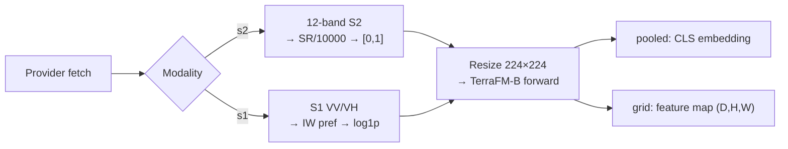
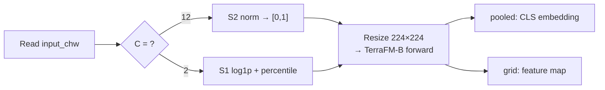
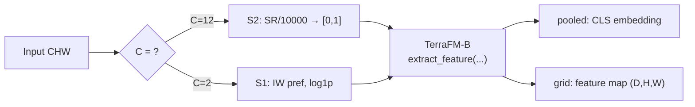

# TerraFM-B (`terrafm`)

## Quick Facts

| Field                | Value                                                                                  |
| -------------------- | -------------------------------------------------------------------------------------- |
| Model ID             | `terrafm`                                                                              |
| Aliases              | `terrafm_b`                                                                            |
| Family / Backbone    | TerraFM-B from Hugging Face (`MBZUAI/TerraFM`)                                         |
| Adapter type         | `on-the-fly`                                                                           |
| Training alignment   | Medium-High when modality-specific preprocessing matches the intended TerraFM path     |

!!! success "TerraFM In 30 Seconds"
    TerraFM-B is a dual-modality backbone that takes either Sentinel-2 12-band SR **or** Sentinel-1 `VV/VH` — the original model routes by channel count at the input (`C==2` → S1 branch, `C==12` → S2 branch) — and at output time it returns a model-native last-layer feature map via `extract_feature(...)` rather than a ViT token reshape.

    In `rs-embed`, its most important characteristics are:

    - modality switch via `modality="s1"` or `modality="s2"`, strictly validated by channel count (`2` or `12`): see [Input Contract](#input-contract)
    - S1 path prefers `IW` by default as an `rs-embed` adapter policy (not a TerraFM paper requirement) with an optional relaxed retry: see [Preprocessing Pipeline](#preprocessing-pipeline)
    - `grid` returns TerraFM's own last-layer feature map `(D,H,W)`, not a patch-token reshape: see [Output Semantics](#output-semantics)

---

## Input Contract

=== "Provider backend (`gee` / `auto`)"

    | Modality       | Collection                    | Bands (order)                                    | `input_chw` (override)             | Extra sensor fields                                         |
    | -------------- | ----------------------------- | ------------------------------------------------ | ---------------------------------- | ----------------------------------------------------------- |
    | `s2` (default) | `COPERNICUS/S2_SR_HARMONIZED` | `B1,B2,B3,B4,B5,B6,B7,B8,B8A,B9,B11,B12` (12-band) | `CHW`, `C=12`, raw SR `0..10000`   | `scale_m`, `cloudy_pct`, `composite`                        |
    | `s1`           | `COPERNICUS/S1_GRD_FLOAT`     | `VV, VH` (2-band)                                | `CHW`, `C=2` in `VV,VH`, raw VV/VH | `use_float_linear`, `s1_require_iw`, `s1_relax_iw_on_empty` |

=== "Tensor backend (`tensor`)"

    | Modality       | `input_chw`                                      | Adapter normalization                                      |
    | -------------- | ------------------------------------------------ | ---------------------------------------------------------- |
    | `s2` (default) | `CHW`, `C=12`, raw SR `0..10000`                 | raw SR → `/10000` → clip `[0,1]` (provider-equivalent)     |
    | `s1`           | `CHW`, `C=2` in `VV, VH`, raw Sentinel-1 values  | shared `log1p` + percentile scaling (provider-equivalent)  |

!!! warning "Strict channel-count routing"
    TerraFM's original model routes by channel count: `C == 12` → S2 branch, `C == 2` → S1 branch. Setting `modality` alone is not enough if `input_chw` has the wrong `C`.

---

## Preprocessing Pipeline

!!! tip "Resize is the default — tiling is also available"
    The pipeline below shows the default `input_prep="resize"` path. For large ROIs, use `input_prep="tile"` to split the input into tiles and preserve spatial detail. See [Choosing Settings](../choosing_settings.md#input-preparation-resize-vs-tile).

!!! note "What the original TerraFM model assumes for S1"
    TerraFM treats Sentinel-1 as a 2-channel input branch (`VV`, `VH`). The official model code routes the S1 path by channel count (`C == 2`). The TerraFM paper describes S1 pretraining data as Sentinel-1 RTC patches, so the strongest original assumption is dual-pol `VV/VH` plus an analysis-ready S1 product, not a hard-coded `IW` rule.

!!! note "Why rs-embed prefers `IW` on GEE"
    Earth Engine Sentinel-1 collections are heterogeneous: different instrument modes, coverage patterns, and product characteristics can appear in the same collection. rs-embed therefore prefers `IW` by default as a conservative proxy for a more homogeneous land-observation subset when approximating TerraFM's S1 training distribution from `COPERNICUS/S1_GRD_FLOAT` / `COPERNICUS/S1_GRD`. This `IW` preference is an adapter policy, not a TerraFM paper requirement.

!!! info "S1 fetch options in rs-embed"
    With `s1_require_iw=True`, rs-embed first tries `instrumentMode == "IW"` together with dual-pol `VV/VH`. If `s1_relax_iw_on_empty=True`, a strict `IW` miss triggers one retry without the `IW` filter. With `s1_require_iw=False`, the adapter queries dual-pol `VV/VH` directly and does not enforce `IW`.

    When provider-backed S1 fetch succeeds, metadata records `s1_iw_requested`, `s1_iw_applied`, `s1_iw_relaxed_on_empty`, and `s1_relax_iw_on_empty`, so you can tell whether a sample came from strict `IW` filtering or from the relaxed fallback path.

### Provider path



### Tensor backend path



!!! note "Tensor backend normalization"
    The tensor backend does apply the adapter's modality-specific normalization. In practice, `input_chw` should still be raw S2 SR values for `s2`, or raw Sentinel-1 `VV/VH` values for `s1`, so that the tensor path matches the provider path semantics.

---

## Architecture Concept



---

## Environment Variables / Tuning Knobs

| Env var                          | Default            | Effect                                   |
| -------------------------------- | ------------------ | ---------------------------------------- |
| `RS_EMBED_TERRAFM_FETCH_WORKERS` | `8`                | Provider prefetch workers for batch APIs |
| `RS_EMBED_TERRAFM_BATCH_SIZE`    | CPU:`8`, CUDA:`64` | Inference batch size for batch APIs      |

!!! note "Cache and adapter behavior"
    HF cache environment variables: `HUGGINGFACE_HUB_CACHE`, `HF_HOME`, `HUGGINGFACE_HOME`.

    Image size is fixed at `224` in the current implementation, the runtime code is vendored inside `rs-embed`, and weights are fetched from `MBZUAI/TerraFM` as `TerraFM-B.pth`. Although the vendored runtime also exposes a `large` factory, the current adapter only wires up the TerraFM-B weight path, so variant switching is not exposed yet.

---

## Output Semantics

**`pooled`**: TerraFM's own pooled forward output `(D,)` — not token pooling.

**`grid`**: last-layer feature map via `extract_feature(...)` `(D,H,W)`; metadata records `grid_type="feature_map"`.

---

## Examples

### Minimal provider-backed S2 example

```python
from rs_embed import get_embedding, PointBuffer, TemporalSpec, OutputSpec

emb = get_embedding(
    "terrafm",
    spatial=PointBuffer(lon=121.5, lat=31.2, buffer_m=2048),
    temporal=TemporalSpec.range("2022-06-01", "2022-09-01"),
    modality="s2",
    output=OutputSpec.pooled(),
    backend="gee",
)
```

### Minimal provider-backed S1 example

```python
from rs_embed import get_embedding, PointBuffer, TemporalSpec, OutputSpec, SensorSpec

sensor = SensorSpec(
    collection="COPERNICUS/S1_GRD_FLOAT",
    bands=("VV", "VH"),
    scale_m=10,
    composite="median",
    use_float_linear=True,
    s1_require_iw=True,
    s1_relax_iw_on_empty=True,
)

emb = get_embedding(
    "terrafm",
    spatial=PointBuffer(lon=121.5, lat=31.2, buffer_m=2048),
    temporal=TemporalSpec.range("2022-06-01", "2022-09-01"),
    sensor=sensor,
    modality="s1",
    output=OutputSpec.pooled(),
    backend="gee",
)
```

!!! note "Modality switching"
    Prefer passing `modality="s1"` or `modality="s2"` directly at the public API layer. Setting `modality="s1"` is what actually switches TerraFM onto the S1 path; changing only `collection` or `bands` is not enough. `use_float_linear=True` matches `COPERNICUS/S1_GRD_FLOAT`, while `False` matches `COPERNICUS/S1_GRD`. The conservative default is `s1_require_iw=True`, and `s1_relax_iw_on_empty=True` keeps that strict path but retries without `IW` if the strict query is empty. For maximum reproducibility, keep `s1_require_iw=True` and set `s1_relax_iw_on_empty=False`.

---

## Paper & Links

- **Publication**: [ICLR 2026](https://arxiv.org/abs/2506.06281)
- **Code**: [mbzuai-oryx/TerraFM](https://github.com/mbzuai-oryx/TerraFM)

---

## Reference

- S1 `IW` filtering can return an empty collection for some AOI/time combinations — set `s1_relax_iw_on_empty=True` to allow a retry without `IW`.
- Setting `modality="s1"` is what switches to the S1 path; changing only `collection` or `bands` is not enough.
- Grid output is a native feature map via `extract_feature(...)`, not a ViT patch-token reshape — the spatial dimensions differ from token-based models.
