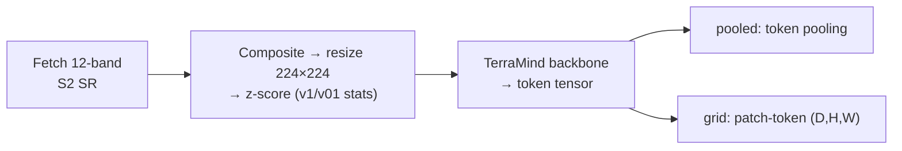
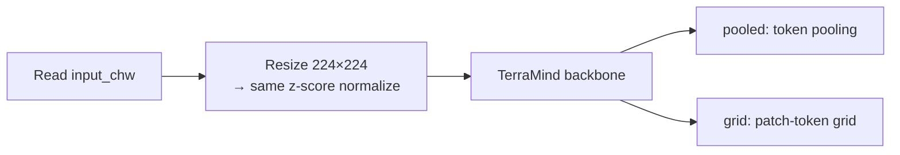
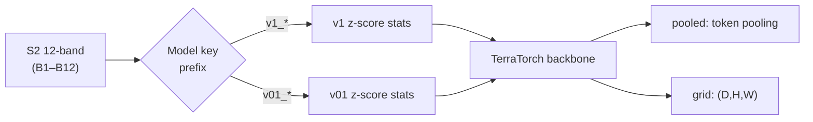

# TerraMind (`terramind`)
## Quick Facts

| Field                | Value                                                          |
| -------------------- | -------------------------------------------------------------- |
| Model ID             | `terramind`                                                    |
| Family / Backbone    | TerraMind via TerraTorch `BACKBONE_REGISTRY`                   |
| Adapter type         | `on-the-fly`                                                   |
| Training alignment   | High when default TerraMind z-score normalization is preserved |

!!! success "TerraMind In 30 Seconds"
    TerraMind is IBM's any-to-any multimodal geospatial foundation model, accessed in `rs-embed` through TerraTorch's `BACKBONE_REGISTRY` as a strict Sentinel-2 12-band encoder. Its defining subtlety is that TerraMind's z-score normalization statistics are selected by model key prefix — `v1` and `v01` use *different* stats — so switching the model key silently changes the input distribution the backbone sees.

    In `rs-embed`, its most important characteristics are:

    - z-score statistics selected by model key prefix (`v1` vs `v01`); moving away from `zscore` changes what the model sees: see [Environment Variables / Tuning Knobs](#environment-variables-tuning-knobs)
    - strict 12-band S2 order `B1,B2,B3,B4,B5,B6,B7,B8,B8A,B9,B11,B12` on both provider and tensor backends: see [Input Contract](#input-contract)
    - provider and `tensor` backends share the same preprocessing and forward path, including the fixed `224×224` resize: see [Preprocessing Pipeline](#preprocessing-pipeline)

---

## Input Contract

=== "Provider backend (`gee` / `auto`)"

    | Field                 | Value                                                                                |
    | --------------------- | ------------------------------------------------------------------------------------ |
    | `TemporalSpec`        | `range` recommended (normalized via shared helper)                                   |
    | Default collection    | `COPERNICUS/S2_SR_HARMONIZED`                                                        |
    | Default bands (order) | `B1, B2, B3, B4, B5, B6, B7, B8, B8A, B9, B11, B12` (12-band; `_S2_SR_12_BANDS`)     |
    | Default fetch         | `scale_m=10`, `cloudy_pct=30`, `composite="median"`, `fill_value=0.0`                |
    | `input_chw` override  | `CHW`, `C=12` in adapter fetch order, raw SR `0..10000`                              |
    | Side inputs           | none                                                                                 |

=== "Tensor backend (`tensor`)"

    | Field          | Value                                                                                 |
    | -------------- | ------------------------------------------------------------------------------------- |
    | `TemporalSpec` | ignored (no provider fetch)                                                           |
    | `input_chw`    | **required**, `CHW`, `C=12`                                                           |
    | Batch API      | use `get_embeddings_batch_from_inputs(...)` for batched tensor inputs                 |
    | Preprocessing  | same as provider path — resize to 224×224, then TerraMind z-score normalization       |
    | Side inputs    | none                                                                                  |

!!! note "TerraMind semantic band mapping"
    The adapter's fetch order `_S2_SR_12_BANDS` is separate from TerraMind's internal semantic band naming. The internal mapping is tracked in metadata as `bands_terramind`.

---

## Preprocessing Pipeline

!!! tip "Resize is the default — tiling is also available"
    The pipeline below shows the default `input_prep="resize"` path. For large ROIs, use `input_prep="tile"` to split the input into tiles and preserve spatial detail. See [Choosing Settings](../choosing_settings.md#input-preparation-resize-vs-tile).

### Provider path



### Tensor path



---

## Architecture Concept



---

## Environment Variables / Tuning Knobs

| Env var                            | Default              | Effect                                                               |
| ---------------------------------- | -------------------- | -------------------------------------------------------------------- |
| `RS_EMBED_TERRAMIND_MODEL_KEY`     | `terramind_v1_small` | TerraMind backbone key                                               |
| `RS_EMBED_TERRAMIND_MODALITY`      | `S2L2A`              | Modality passed to TerraMind/TerraTorch                              |
| `RS_EMBED_TERRAMIND_NORMALIZE`     | `zscore`             | Input normalization mode (`zscore` vs raw/none)                      |
| `RS_EMBED_TERRAMIND_LAYER_INDEX`   | `-1`                 | Which layer output to select when sequence-like outputs are returned |
| `RS_EMBED_TERRAMIND_PRETRAINED`    | `1`                  | Use pretrained weights                                               |
| `RS_EMBED_TERRAMIND_FETCH_WORKERS` | `8`                  | Provider prefetch workers for batch APIs                             |

!!! note "Fixed adapter behavior"
    In the current implementation, image size is fixed to `224`.

---

## Examples

### Minimal provider-backed example

```python
from rs_embed import get_embedding, PointBuffer, TemporalSpec, OutputSpec

emb = get_embedding(
    "terramind",
    spatial=PointBuffer(lon=121.5, lat=31.2, buffer_m=2048),
    temporal=TemporalSpec.range("2022-06-01", "2022-09-01"),
    output=OutputSpec.pooled(),
    backend="gee",
)
```

### Example normalization/model tuning (env-controlled)

```python
# Example (shell):
export RS_EMBED_TERRAMIND_MODEL_KEY=terramind_v1_small
export RS_EMBED_TERRAMIND_NORMALIZE=zscore
export RS_EMBED_TERRAMIND_MODALITY=S2L2A
```

---

## Paper & Links

- **Publication**: [ICCV 2025](https://arxiv.org/abs/2504.11171)
- **Code**: [IBM/terramind](https://github.com/IBM/terramind)

---

## Reference

- Model key prefix matters: `v1_*` and `v01_*` use **different** z-score statistics — switching keys without awareness changes normalization silently.
- Requires `terratorch` (`pip install "rs-embed[terratorch]"`) — missing this dependency fails at import time.
- Image size is fixed at `224` in the current adapter; the env var table documents this but it is not yet configurable.
