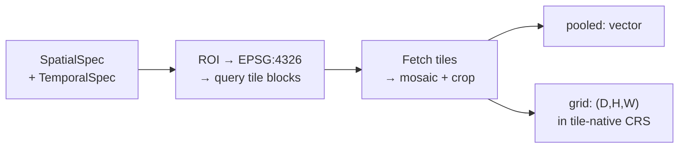
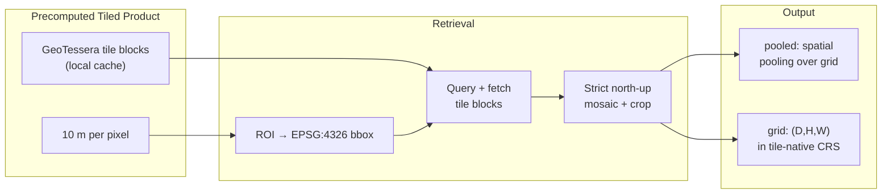

# Tessera (`tessera`)

## Quick Facts

| Field              | Value                             |
| ------------------ | --------------------------------- |
| Model ID           | `tessera`                         |
| Family / Source    | GeoTessera precomputed embeddings |
| Adapter type       | `precomputed`                     |
| Training alignment | N/A (precomputed product)         |

!!! success "Tessera In 30 Seconds"
    Tessera is a precomputed 10 m global embedding product distributed as local GeoTessera tiles — `rs-embed` does no model inference here; it mosaics the tiles covering your ROI, reprojects the ROI into each tile's native CRS if needed, and returns the cropped `(D,H,W)` embedding grid in that tile-native CRS.

    In `rs-embed`, its most important characteristics are:

    - strict north-up mosaic requiring consistent tile CRS/resolution — rotated/sheared or heterogeneous tiles raise: see [Preprocessing / Retrieval Pipeline](#preprocessing-retrieval-pipeline)
    - year-selector temporal semantics: `TemporalSpec.range(...)` silently uses the `start` year rather than doing real temporal filtering: see [Retrieval Contract](#retrieval-contract)
    - output CRS follows the tile-native CRS, not the EPSG:3857 default used by provider-backed paths elsewhere: see [Output Semantics](#output-semantics)

---

## Retrieval Contract

| Field              | Value                                                                                              |
| ------------------ | -------------------------------------------------------------------------------------------------- |
| Backend            | `auto` (legacy `local` still accepted)                                                             |
| `SpatialSpec`      | `BBox` direct, or `PointBuffer` converted to EPSG:4326 BBox (approximate meter-to-degree)          |
| `TemporalSpec`     | `year(YYYY)` — uses `.year`; `range(start, end)` falls back to `start`'s year; default year `2021` |
| Source             | GeoTessera precomputed tiles                                                                       |
| Product CRS        | tile-native (varies by tile), **not** EPSG:3857                                                    |
| Product resolution | 10 m                                                                                               |
| Cache directory    | `RS_EMBED_TESSERA_CACHE`, or per-call `sensor.collection="cache:/path/to/cache"`                   |
| Side inputs        | none                                                                                               |

!!! warning "Output CRS and temporal semantics"
    Tessera reads and returns embeddings in the **product-native tile CRS** after mosaic + crop. This differs from the EPSG:3857 default used by provider-backed models. `TemporalSpec.range(...)` is a year selector here, **not** scene-level temporal filtering.

---

## Preprocessing / Retrieval Pipeline



---

## Architecture Concept



---

## Environment Variables / Tuning Knobs

| Env var                          | Default                    | Effect                                             |
| -------------------------------- | -------------------------- | -------------------------------------------------- |
| `RS_EMBED_TESSERA_CACHE`         | unset (GeoTessera default) | Local GeoTessera cache directory                   |
| `RS_EMBED_TESSERA_BATCH_WORKERS` | `4`                        | Batch worker count for `get_embeddings_batch(...)` |

!!! info "Non-env override"
    `sensor.collection="cache:/path/to/cache"` overrides the cache directory for one call.

---

## Output Semantics

**`pooled`**: spatial pooling over the cropped embedding grid.

**`grid`**: cropped `(D,H,W)` in product pixel space after mosaic + crop; metadata records `input_crs=EPSG:4326` and `output_crs` follows the tile-native CRS.

---

## Examples

### Minimal example

```python
from rs_embed import get_embedding, PointBuffer, TemporalSpec, OutputSpec

emb = get_embedding(
    "tessera",
    spatial=PointBuffer(lon=121.5, lat=31.2, buffer_m=5000),
    temporal=TemporalSpec.year(2021),
    output=OutputSpec.pooled(),
    backend="auto",
)
```

### Example cache override

```python
# Example (shell):
export RS_EMBED_TESSERA_CACHE=/data/geotessera
```

---

## Paper & Links

- **Publication**: [CVPR 2026](https://arxiv.org/abs/2506.20380v4)

---

## Reference

- Tile mosaic requires all tiles to be north-up with consistent CRS and resolution — tiles with rotation/shear are rejected.
- Output CRS is tile-native (not EPSG:3857) — do not compare grids with provider-backed models without reprojecting.
- "No tiles found" usually means the ROI/year combination has no coverage in the GeoTessera cache, not that the cache is broken.
