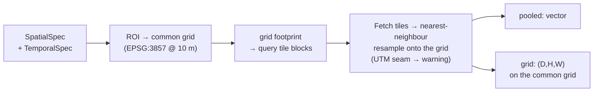
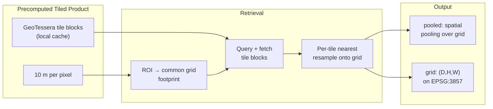

# Tessera (`tessera`)

## Quick Facts

| Field              | Value                             |
| ------------------ | --------------------------------- |
| Model ID           | `tessera`                         |
| Family / Source    | GeoTessera precomputed embeddings |
| Adapter type       | `precomputed`                     |
| Training alignment | N/A (precomputed product)         |

!!! success "Tessera In 30 Seconds"
    Tessera is a precomputed 10 m global embedding product distributed as local GeoTessera tiles — `rs-embed` does no model inference here; it resamples the tiles covering your ROI (nearest neighbour, each tile through its own UTM CRS) onto the common EPSG:3857 grid at 10 m and returns the `(D,H,W)` embedding grid on that grid — the same grid provider-backed models sample on.

    In `rs-embed`, its most important characteristics are:

    - output lives on the common EPSG:3857 grid at 10 m, pixel-aligned with provider-backed models for the same ROI: see [Output Semantics](#output-semantics)
    - a ROI straddling a UTM zone boundary is served (tiles from both zones are resampled independently) with a `UserWarning` about the seam: see [Preprocessing / Retrieval Pipeline](#preprocessing-retrieval-pipeline)
    - year-selector temporal semantics: `TemporalSpec.range(...)` silently uses the `start` year rather than doing real temporal filtering: see [Retrieval Contract](#retrieval-contract)

---

## Retrieval Contract

| Field              | Value                                                                                              |
| ------------------ | -------------------------------------------------------------------------------------------------- |
| Backend            | `auto` (legacy `local` still accepted)                                                             |
| `SpatialSpec`      | `BBox` / `PointBuffer`, mapped to the common EPSG:3857 grid exactly as provider requests are       |
| `TemporalSpec`     | `year(YYYY)` — uses `.year`; `range(start, end)` falls back to `start`'s year; default year `2021` |
| Source             | GeoTessera precomputed tiles                                                                       |
| Product CRS        | tile-native UTM (varies by tile); output resampled onto EPSG:3857                                  |
| Product resolution | 10 m                                                                                               |
| Cache directory    | `RS_EMBED_TESSERA_CACHE`, or per-call `sensor.collection="cache:/path/to/cache"`                   |
| Side inputs        | none                                                                                               |

!!! warning "Temporal semantics"
    `TemporalSpec.range(...)` is a year selector here, **not** scene-level temporal filtering.

---

## Preprocessing / Retrieval Pipeline


```mermaid
flowchart LR
    INPUT["SpatialSpec\n+ TemporalSpec"] --> GRIDDEF["ROI → common grid\n(EPSG:3857 @ 10 m)"]
    GRIDDEF --> QUERY["grid footprint\n→ query tile blocks"]
    QUERY --> RESAMPLE["Fetch tiles → nearest-neighbour\nresample onto the grid\n(UTM seam → warning)"]
    RESAMPLE --> POOL["pooled: vector"]
    RESAMPLE --> GRID["grid: (D,H,W)\non the common grid"]
```

---

## Architecture Concept


```mermaid
flowchart LR
    subgraph "Precomputed Tiled Product"
        RES["10 m per pixel"]
        STORE["GeoTessera tile blocks\n(local cache)"]
    end
    subgraph Retrieval
        RES --> BBOX["ROI → common grid\nfootprint"]
        STORE --> TILES["Query + fetch\ntile blocks"]
        BBOX --> TILES
        TILES --> MOS["Per-tile nearest\nresample onto grid"]
    end
    subgraph Output
        MOS --> POOL["pooled: spatial\npooling over grid"]
        MOS --> GRID["grid: (D,H,W)\non EPSG:3857"]
    end
```

---

## Environment Variables / Tuning Knobs

| Env var                          | Default                    | Effect                                             |
| -------------------------------- | -------------------------- | -------------------------------------------------- |
| `RS_EMBED_TESSERA_CACHE`         | unset (GeoTessera default) | Local GeoTessera cache directory                   |
| `RS_EMBED_TESSERA_BATCH_WORKERS` | `4`                        | Batch worker count for `get_embeddings_batch(...)` |

!!! info "Non-env override"
    `sensor.collection="cache:/path/to/cache"` overrides the cache directory for one call.

---

## Output Semantics

**`pooled`**: spatial pooling over the cropped embedding grid.

**`grid`**: `(D,H,W)` on the common grid. Metadata records `input_crs=EPSG:4326`, `output_crs=EPSG:3857`, `scale_m=10`, the north-up `transform` (affine, pixel → EPSG:3857), `grid_hw`, `tile_crs` (the UTM CRSs the tiles came from), `resampling=nearest`, and `coverage` (fraction of grid pixels a tile covered; the rest are zero vectors).

---

## Examples

### Minimal example

```python
from rs_embed import get_embedding, PointBuffer, TemporalSpec, OutputSpec

emb = get_embedding(
    "tessera",
    spatial=PointBuffer(lon=121.5, lat=31.2, buffer_m=5000),
    temporal=TemporalSpec.year(2021),
    output=OutputSpec.pooled(),
    backend="auto",
)
```

### Example cache override

```python
# Example (shell):
export RS_EMBED_TESSERA_CACHE=/data/geotessera
```

---

## Paper & Links

- **Publication**: [CVPR 2026](https://arxiv.org/abs/2506.20380v4)

---

## Reference

- Tiles are placed through their own CRS/affine, so mixed UTM zones and rotated tiles are all handled; tiles must share the embedding dimension.
- A ROI across a UTM zone boundary warns once per request: the two sides are resampled independently, so expect a seam along the boundary.
- "No tiles found" usually means the ROI/year combination has no coverage in the GeoTessera cache, not that the cache is broken.
