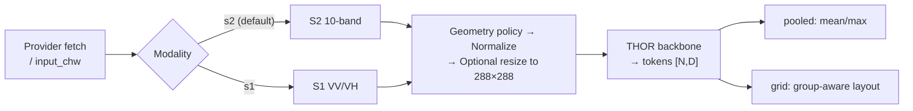
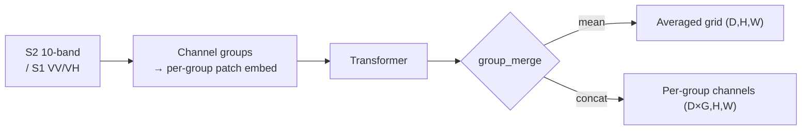
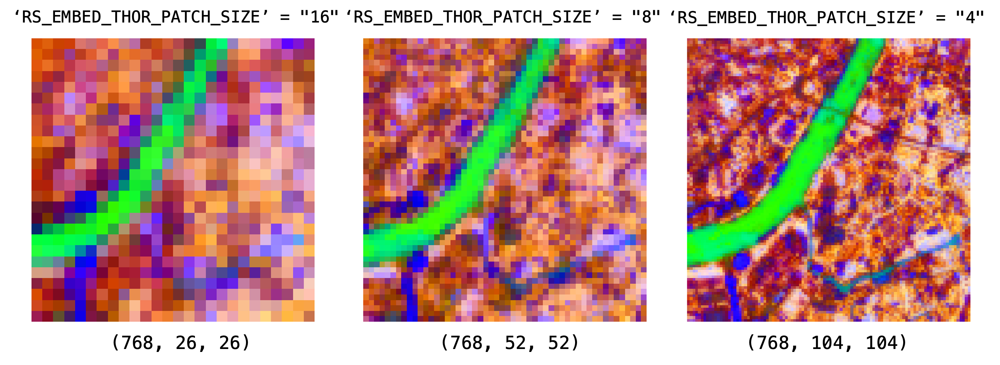

# THOR (`thor`)

## Quick Facts

| Field              | Value                                                                                             |
| ------------------ | ------------------------------------------------------------------------------------------------- |
| Model ID           | `thor`                                                                                            |
| Aliases            | `thor_1_0_base`                                                                                   |
| Family / Backbone  | Fully vendored THOR runtime (`thor_v1_tiny` / `thor_v1_small` / `thor_v1_base` / `thor_v1_large`) |
| Adapter type       | `on-the-fly`                                                                                      |
| Model config keys  | `variant` (default: `base`; choices: `tiny`, `small`, `base`, `large`)                            |
| Training alignment | High when `thor_stats` normalization and default S2 SR setup are preserved                        |

!!! success "THOR In 30 Seconds"
    THOR in `rs-embed` can run either a Sentinel-2 SR 10-band path or a Sentinel-1 VV/VH path, and it works well when you want either a pooled embedding or a grid-like token output while preserving THOR's channel-group structure.

    In `rs-embed`, its most important characteristics are:

    - grouped token layout instead of one ready-made spatial feature map: see [Output Semantics](#output-semantics)
    - patch-size-sensitive token density and geometry: see [Environment Variables / Tuning Knobs](#environment-variables-tuning-knobs)
    - bounded `native_snap` preprocessing for small near-square projection mismatches: see [Preprocessing Pipeline](#preprocessing-pipeline)

---

## Quick Decision Guide

=== "Near-Square Input"

    Use `input_prep="resize"` with the default `RS_EMBED_THOR_RESIZE_MODE=native_snap`.

    This handles small projection mismatches without forcing an immediate `288x288` resize.

=== "Large ROI"

    Use `input_prep="tile"`.

    This avoids token explosion and keeps stitched grid geometry stable.

=== "Per-Group Channels"

    Use `RS_EMBED_THOR_GROUP_MERGE=concat`.

    This keeps aligned group maps separate in the channel dimension instead of collapsing them into one shared grid.

!!! warning "What Usually Goes Wrong"
    Most THOR confusion comes from three places: changing `patch_size` without checking that `image_size` still divides cleanly, assuming `native_snap` should also apply inside tiled inference, and interpreting `concat` grids as directly comparable to `mean` grids. Treat those as different representation settings, not just cosmetic options.

---

## Input Contract

Provider-only backend (`gee` / `auto`). `TemporalSpec` is normalized to a range via the shared helper; `TemporalSpec.range(...)` is recommended for reproducibility — the temporal window controls compositing rather than locking to one acquisition. Side inputs: none.

| Modality       | Collection                    | Bands (order)                                | `input_chw`                        | Default normalization              | Extra fetch fields                                                        |
| -------------- | ----------------------------- | -------------------------------------------- | ---------------------------------- | ---------------------------------- | ------------------------------------------------------------------------- |
| `s2` (default) | `COPERNICUS/S2_SR_HARMONIZED` | `B2,B3,B4,B5,B6,B7,B8,B8A,B11,B12` (10-band) | `CHW`, `C=10`, raw SR `0..10000`   | `thor_stats` z-score after `/10000` | `scale_m=10`, `cloudy_pct=30`, `composite="median"`, `fill_value=0.0`     |
| `s1`           | `COPERNICUS/S1_GRD_FLOAT`     | `VV, VH` (2-band)                            | `CHW`, `C=2` in `VV,VH`, raw VV/VH | shared S1 `log1p` + p99 scaling    | `use_float_linear=True`, `s1_require_iw=True`, `s1_relax_iw_on_empty=True` |

Before normalization, the adapter clips NaN/Inf values and clamps raw SR to `0..10000`. Set `RS_EMBED_THOR_NORMALIZE=none` to bypass the default normalization on either modality.

---

## Preprocessing Pipeline



---

## Architecture Concept



---

## Environment Variables / Tuning Knobs

| Env var                           | Default        | Effect                                                                                          |
| --------------------------------- | -------------- | ----------------------------------------------------------------------------------------------- |
| `RS_EMBED_THOR_MODEL_KEY`         | `thor_v1_base` | THOR backbone key for the vendored runtime                                                      |
| `RS_EMBED_THOR_CKPT`              | unset          | Local checkpoint path override                                                                  |
| `RS_EMBED_THOR_PRETRAINED`        | `1`            | Use pretrained weights (HF default path)                                                        |
| `RS_EMBED_THOR_IMG`               | `288`          | Resize target image size                                                                        |
| `RS_EMBED_THOR_RESIZE_MODE`       | `native_snap`  | `native_snap` keeps bounded snapped native sides; `fixed` always resizes to `RS_EMBED_THOR_IMG` |
| `RS_EMBED_THOR_NORMALIZE`         | `thor_stats`   | S2: `thor_stats`, `unit_scale`, or `none`; S1: `thor_stats` (shared S1 log normalize) or `none` |
| `RS_EMBED_THOR_GROUP_MERGE`       | `mean`         | THOR group-grid aggregation: `mean`, `sum`, `concat`                                            |
| `RS_EMBED_THOR_PATCH_SIZE`        | `8`            | THOR flexi patch size parameter                                                                 |
| `RS_EMBED_THOR_SHAPE_ADJUST`      | `crop`         | How `native_snap` resolves small non-square inputs: `crop` or `pad`                             |
| `RS_EMBED_THOR_SHAPE_TOL_PX`      | `8`            | Maximum `abs(H-W)` tolerated before `native_snap` falls back to fixed resize                    |
| `RS_EMBED_THOR_MAX_NATIVE_SIDE`   | `384`          | Largest snapped native side allowed before falling back to fixed resize                         |
| `RS_EMBED_THOR_MAX_NATIVE_TOKENS` | `3000`         | Largest estimated THOR patch-token count allowed for `native_snap`                              |
| `RS_EMBED_THOR_FETCH_WORKERS`     | `8`            | Provider prefetch workers for batch APIs                                                        |

=== "Patch Size"

    `patch_size` changes token density, not embedding dimension. Smaller patch sizes mean denser token grids and more compute.

    Keep `RS_EMBED_THOR_IMG` divisible by `2 * RS_EMBED_THOR_PATCH_SIZE` for the current S2 10m/20m path. If you are unsure, keep `RS_EMBED_THOR_IMG=288` and change only `patch_size` to one of the known-compatible values such as `4`, `6`, `8`, `12`, `16`, or `18`.

=== "Resize vs Tile"

    `input_prep="resize"` means one whole input patch goes through THOR once; in that path the adapter may use `native_snap`.

    `input_prep="tile"` means the API slices a larger input into multiple tiles first; inside that tiled path THOR intentionally uses fixed per-tile resize behavior so the stitched output still maps cleanly back to the tile layout.

=== "Native-Snap Limits"

    `native_snap` is intentionally bounded. It only stays on the native path when the input is close to square, the snapped side does not exceed `RS_EMBED_THOR_MAX_NATIVE_SIDE`, and the estimated THOR patch-token count does not exceed `RS_EMBED_THOR_MAX_NATIVE_TOKENS`.

    For the current default S2 10m/20m path with `patch_size=8`, `side=384` corresponds to about `2880` patch tokens, which is why `384` is the default ceiling.

## Model-specific Settings

`variant` selects the THOR backbone size. In `rs-embed`, pass it as `variant="tiny" | "small" | "base" | "large"`.

| Variant | Vendored model key | Parameters | Output channels | Transformer blocks | Attention heads | Notes                                     |
| ------- | ------------------ | ---------- | --------------- | ------------------ | --------------- | ----------------------------------------- |
| `tiny`  | `thor_v1_tiny`     | 7.6M       | 192             | 12                 | 3               | Smallest and fastest option.              |
| `small` | `thor_v1_small`    | 25.8M      | 384             | 12                 | 6               | Middle ground when `tiny` is too limited. |
| `base`  | `thor_v1_base`     | 94.1M      | 768             | 12                 | 12              | Current default.                          |
| `large` | `thor_v1_large`    | 314.4M     | 1024            | 24                 | 16              | Highest capacity and heaviest runtime.    |

!!! info "How To Read Output Channels"
    `Output channels` here means the default THOR embedding width for `pooled` output and for `grid` output when group aggregation keeps one shared channel space, such as `RS_EMBED_THOR_GROUP_MERGE=mean` or `sum`.

    If you use `RS_EMBED_THOR_GROUP_MERGE=concat`, the final `grid` channel count becomes `embedding_width x number_of_THOR_groups`, so it is larger than the values listed above.

Example:

```python
from rs_embed import PointBuffer, TemporalSpec, OutputSpec, get_embedding

emb = get_embedding(
    "thor",
    spatial=PointBuffer(lon=121.5, lat=31.2, buffer_m=2048),
    temporal=TemporalSpec.range("2022-06-01", "2022-09-01"),
    output=OutputSpec.pooled(),
    backend="gee",
    variant="large",
)
```

---

## Output Semantics

### `OutputSpec.pooled()`

`OutputSpec.pooled()` pools the token sequence through `_pool_thor_tokens(...)`. When the expected THOR patch-token count is available, the adapter uses it to avoid pooling non-patch tokens incorrectly. Metadata records the pooling mode and `cls_removed`.

### `OutputSpec.grid()`

`OutputSpec.grid()` first tries to build a THOR group-aware grid with `grid_kind="thor_group_grid"` from the channel groups. If that fails, it falls back to a generic ViT-style patch-token reshape with `grid_kind="patch_tokens"`. Some token layouts still cannot be reshaped into a grid, in which case the adapter raises a clear error and suggests using pooled output.

The group-aware path exists because native THOR emits one token sequence plus layout metadata, not one uniform spatial tensor. `rs-embed` uses that metadata to reconstruct per-group feature maps, upsamples lower-resolution groups onto the densest group grid, and then applies `group_merge`.

=== "`mean`"

    Use this unless you have a specific reason not to.

    It averages aligned group maps into one shared grid, keeps output dimensionality stable, and is the easiest setting to compare across runs.

=== "`sum`"

    Use this when you want one shared grid but prefer additive responses over averaging.

    It is more sensitive to feature scale than `mean`.

=== "`concat`"

    Use this only when downstream code expects a wider channel dimension and you explicitly want to preserve group-specific information instead of collapsing it.

---

## Examples

Minimal example:

```python
from rs_embed import get_embedding, PointBuffer, TemporalSpec, OutputSpec

emb = get_embedding(
    "thor",
    spatial=PointBuffer(lon=121.5, lat=31.2, buffer_m=2048),
    temporal=TemporalSpec.range("2022-06-01", "2022-09-01"),
    output=OutputSpec.pooled(),
    backend="gee",
)
```

=== "S1 Via Modality"

    ```python
    from rs_embed import get_embedding, PointBuffer, TemporalSpec, OutputSpec

    emb = get_embedding(
        "thor",
        spatial=PointBuffer(lon=121.5, lat=31.2, buffer_m=2048),
        temporal=TemporalSpec.range("2022-06-01", "2022-09-01"),
        modality="s1",
        output=OutputSpec.pooled(),
        backend="gee",
    )
    ```

    This switches THOR onto the default `VV,VH` Sentinel-1 path. If you need a different provider collection, pass an explicit `SensorSpec(..., modality="s1")`.
    

=== "Common Tuning"

    ```bash
    export RS_EMBED_THOR_RESIZE_MODE=native_snap
    export RS_EMBED_THOR_NORMALIZE=thor_stats
    export RS_EMBED_THOR_GROUP_MERGE=mean
    export RS_EMBED_THOR_IMG=288
    export RS_EMBED_THOR_PATCH_SIZE=8
    ```

=== "Native-Snap"

    ```bash
    export RS_EMBED_THOR_RESIZE_MODE=native_snap
    export RS_EMBED_THOR_SHAPE_ADJUST=crop
    export RS_EMBED_THOR_SHAPE_TOL_PX=8
    export RS_EMBED_THOR_MAX_NATIVE_SIDE=384
    export RS_EMBED_THOR_MAX_NATIVE_TOKENS=3000
    ```

    This lets THOR keep a snapped native side for near-square inputs such as `289x288` or `300x300`, but still falls back to fixed resize for larger or more expensive inputs.

=== "Patch Size"

    ```bash
    export RS_EMBED_THOR_IMG=288
    export RS_EMBED_THOR_PATCH_SIZE=4
    ```

    Use a smaller `patch_size` when spatial detail matters more than runtime or memory.

    ```bash
    export RS_EMBED_THOR_IMG=288
    export RS_EMBED_THOR_PATCH_SIZE=12
    ```

    Use a larger `patch_size` when you want a coarser token grid with lower compute cost.

    ```bash
    export RS_EMBED_THOR_IMG=280
    export RS_EMBED_THOR_PATCH_SIZE=10
    ```

    When `patch_size` no longer divides cleanly, change `RS_EMBED_THOR_IMG` together with it.

    

=== "Large ROI / Tile"

    ```python
    from rs_embed import get_embedding, PointBuffer, TemporalSpec, OutputSpec, InputPrepSpec

    emb = get_embedding(
        "thor",
        spatial=PointBuffer(lon=121.5, lat=31.2, buffer_m=4096),
        temporal=TemporalSpec.range("2022-06-01", "2022-09-01"),
        output=OutputSpec.grid(pooling="mean"),
        backend="gee",
        input_prep=InputPrepSpec.tile(tile_size=288),
    )
    ```

    In this mode the large input is split into `288x288` tiles. Each tile uses THOR's fixed per-tile resize path rather than `native_snap`, so stitched grid outputs stay aligned with the tile layout.

=== "Variant"

    ```python
    from rs_embed import get_embedding, PointBuffer, TemporalSpec, OutputSpec

    emb = get_embedding(
        "thor",
        spatial=PointBuffer(lon=121.5, lat=31.2, buffer_m=2048),
        temporal=TemporalSpec.range("2022-06-01", "2022-09-01"),
        output=OutputSpec.grid(pooling="mean"),
        backend="gee",
        variant="small",
    )
    ```

    Use `variant` only for backbone size selection. Other THOR runtime knobs such as image size, normalization, patch size, and checkpoint override still use the environment-variable path above.

---

## Paper & Links

- **Publication**: [arXiv 2026](https://arxiv.org/abs/2601.16011)
- **Code**: [FM4CS/THOR](https://github.com/FM4CS/THOR)

---

## Reference

- Changing `patch_size` without updating `image_size` to divide cleanly is the most common misconfiguration.
- `native_snap` only applies in `input_prep="resize"` mode — tiled inference always uses fixed per-tile resize.
- `group_merge=concat` and `group_merge=mean` produce different channel dimensions; do not compare them directly.
- Grid construction can fail if the token layout is not square and group parsing cannot resolve it — fall back to `pooled` to isolate the issue.
