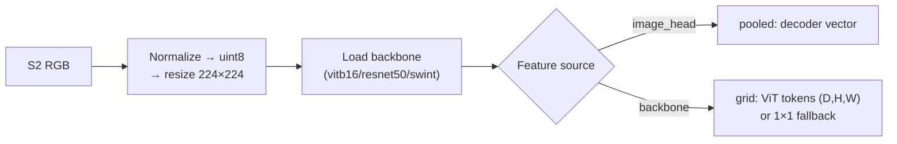
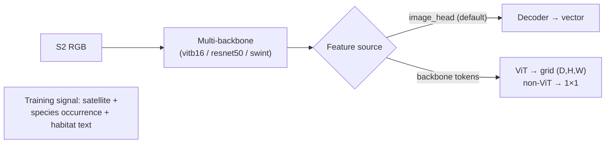

# WildSAT (`wildsat`)

## Quick Facts

| Field                | Value                                                                                         |
| -------------------- | --------------------------------------------------------------------------------------------- |
| Model ID             | `wildsat`                                                                                     |
| Family / Backbone    | WildSAT checkpoint loader + torchvision backbones (`vitb16`, `resnet50`, `swint`)             |
| Adapter type         | `on-the-fly`                                                                                  |
| Model config keys    | `variant` (default: `vitb16`; choices: `vitb16`, `resnet50`, `swint`)                         |
| Training alignment   | Medium (depends on checkpoint source, arch inference, normalization mode, and feature source)  |

!!! success "WildSAT In 30 Seconds"
    WildSAT is trained jointly on satellite imagery, **species occurrence maps, and habitat text** — so its embeddings carry biodiversity- and habitat-level signal rather than only generic visual similarity, which makes it the best fit in `rs-embed` for ecological and environmental downstream tasks. The same adapter hosts several backbone families (`vitb16`, `resnet50`, `swint`) behind one checkpoint loader.

    In `rs-embed`, its most important characteristics are:

    - `variant` selects the backbone architecture — each variant auto-downloads its own ImageNet-pretrained checkpoint: see [Model-specific Settings](#model-specific-settings)
    - selectable feature source: the WildSAT **decoder image head** (default `image_head`) vs raw backbone features: see [Output Semantics](#output-semantics)
    - `grid` silently falls back to a `1×1` vector grid (`grid_kind="vector_as_1x1"`) for non-ViT backbones instead of failing: see [Output Semantics](#output-semantics)

---

## Input Contract

| Field                 | Value                                                       |
| --------------------- | ----------------------------------------------------------- |
| Backend               | provider only (`gee` / `auto`)                              |
| `TemporalSpec`        | `range` recommended (normalized via shared helper)          |
| Default collection    | `COPERNICUS/S2_SR_HARMONIZED`                               |
| Default bands (order) | `B4, B3, B2`                                                |
| Default fetch         | `scale_m=10`, `cloudy_pct=30`, `composite="median"`         |
| `input_chw`           | `CHW`, `C=3` in `(B4,B3,B2)` order, raw SR `0..10000`       |
| Side inputs           | none (but checkpoint/arch/feature-source settings matter)   |

The adapter clips NaN/Inf values and converts the normalized result to `uint8` RGB before backbone preprocessing.

---

## Preprocessing Pipeline

!!! tip "Resize is the default — tiling is also available"
    The pipeline below shows the default `input_prep="resize"` path. For large ROIs, use `input_prep="tile"` to split the input into tiles and preserve spatial detail. See [Choosing Settings](../choosing_settings.md#input-preparation-resize-vs-tile).



!!! note "Grid fallback behavior"
    If `grid` is requested but ViT tokens are unavailable, for example with a non-ViT architecture or when token extraction is disabled, the adapter returns a `1x1` grid with `grid_kind="vector_as_1x1"` instead of failing.

---

## Architecture Concept



---

## Model-specific Settings

`variant` selects the WildSAT backbone architecture. Each variant auto-downloads its corresponding ImageNet-pretrained checkpoint from Google Drive.

| Variant    | Backbone           | Pre-training | Notes                                           |
| ---------- | ------------------ | ------------ | ----------------------------------------------- |
| `vitb16`   | ViT-B/16           | ImageNet1k   | Default. Best overall performance (77.4% avg).   |
| `resnet50` | ResNet-50          | ImageNet1k   | Lightweight CNN backbone.                        |
| `swint`    | Swin Transformer-T | ImageNet1k   | Strong base performance (76.4% avg).             |

!!! info "Other pre-training initializations"
    The WildSAT paper evaluates additional pre-training initializations (CLIP, Prithvi, SatCLIP, Satlas, MoCov3, SeCo) for each backbone. These are not built-in as variants, but you can use any of them by downloading the checkpoint manually and setting `RS_EMBED_WILDSAT_CKPT` to its local path. See the [official WildSAT repo](https://github.com/cvl-umass/wildsat) for all available checkpoints.

Example:

```python
from rs_embed import PointBuffer, TemporalSpec, OutputSpec, get_embedding

emb = get_embedding(
    "wildsat",
    spatial=PointBuffer(lon=121.5, lat=31.2, buffer_m=2048),
    temporal=TemporalSpec.range("2022-06-01", "2022-09-01"),
    output=OutputSpec.pooled(),
    backend="gee",
    variant="swint",
)
```

!!! note
    Use `variant` only for backbone selection. Other WildSAT runtime knobs such as image size, normalization, feature source, and checkpoint override still use the environment-variable path below.

---

## Environment Variables / Tuning Knobs

### Runtime / feature extraction

| Env var                               | Default      | Effect                                                                  |
| ------------------------------------- | ------------ | ----------------------------------------------------------------------- |
| `RS_EMBED_WILDSAT_ARCH`               | `auto`       | Backbone arch hint (`vitb16`, `resnet50`, `swint`, or `auto`); overridden by `variant` in `model_config` |
| `RS_EMBED_WILDSAT_IMG`                | `224`        | Resize target image size                                                |
| `RS_EMBED_WILDSAT_NORM`               | `minmax`     | `minmax`, `unit_scale`, or `none`                                       |
| `RS_EMBED_WILDSAT_FEATURE`            | `image_head` | Feature source: `auto`, `image_head`, `backbone`                        |
| `RS_EMBED_WILDSAT_IMAGE_BRANCH`       | `3`          | Preferred decoder branch for image head extraction                      |
| `RS_EMBED_WILDSAT_POOLED_FROM_TOKENS` | `0`          | If true and ViT tokens available, pooled output uses token pooling      |
| `RS_EMBED_WILDSAT_GRID_FROM_TOKENS`   | `1`          | Enable ViT token extraction for grid/token-based pooling                |
| `RS_EMBED_WILDSAT_FETCH_WORKERS`      | `8`          | Provider prefetch workers for batch APIs                                |

### Checkpoint path / download

| Env var                           | Default                     | Effect                                               |
| --------------------------------- | --------------------------- | ---------------------------------------------------- |
| `RS_EMBED_WILDSAT_CKPT`           | unset                       | Local checkpoint path (overrides variant auto-download) |
| `RS_EMBED_WILDSAT_AUTO_DOWNLOAD`  | `1`                         | Allow auto-download if `CKPT` not set                |
| `RS_EMBED_WILDSAT_CACHE_DIR`      | `~/.cache/rs_embed/wildsat` | Checkpoint cache dir                                 |
| `RS_EMBED_WILDSAT_CKPT_MIN_BYTES` | adapter threshold           | Download size sanity check                           |
| `RS_EMBED_WILDSAT_GDRIVE_ID`      | per-variant default         | Google Drive source (overrides variant default)      |
| `RS_EMBED_WILDSAT_CKPT_FILE`      | per-variant default         | Local cached filename for GDrive path                |
| `RS_EMBED_WILDSAT_HF_REPO`        | unset                       | Optional HF repo override (must pair with `HF_FILE`) |
| `RS_EMBED_WILDSAT_HF_FILE`        | unset                       | Optional HF file override (must pair with `HF_REPO`) |

---

## Output Semantics

**`pooled`**: defaults to the `image_head` feature vector; set `RS_EMBED_WILDSAT_POOLED_FROM_TOKENS=1` to use token pooling instead; metadata records `feature_source`, `tokens_available`, and `pooled_from_tokens`.

**`grid`**: ViT patch-token grid (`grid_kind="vit_patch_tokens"`) when tokens are available, else `1x1` fallback with `grid_kind="vector_as_1x1"`.

---

## Examples

### Minimal provider-backed example

```python
from rs_embed import get_embedding, PointBuffer, TemporalSpec, OutputSpec

emb = get_embedding(
    "wildsat",
    spatial=PointBuffer(lon=121.5, lat=31.2, buffer_m=2048),
    temporal=TemporalSpec.range("2022-06-01", "2022-09-01"),
    output=OutputSpec.pooled(),
    backend="gee",
)
```

### Selecting a variant

```python
emb = get_embedding(
    "wildsat",
    spatial=PointBuffer(lon=121.5, lat=31.2, buffer_m=2048),
    temporal=TemporalSpec.range("2022-06-01", "2022-09-01"),
    output=OutputSpec.pooled(),
    backend="gee",
    variant="swint",
)
```

### Example feature/arch tuning (env-controlled)

```python
# Example (shell):
export RS_EMBED_WILDSAT_FEATURE=image_head
export RS_EMBED_WILDSAT_NORM=minmax
export RS_EMBED_WILDSAT_GRID_FROM_TOKENS=1
```

---

## Paper & Links

- **Publication**: [ICCV 2025](https://arxiv.org/abs/2412.14428)
- **Code**: [cvl-umass/wildsat](https://github.com/cvl-umass/wildsat)

---

## Reference

- The default variant (`vitb16`) auto-downloads the ImageNet-pretrained checkpoint; other variants (`resnet50`, `swint`) also auto-download their respective checkpoints.
- Backbone architecture is determined by the selected variant. When using `RS_EMBED_WILDSAT_CKPT` to provide a custom checkpoint, set `RS_EMBED_WILDSAT_ARCH` explicitly if architecture inference is ambiguous.
- Non-ViT backbones (resnet50, swint) cannot produce patch-token grids; the adapter returns a `1×1` grid with `grid_kind="vector_as_1x1"` instead.
