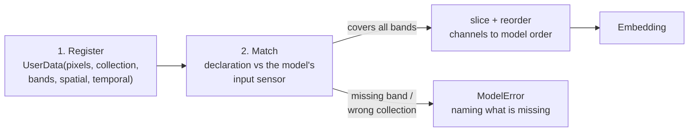

# API: User-Provided Data

You already have imagery — patches from your own dataset, exported GeoTIFFs, a training cube on disk. This page covers the bring-your-own-data API: computing embeddings from that imagery directly, with no provider fetch and no provider auth.

Related pages: [API: Embedding](api_embedding.md), [API: Specs and Data Structures](api_specs.md), [Spatial ROI Handling](spatial_roi.md).

!!! abstract "The one idea"
    You **register** each piece of imagery once as a `UserData` — the pixels plus everything that describes them: which collection they came from, one band name per channel, and where/when they were acquired. From then on, embedding takes only a model name. The declaration, not the array shape, is the contract: a model whose bands your declaration covers gets its channels sliced out automatically; a model it cannot satisfy is **refused with the exact reason**, never served silently wrong data.

---

## The two-step flow



Every on-the-fly model declares an input sensor (a collection plus an ordered band list), and your declaration is matched against it per request.

**Superset data is accepted.** If your declaration covers all bands the model needs, the needed channels are sliced out and reordered automatically. One 12-band Sentinel-2 L2A cube serves models that need 3, 6, or 10 of those bands — `galileo` takes its 10, an RGB model takes `B4/B3/B2`, all from the same declaration. Band aliases resolve the same way provider fetches resolve them (`"RED"` → `"B4"`, `"NIR_NARROW"` → `"B8A"`, …).

**Insufficient data is refused.** A collection mismatch (e.g. S2 data offered to a MODIS model) or a missing band raises `ModelError` naming exactly what is missing. Precomputed models (`tessera`, `gse`, `copernicus`) are always refused — they have no imagery input. Call [`list_models_for_data`](#list_models_for_data) to see the verdict for every catalog model up front.

!!! warning "Values must be raw provider units"
    Pass exactly what a provider fetch would return — for Sentinel-2 L2A that is surface-reflectance DN in `0..10000`, **not** reflectance rescaled to `0..1`. Per-model normalization stays inside each embedder, so you never need to know a model's normalization; but data that looks already normalized (max ≤ 1.5 on an S2 declaration) triggers a `UserWarning`, because it would otherwise produce silently wrong embeddings.

---

## UserData

```python
from rs_embed import UserData

UserData(
    data: np.ndarray,                      # [C,H,W] or [T,C,H,W], raw provider values
    collection: str,                       # e.g. "COPERNICUS/S2_SR_HARMONIZED" or alias "s2"
    spatial: SpatialSpec | None = None,    # where the imagery is (PointBuffer / BBox)
    bands: tuple[str, ...] | None = None,  # one band name per channel; None = canonical order
    temporal: TemporalSpec | None = None,  # when the imagery was acquired
    scale_m: int | None = None,            # optional nominal pixel size, provenance only
)
```

**`collection` names the sensor product — and thereby the units.** Short aliases resolve to full ids: `"s2"` / `"sentinel-2"` / `"s2-l2a"` → `COPERNICUS/S2_SR_HARMONIZED`; `"s1"` / `"sentinel-1"` → `COPERNICUS/S1_GRD`. Full collection ids pass through unchanged.

**`bands` may be omitted only for the canonical case.** An S2 L2A declaration with exactly 12 channels defaults to the canonical order `B1, B2, B3, B4, B5, B6, B7, B8, B8A, B9, B11, B12`. Any other channel count, order, or collection must name its bands — band identity is never guessed from channel count.

**`spatial` and `temporal` travel with the data**, because they describe *this imagery* (where it is, when it was acquired), not the API call. Both are optional, but supply them whenever you have them: models that condition on time read `temporal`, and models whose forward pass conditions on geometry (lat/lon or GSD encodings: `clay`, `prithvi`) **refuse** declarations without `spatial` — coordinates are never fabricated. Everything else accepts ungeoreferenced data and merely loses location provenance in the metadata.

!!! note "Multi-frame arrays"
    A `[T,C,H,W]` array is only meaningful for time-series models (`galileo`, `prithvi`, `olmoearth`, `anysat`, `agrifm`); single-frame models reject it.

---

## Functions

### get_embedding_from_data

A complete example, starting from a file on disk. Say you have a Sentinel-2 L2A patch saved as a GeoTIFF — 12 bands in the canonical order, raw surface-reflectance DN:

```python
import rasterio                        # example only; not an rs-embed dependency
from rasterio.warp import transform_bounds

from rs_embed import UserData, get_embedding_from_data
from rs_embed.core.specs import BBox, TemporalSpec

# 1. Load the pixels and the footprint from the file.
with rasterio.open("maize_field_2022.tif") as src:
    pixels = src.read()                             # numpy array, shape [12, H, W]
    left, bottom, right, top = transform_bounds(    # footprint -> lon/lat degrees
        src.crs, "EPSG:4326", *src.bounds
    )

# 2. Register the imagery: the pixels plus everything that describes them.
data = UserData(
    data=pixels,
    collection="s2",
    spatial=BBox(minlon=left, minlat=bottom, maxlon=right, maxlat=top),
    temporal=TemporalSpec.range("2022-06-01", "2022-09-01"),
)

# 3. Embed — just name the model.
emb = get_embedding_from_data("galileo", data)

print(emb.data.shape)                # pooled feature vector, shape [D]
print(emb.meta["user_input"])        # which bands/channels were actually used
```

If your data is already a numpy array (e.g. one sample from a training dataset), skip step 1 — anything `[C,H,W]` in raw provider units works as `data=`.

Returns one `Embedding`. `meta["user_input"]` records the declaration and the channel selection actually fed to the model (`declared_bands`, `bands_used`, `channel_indices`), and `meta["input_prep"]` records how the array was sized (see [Input size handling](#input-size-handling)).

### get_embeddings_batch_from_data

Continuing the example above — a whole directory of patches into one feature matrix:

```python
from pathlib import Path

import numpy as np

from rs_embed import get_embeddings_batch_from_data

datas = []
for path in sorted(Path("patches/").glob("*.tif")):
    with rasterio.open(path) as src:
        left, bottom, right, top = transform_bounds(src.crs, "EPSG:4326", *src.bounds)
        datas.append(
            UserData(
                data=src.read(),
                collection="s2",
                spatial=BBox(minlon=left, minlat=bottom, maxlon=right, maxlat=top),
                temporal=TemporalSpec.range("2022-06-01", "2022-09-01"),
            )
        )

embs = get_embeddings_batch_from_data("galileo", datas, batch_size=16)

X = np.stack([e.data for e in embs])   # [N, D] — ready for sklearn, clustering, ...
```

Each item is matched independently and carries its own `spatial` / `temporal`, so one batch can mix locations, dates, and even band orders. Items sharing a temporal are dispatched together (models with true batching benefit); results always come back in input order.

!!! tip "Fitting your GPU with `batch_size`"
    `batch_size` caps how many items reach one model forward batch — set a small value for a small GPU. Models keep their own per-device internal default (e.g. `clay` 32 on CUDA / 4 on CPU) as a further cap, so `batch_size` lowers but does not raise a model's forward batch; to raise it, use the model's `RS_EMBED_<MODEL>_BATCH_SIZE` environment variable.

### list_models_for_data

```python
from rs_embed import list_models_for_data

report = list_models_for_data(data)
[r["model"] for r in report if r["compatible"]]
```

Runs the same matching against every catalog model without loading weights. Each entry has `model`, `compatible`, `bands_used`, and `reason` (why the model is incompatible).

---

## Input size handling

User data follows the package-wide `input_prep` policy, defaulting to **`"tile"`** — the same fairness semantics as the provider-fetch path (see [Spatial ROI Handling](spatial_roi.md) and the *Input size* column in [Models Overview](models.md)).

**Larger than the model's input size — tiled, not squashed.** The array is cut into model-native tiles at its own resolution, each tile embedded, and the outputs stitched. Every model sees the full detail regardless of its input size: a 256×256 patch reaches `clay` as one 256-px pass and `galileo` as a 4×4 grid of 64-px tiles, instead of `galileo` silently losing 15/16 of the pixels to a resize. Pass `input_prep="resize"` for one-step downsampling instead (faster, lossy); `meta["input_prep"]` records which path ran.

**At or below the model's input size — straight through.** There is nothing to tile: the array goes to the embedder, which resizes up if needed (`prithvi` can pad instead via `RS_EMBED_PRITHVI_PREP=pad`). Very small arrays run fine but carry only the information your pixels have — expect weak embeddings below roughly half the model's input size.

**Non-square — tiling handles it cleanly.** Edge tiles are padded and the outputs cropped back. Under `"resize"`, a plain resize distorts the aspect ratio — another reason to keep the tile default for non-square patches.

!!! note "Flexible-size models run your data natively"
    `olmoearth` (FlexiViT) accepts any patch-divisible input size, so your data is consumed **natively by default** — a 512×512 patch runs as one seamless pass instead of a 2×2 tile mosaic, with no configuration needed (the side length is snapped up to a patch multiple). Passing an explicit `image_size` in model kwargs restores fixed-size behavior (larger inputs tile at it).

!!! warning "Very large native passes"
    A flexible-size native pass beyond **512 px** emits a warning: attention cost grows quadratically with token count, so very large patches can be slow or exhaust GPU memory. Tile them via `input_prep=InputPrepSpec(mode="tile", tile_size=...)` or downsample via `"resize"`.

---

## Refusal semantics

| Situation | Result |
| --------- | ------ |
| Declaration covers all model bands | Accepted; channels sliced/reordered |
| Missing band(s) | `ModelError` listing the missing band names |
| Collection mismatch | `ModelError` (raw units differ across collections) |
| Precomputed model | `ModelError` (no imagery input) |
| Channel count ≠ declared bands | `SpecError` from `UserData.validate()` |
| `bands=None` outside the canonical case | `SpecError` (declare bands explicitly) |
| Missing `spatial` on a georef-conditioned model (`clay`, `prithvi`) | `ModelError` (coordinates are never fabricated) |
| S2 values look normalized (max ≤ 1.5) | `UserWarning`, request still runs |
